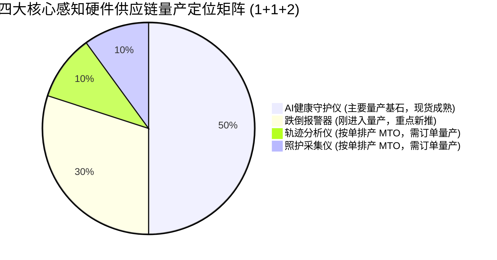
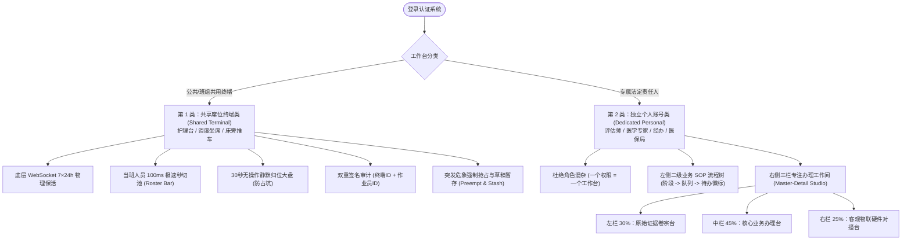

# 中科安樵智能物联网产品需求规格说明书（PRD & Product Spec）

> **文档版本**：v2.0 (全量重构基准稿)  
> **文档密级**：核心商业机密 / 战略工程规范  
> **编制依据**：硬件系统集成商战略定位、国家医保局/民政部失能评估操作指南、长护险全闭环风控规范、宿迁真实试点运行标准  
> **生效范围**：中科安樵全域系统（`anqiao-console`、`anqiao-dashboard`、`suqian-dashboard`、`server/` 底座及全部外延硬件套件）  
> **工程纪律**：**Spec 先行（SDD 驱动）；关键和难点业务逻辑必须实施 TDD 红绿测试；严禁脱离硬件的纯文字录入 SaaS 反模式；零虚拟假数据（Zero Fake Data）**。

---

## 0. 战略商业模式重构与系统集成商定位（Strategic Context）

### 0.1 商业本质与主营战略
中科安樵不是“纯软件 SaaS 研发公司”，而是**以智能物联网核心感知硬件为基石的系统集成商（System Integrator）**。
- **核心商业目的**：**研发、集成并销售智能感知硬件产品**。
- **软件系统定位**：全域软件平台（管理端控制台、数据大屏、移动工作台）不是脱离硬件而独立盈利的纯 SaaS，而是**硬件产品在长护险医保结算、养老院智慧升级、社区居家网格化照护、失能等级医学评估等场景落地交付的技术载体、销售抓手与履约验收中枢**。
- **商业闭环链路**：
  $$\text{硬件进场部署} \longrightarrow \text{7×24h 连续客观监测} \longrightarrow \text{医保防欺诈/评估质证/工单客观凭证} \longrightarrow \text{机构按床位/按人头合规结算} \longrightarrow \text{驱动硬件规模化复购}$$

### 0.2 反模式根除：严禁系统降格为“脱离硬件的纯软件 SaaS”
1. **纯文字录入反模式**：任何失能评定、服务工单、晨晚间巡房、生命体征记录，如果仅依赖人工在网页输入框中手工填报，而没有硬件数据交叉对撞，即被系统认定为“低公信力风险动作”；
2. **硬件证据优先原则**：所有业务单据（评估报告、月度结算申报、欺诈调查卷宗）必须强制挂接硬件产生的连续体征基线包（`telemetryPacket`）、雷达姿态突变波形或采集仪近场核验凭证；
3. **硬件结论中立原则**：感知硬件提供客观真实物理信号（体征、微动、姿态、时间戳），其内置 `conclusion` 字段在入库前恒为 `null`，严禁算法越权代替评估师或医师做行政定级，硬件永远作为法医学级、医保稽核级的“客观证人”。

---

## 1. 四大核心感知硬件「1+1+2」矩阵与供应链排产规则

根据中科安樵当前的供应链产能、研发成熟度与量产阶段，全系感知硬件划分为严格的「1+1+2」矩阵，任何界面展示、进销存台账与销售配单必须严格对齐如下量产状态：

| 硬件产品类别 (Category) | 产品型号 (Model) | 核心传感与硬件机理 | 供应链与量产阶段 (Manufacturing Stage) | 核心业务赋能场景 | 商业销售与集成抓手 |
|---|---|---|---|---|---|
| **① AI健康守护仪** | `ASH-01` / `ANCE-01` | 高精度压电微动体征感应垫 / 毫米波连续体征感知雷达 | **核心基石，目前主要量产的产品** （成熟现货量产，稳定供货） | 7×24h 卧床体征（心率/呼吸/在床/离床/睡眠分期/体动翻身） | 全天候床位监护压舱石，医保长护险入户与定点机构必须铺设的基础硬件 |
| **② 跌倒报警器** | `AFD-01` / 毫米波微动点云雷达 | 60GHz/77GHz 毫米波空间微动点云雷达，非接触姿态解析 | **刚进入量产** （量产爬坡期，新推主力） | 卫浴间/卧室空间跌倒 0 秒毫秒级捕获、急跌告警、全屏生命危象强行抢占 | 0 秒救命抢险抓手，居家适老化改造与养老院卫浴安全必备爆款硬件 |
| **③ 轨迹分析仪** | `ATA-01` | 广角空间微动轨迹寻踪天线阵列、步态衰退分析仪 | **需要有订单才能开始量产** （按单排产 MTO - Make to Order） | 室内活动轨迹热力图、步态缓慢度分析、认知症走失游荡风险筛查 | 高阶质证与认知症专护选配促单利器，针对高净值或特殊专案专项排产 |
| **④ 照护采集仪** | `ACA-01` | 智能照护工牌 / 移动打卡采集终端（BLE + 近场声学 + 空间定位） | **需要有订单才能开始量产** （按单排产 MTO - Make to Order） | 助老员/护理员入户打卡、近场声学客观服务留痕、工单真实性防虚报核验 | 防虚假挂单与医保结算合规防线，政企集采与规模化保司经办标包选配硬件 |

### 1.1 供应链状态业务流转约束（SDD 强制规则）
1. **现货可售状态（`mass_production`）**：
   - 守护仪随时可分配库存（`stocked`）、直发客户现场（`shipped`）、立即激活（`activated`）；
2. **爬坡量产状态（`entering_mass_production`）**：
   - 跌倒报警器优先供应重点试点与示范项目，支持预留配额（`reserved`）与快速补货；
3. **按单排产状态（`make_to_order`）**：
   - 轨迹分析仪与照护采集仪在销售端未签署正式采购合同或未录入有效意向订单前，严禁建立虚拟装机点位，杜绝占用产线备料资金。

---

## 2. 真实数据唯一性与虚假数据零容忍准则（Real-Data Authenticity Standard）

### 2.1 彻底肃清虚拟与捏造数据
系统坚决贯彻“真实试点、真实设备、真实长者”的公信力红线：
1. **全面清除捏造账号**：彻底删除历史遗留的 `user_zhoumin`、`user_zhangdefu`、`user_wangjianguo`、`user_qianxiuying`、`user_liuchangsheng`、`user_chenguizhi` 等为了迎合在线大屏而虚构的假用户；
2. **全面废除伪随机造人算法**：废除利用 `mulberry32` 与百家姓、男女假名数组对空床位批量灌入假长者的作弊逻辑；
3. **空床真实呈现标准**：养老机构未铺装设备或未入住长者的床位，系统必须诚实呈现为空床态（`status: 'vacant'`, `patient: null`, `vitals: null`），维护系统集成商最严谨的工业操守。

### 2.2 生产基线真实数据锚点（唯一合法清单）
1. **宿迁长护险真实试点**：
   - **在册在线实机（3台）**：`ASH01086`、`ASH01078`、`ASH01092`，全部接入江苏宿迁物联专网；
   - **真实参保长者（3位）**：许丽（`xuli` / `P_SQ_01`）、何家齐（`hejiaqi` / `P_SQ_02`）、王雪金（`wangxuejin` / `P_SQ_03`），外加备选长者丁志坤（`dingzhikun`）；
   - **真实家属**：`family_demo`（许丽法定监护人家属）；
   - **真实试点机构**：宿迁市医疗保障局（`bureau_suqian`）、太保寿险宿迁经办专班（`insurer_suqian`）、宿迁广济第三方评定中心（`assessor_org`）。
2. **中科安樵自营在册感知硬件资产（真实点位）**：
   - `ANCE00001`：凯健国际 404 实机（康养示范点）
   - `ASH01146`：太湖科创中心 A 座 903 实机（中科展厅总控）
   - `ASH01076`：独墅湖园区康养 815 实机（示范点）
   - `ASH01016`：独墅湖科教创新区科研楼 B 栋 206 实机（睡眠研究中心）
   - `ANCE00003`：园区康养 613 实机
   - `ANCE00002`：石湖金陵广场 B 座 301 实机（运维中枢）
   - `ASH01038`：太湖科创中心 9 层演示台实机
   - `ASH01021`：太湖科创中心 9 层库房 B 实机

### 2.3 三域数据架构与交付切片规范

全域软件是随硬件供应交付给客户的增值服务。客户类型以账号矩阵（`docs/ACCOUNT-MATRIX.md` / `server/seed.js` `ACCOUNTS`）为唯一权威清单。系统按「真实域 / 体验域 / 交付域」三域组织账号、数据与设备。

#### 2.3.1 三域定义

| 域 | 账号 | 业务数据 | 设备 |
|---|---|---|---|
| **真实域**（宿迁长护险试点） | 3 位真实长者（许丽 / 何家齐 / 王雪金）、家属 `family_demo`、宿迁试点机构账号（bureau_suqian / insurer_suqian / assessor_suqian） | 全部真实，使用范围限于长护险试点场景 | 3 台真实在网设备（ASH01086 / ASH01078 / ASH01092），遥测数据仅流向长护险试点场景 |
| **体验域**（目标客户体验） | 每类客户一套独立体验角色群，工作台配置与生产环境一致 | 模拟数据：机构名一律使用虚构名称；界面常驻演示标识，向体验客户明示「业务数据为模拟、设备遥测为真实物联」 | 公司自营真实设备分配至体验角色群；一台设备可同时归属多个角色群（N:M） |
| **交付域**（客户开通） | 按客户类型开通的角色群与配套工作台切片；切片外的工作台与内容对该客户隐藏 | 全部真实，遵循本章真实数据红线 | 客户购置或租用并激活的设备 |

#### 2.3.2 设备资产域

公司自营在册设备（§2.2 锚点及台账在册设备，约 45 台）与宿迁试点 3 台共同构成真实设备资产，产权归属中科安樵。系统提供设备资产的新增、修改、删除、查询全生命周期管理，并提供「设备 ↔ 体验角色群」分配关系的持久化管理。

#### 2.3.3 账号矩阵要求

种子账号矩阵仅包含三类账号：宿迁真实试点账号、演示统筹区（某某市）账号、平台自营账号。演示统筹区的经办机构、评定机构、照护机构一律使用虚构名称。体验域各角色群及其业务数据于系统验收后统一制作。

#### 2.3.4 工作台切片与身份标识

院舍照护、社区居家、长护险生态各工作台组件为标准交付资产，按客户角色群配置挂载。机构名称、统筹区标识等身份信息一律取自登录会话 `principal`（`org_name` / `pool_id`），由租户配置驱动。

#### 2.3.5 实现要求与验收

| 工作流 | 要求 | 验收 |
|---|---|---|
| 账号矩阵收敛 | 移除凯健国际与姑苏居家养老两个租户的账号及其关联模拟数据（患者、床位、花名册、工单） | 账号矩阵仅余三类账号；受影响测试改写锚定宿迁试点后 `npm test` 全绿 |
| 设备全生命周期管理 | 新增 `POST`、修改 `PATCH`、删除 `DELETE` 设备接口（契约经 API-CONTRACT 登记），写操作含权限校验与审计 | TDD 红绿用例覆盖越权 403 与审计留痕 |
| 设备分配机制 | 「设备 ↔ 体验角色群」分配关系持久化，支持 N:M | TDD 断言多角色群共享设备；宿迁 3 台设备仅限真实域 |
| 体验域标识 | 演示统筹区机构名全部替换为虚构名称；体验态界面常驻演示标识 | 全局检索无真实机构名残留于演示统筹区；演示标识在体验态可见 |

---

## 3. 双类工作台分类学与多层级信息架构规范

针对传统软件工作台“左侧荒漠化、右侧大杂烩、单页堆砌几十个功能”的严重体验缺陷，依据岗位物理现实建立**双类工作台分类学体系**：

### 3.1 第 1 类：共享终端类工作台规范（Shared Terminal Spec）
- **承载载体**：病区护士站一体机、走廊壁挂触摸大屏、移动查房推车平板、居家调度坐席。
- **运行特征**：7×24h 常开常亮，网络高保活，绝不轻易注销完全退出。
- **核心交互机制**：
  1. **双层身份解耦**：终端层保持病区硬件设备数据链路长连接；作业员层通过顶栏头像或 PIN 码 100ms 内极速秒切；
  2. **30 秒无操作自动归位**：人员录完数据离开后，30 秒自动退回全病区公共物联态势图，防止个人会话占坑；
  3. **双重签名留痕（Dual-Signature）**：所有业务写入必须强制携带 `terminal_id` 与 `operator_id`；
  4. **突发危象全屏强制抢占（Preempt & Stash）**：一旦发生跌倒报警器 Level 1 突发告警或心率失常，悬浮告警条毫秒级弹窗覆盖全屏，作业员当前表单就地暂存（Stash），处置完毕一键还原（Pop）。

### 3.2 第 2 类：独立个人账号类工作台规范（Dedicated Personal Spec）
- **承载载体**：外勤人员平板电脑、办公室个人电脑、医学专家审批机。
- **运行特征**：一人一号、强隐私、强法定医学与行政责任。
- **核心交互机制**：
  1. **“一个权限 = 一个独立工作台”**：严禁在同页提供横向切换按钮让同一人身兼“评估师、专家、结算员”等互斥岗位；
  2. **左侧业务 SOP 流程树**：
     - Level 1 业务阶段（如：今日待办、入户评定、专家质证、归档结案）；
     - Level 2 状态队列（待受理、待入户、质证中、待会签、已退回），末端动态展示实时待办计数徽标；
  3. **右侧三栏专注办理工作间（Master-Detail Studio）**：
     - 点击队列案卷进入全屏沉浸式三栏办理态，杜绝局促弹窗；
     - **左栏（证据卷宗台，30% 宽）**：长者既往病历、住院出院小结、残疾证扫描件、历史评估档案；
     - **中栏（核心业务台，45% 宽）**：国家失能标准 29 项量表、打分计算器、经办审核意见栏；
     - **右栏（客观物联辅助台，25% 宽）**：AI健康守护仪 7 天连续体征基线包、跌倒雷达告警历史、AI冲突提示（结论恒为 null，采纳必留痕）；
     - **底栏（法定签名区）**：双评定师数字签名、医学专家联合会签、CA 电子签章。

---

## 4. 全系统 36 岗位角色映射与业务 SOP 流程树全景图

系统严格收敛 36 个独立岗位，每个岗位专属映射至唯一的 SOP 流程树与工作空间：

| 序号 | 角色代号 (Role) | 岗位名称 | 工作台分类 | 挂载路由/模块 | 专属 SOP 流程树核心节点 (Level 1 $\rightarrow$ Level 2) |
|---|---|---|---|---|---|
| 1 | `nursing_station` | 护士台公共席位 | 共享终端 | `care_desk` | 病区全盘态势 $\rightarrow$ 床位风险漏斗、当班排班、危急预警 |
| 2 | `nursing_head` | 病区护士长 | 共享终端 | `care_desk` | 重点监护专区 $\rightarrow$ 坠床高危、呼吸暂停、排班质控、护理督办 |
| 3 | `nursing_nurse` | 责任护士 | 共享终端 | `care_desk` / `nursing_staff` | 管床长者清单 $\rightarrow$ 晨间生命体征测量、翻身防压疮打卡、给药核对 |
| 4 | `nursing_caregiver`| 管床护工 | 共享终端 | `nursing_staff` | 照护任务清单 $\rightarrow$ 协助进餐、助浴助洁、如厕陪护、夜间巡更 |
| 5 | `home_dispatcher` | 虚拟养老院调度席 | 共享终端 | `home_dispatch` | 应急呼叫应答 $\rightarrow$ 紧急 SOS、待派工单、在途网格员、完工质检 |
| 6 | `elderly_care_admin`| 居家服务中心主任 | 共享终端 | `home_dispatch` | 片区运营大盘 $\rightarrow$ 突发指挥调度、服务运力分析、满意度督查 |
| 7 | `grid_team_leader` | 居家应急网格长 | 共享终端 | `home_dispatch` | 片区网格督导 $\rightarrow$ 助老员打卡跟踪、疑难工单协同、家属报障处置 |
| 8 | `assessor` | 入户主评人 | 独立账号 | `assessor_field_studio` | 现场评估流程 $\rightarrow$ 待预约、在途签到、现场29项打分、双人核验签名 |
| 9 | `assessor_expert` | 临床医学评审专家 | 独立账号 | `assessor_expert_studio`| 医学质证会审 $\rightarrow$ 待会审卷宗、临床病历质证、雷达客观比对、双专家会签 |
| 10 | `assessor_admin` | 评估机构质控主管 | 独立账号 | `assessor_quality_admin`| 机构公信力中心 $\rightarrow$ 高斯分布离群预警、双人双录抽查、结论书盖章签发 |
| 11 | `insurer_intake` | 经办受理派单专员 | 独立账号 | `insurer_intake_studio` | 申请受理调度 $\rightarrow$ 资格初核、机构回避算法匹配、派单时限倒计时催办 |
| 12 | `insurer_inspector`| 经办现场飞检专员 | 独立账号 | `insurer_inspector_studio`| 双随机飞检中心 $\rightarrow$ 靶向飞检清单、现场暗访双录、违规挂床稽核留痕 |
| 13 | `insurer_auditor` | 经办结算初审核销员 | 独立账号 | `insurer_auditor_studio` | 费用审核凭证 $\rightarrow$ 机构月申报核验、物联脱管核减计算、经办初审凭证出具 |
| 14 | `insurer_service` | 经办综合客服申诉员 | 独立账号 | `insurer_service_studio` | 信访申诉通道 $\rightarrow$ 申诉争议立案、调阅物联原始卷宗、组织二次复评 |
| 15 | `insurer_director` | 经办项目总监 | 独立账号 | `insurer_director_studio` | 统筹区经办大盘 $\rightarrow$ 基金支出流速监控、协议机构 KPI、重大违规上报 |
| 16 | `medical_director` | 医保分管局长 | 独立账号 | `medical_director_studio` | 局级监管驾驶舱 $\rightarrow$ 全市长护资金大盘、穿透式监管看板、行政处罚签批 |
| 17 | `medical_supervisor`| 医保长护监督科长 | 独立账号 | `medical_supervision_studio`| 医保协议监管 $\rightarrow$ 机构星级信用评定、多部门联合线索、督办函一键签发 |
| 18 | `medical_auditor` | 基金监管稽核专员 | 独立账号 | `medical_auditor_studio` | 欺诈线索查办 $\rightarrow$ AI 疑点线索研判、一案一档专卷、追回退款执行留痕 |
| 19 | `medical_finance` | 医保待遇财务专员 | 独立账号 | `medical_finance_studio` | 医保终审划拨 $\rightarrow$ 经办初审账册复核、财政专户清算、终审支付凭证生成 |
| 20 | `medical_assessor_admin`| 评估资格核准专员 | 独立账号 | `medical_assessor_studio` | 行业准入管理 $\rightarrow$ 评定机构名录准入、评定师执业库备案、异议终局仲裁 |
| 21 | `nursing_admin` | 养老院院长 | 独立账号 | `nursing_home_admin` | 机构运筹大盘 $\rightarrow$ 在院实住率看板、长护申报归档、院内医疗督办 |
| 22 | `patient_dossier` | 病案管理专员 | 独立账号 | `patient_dossier` | 全生命周期健康档案 $\rightarrow$ 楼层-房间-长者拓扑树、多病共存慢病谱透视 |
| 23 | `device_monitoring`| 院内物联运维专员 | 独立账号 | `device_monitoring` | 硬件资产物理拓扑树 $\rightarrow$ 守护仪离线漏斗、雷达信号衰减巡检、固件 OTA |
| 24 | `reports_center` | 医保结算报表专员 | 独立账号 | `reports_center` | 医保核销台账 $\rightarrow$ 年度月度账期树、连续在床凭证汇编、翻身合规报告 |
| 25 | `rehab_therapist` | 康复治疗师 | 独立账号 | `rehab_studio` | 康复处方流程 $\rightarrow$ 肌力步态初评、康复训练打卡、训练后雷达评效 |
| 26 | `dementia_specialist`| 认知症照护专员 | 独立账号 | `dementia_studio` | 认知症专护流程 $\rightarrow$ MMSE 量表测评、防走失电子围栏标定、非药物干预记录 |
| 27 | `assistive_specialist`| 适老辅具顾问 | 独立账号 | `assistive_studio` | 辅具适配闭环 $\rightarrow$ 居家辅具需求评定、适老化改造方案、出库安装与回访 |
| 28 | `case_manager` | 居家个案管理师 | 独立账号 | `home_case_studio` | 重点个案跟踪 $\rightarrow$ 辖区独居高龄主线、转介失能申请、定制照护计划 |
| 29 | `quality_inspector`| 居家服务质检员 | 独立账号 | `home_quality_studio` | 服务质量闭环 $\rightarrow$ 入户双录照片抽检、电话满意度回访、虚假挂单核减 |
| 30 | `ltc_biller` | 居家长护结算员 | 独立账号 | `home_billing_studio` | 居家月度对账 $\rightarrow$ 街道民政与医保补贴合并计算、清算报表导出 |
| 31 | `grid_caregiver` | 社区助老员 | 独立账号 | `caregiver_mobile` | 移动入户作业 $\rightarrow$ 今日上门路线、近场 NFC 打卡、助餐助洁拍照存证 |
| 32 | `family_contact` | 参保人家属 | 独立账号 | `family_workspace` | 亲情守护中枢 $\rightarrow$ 长者档案绑定、在线申报告知、体征实时感知、进度申诉 |
| 33 | `system_admin` | 系统超级管理员 | 独立账号 | `system_admin` | 全域多租户树 $\rightarrow$ 账号矩阵拓扑、跨机构权限配置、全量审计日志 |
| 34 | `platform_admin` | 平台自营总管 | 独立账号 | `platform_operations` | 12阶段硬件全生命周期 $\rightarrow$ 全国点位穿透、出货入库调拨、固件巡检 |
| 35 | `partner_admin` | 渠道合伙人总管 | 独立账号 | `partner_operations` | 渠道销售协同 $\rightarrow$ 拓客报备审批、硬件装机发货追踪、佣金返点结算 |
| 36 | `device_user` | 平台硬件技术员 | 独立账号 | `device_monitoring` | 硬件工程中枢 $\rightarrow$ 批量扫码入库、传感器标定、专网通信协议调试 |

---

## 5. SDD 契约规范与 TDD 测试验收标准（SDD & TDD Discipline）

### 5.1 SDD 契约落盘（Contract Specification）
所有硬件模型、排产规则、工作台分类与 SOP 流程树契约在源码中统一维护于：
- 前端契约：`src/types/workbench-ia.ts`
- 后端服务：`server/hardware-product-matrix.js`、`server/shared-terminal-fsm.js`、`server/workbench-workflow-tree.js`

### 5.2 TDD 验收覆盖基准（Red-Green Checklist）
1. **四大硬件量产与排产状态断言**：
   - AI健康守护仪必须断言为现货量产（`mass_production`）；
   - 跌倒报警器必须断言为新晋量产（`entering_mass_production`）；
   - 轨迹分析仪与照护采集仪必须断言为按单排产（`make_to_order`），无订单不得擅自建立虚拟装机。
2. **零虚拟假数据断言**：
   - 严禁包含 `user_zhoumin` 等 6 个捏造账号，登录必定返回 401 Unauthorized；
   - 严禁空造 87 位假老人名；
   - 宿迁 3 台真实设备与 3 位真实长者 100% 保持在网在线可查。
3. **共享终端状态机断言**：
   - 初始态为公共大盘；
   - 秒切登入后触发 30s 倒计时；
   - 30s 无操作平滑退出归位；
   - 写入操作强制双重签名审计；
   - Level 1 突发危象强制抢占与草稿 Stash/Pop 完美还原。
4. **独立账号流程树断言**：
   - 外勤评定师仅见入户打卡流，专家仅见质证会审流，经办仅见受理与初审流；
   - 跨角色访问未授权节点服务端拦截并抛出 403 异常。
