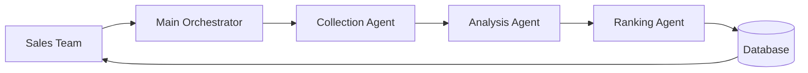

# Subagents Specification - Lead Detection System

**Version**: v1.1.0  
**Target Model**: GLM-5.1 (Zhipu AI)  
**Author**: AI Assistant  
**Last Updated**: 2026-07-26  

---

## Overview

This document defines the subagent architecture for the lead detection system. Each subagent is a self-contained task executor with clearly defined inputs, outputs, and failure behavior. The specification is written for direct model execution and minimizes human-oriented narrative.

### Design Principles

1. Single Responsibility
2. Self-Contained Contracts
3. Type-Safe Interfaces
4. Explicit Error Handling
5. Observable Processing Steps

---

## Subagent 01: Data Collection Agent

### Purpose
Collect raw signals from supported sources.

### Input Schema
```python
@dataclass
class CollectionRequest:
    source_types: list[str]
    time_range_start: datetime
    time_range_end: datetime
    geographic_filter: dict[str, list[str]] | None = None
    budget_min_threshold: float | None = None
    max_results: int = 100
    proxy_urls: list[str] = field(default_factory=list)
```

### Output Schema
```python
@dataclass
class CollectedSignals:
    success: bool
    collected_count: int
    failed_sources: dict[str, str]
    signals: list[RawSignal]
    next_collection_time: datetime
```

### Error Handling Strategy

| Failure Mode | Recovery Action | Retry Count |
|-------------|----------------|------------|
| Network timeout | Retry with backoff | 1 |
| HTTP 429/420 | Exponential backoff | 3 |
| HTML parse error | Skip source or use cached snapshot | 0 |
| Rate limit exceeded | Pause collection window | N/A |

---

## Subagent 02: Signal Analysis Agent

### Purpose
Parse content, extract entities, validate format, and enrich data.

### Input Schema
```python
@dataclass
class AnalysisInput:
    raw_signals: list[RawSignal]
    enrichment_data: dict[str, object] | None = None
    domain_knowledge: list[str] | None = None
```

### Output Schema
```python
@dataclass
class AnalyzedSignals:
    processed_count: int
    validated_count: int
    rejected_signals: list[tuple[RawSignal, str]]
    enriched_signals: list[EnrichedSignal]
```

### Processing Rules

- Reject signals missing required identifiers or content
- Normalize dates to timezone-aware UTC values when possible
- Preserve extraction order for keywords when deduplicating
- Flag review if rejection rate exceeds 80%

---

## Subagent 03: Opportunity Ranking Agent

### Purpose
Apply MEDDIC scoring, calculate grades, and generate recommendations.

### Input Schema
```python
@dataclass
class RankingInput:
    analyzed_signals: list[AnalyzedSignal]
    historical_context: dict[str, object] | None = None
    sales_insights: dict[str, object] | None = None
    algorithm_version: str = "GLM51_MEDDIC_V1"
```

### Output Schema
```python
@dataclass
class RankedOpportunities:
    scored_at: datetime
    algorithm_version: str
    opportunities: list[RankedOpportunity]
    summary_stats: dict[str, float]
    top_recommendations: list[str]
```

### MEDDIC Scoring Notes

- Use the algorithm specification in `../algorithms/01-meddic-scoring.py`
- Grades must align with the shared threshold mapping used across the module
- Win probability must remain in the range 0.0 to 1.0

---

## Subagent Integration Flow



### Error Propagation Rules

1. Collection failure: return partial results if at least half the sources succeed.
2. Analysis failure: trigger manual review when rejection rate exceeds 80%.
3. Ranking failure: fall back to cached scores when available.
4. Database failure: queue writes locally for retry.

---

## Testing Checklist

- [ ] Each agent can be validated independently
- [ ] Signals flow through the pipeline in order
- [ ] Retry and fallback behaviors are documented and testable
- [ ] Output schemas contain no unresolved type references in the final implementation
- [ ] Rejection thresholds and grading thresholds are consistent
