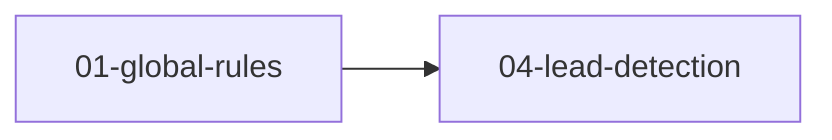

# AI 商机挖掘系统 - SDD 规格说明索引

## 📚 文档导航

本文档是中科安樵 CRM 系统的 SDD (Spec-Driven Development) 规格说明文档集合。当前目录仅保留可直接用于模型执行的 SPEC 文件，强调单文件上下文、自包含和可验证输出，便于 zcode（GLM-5.1）稳定实现。

---

## 🗂️ 文档结构

### Level 1: 顶层架构文档
| 文件 | 描述 | 读者 |
|------|------|------|
| [PLAN.md](../PLAN.md) | 总体架构决策和技术选型 | AI 优先 |
| [ARCHITECTURE.md](../ARCHITECTURE.md) | 系统架构图和组件关系 | AI 优先 |

### Level 2: 全局规范
| 文件 | 描述 | 必须阅读 |
|------|------|---------|
| [01-global-rules.md](01-global-rules.md) | 代码质量规范、命名约定、错误码定义 | 所有模块开发 |

### Level 3: 业务模块 SPEC
| # | 文件名 | 模块名称 | 依赖 |
|---|--------|---------|------|
| 1 | [04-lead-detection/](./04-lead-detection/) | AI 商机挖掘核心 | global-rules |

> 注：当前仓库仅包含 `04-lead-detection` 示例模块；若后续补充其他模块，应先确保对应 SPEC 文件实际存在，再更新本索引。

### Level 4: 配套文档
| 文件 | 描述 |
|------|------|
| [API/openapi.yaml](../API/openapi.yaml) | OpenAPI 3.0 规范 |
| [DIAGRAMS/er-diagram.mermaid](../DIAGRAMS/er-diagram.mermaid) | ER 图 |
| [DIAGRAMS/sequence-diagrams/](../DIAGRAMS/sequence-diagrams/) | 序列图集合 |
| [ACCEPTANCE-CRITERIA.md](../ACCEPTANCE-CRITERIA.md) | 验收标准汇总 |

### 文档输出原则
- 面向模型执行，不面向泛化人类阅读
- 优先提供可验证的约束、输入、输出与边界条件
- 避免与执行无关的修辞性说明和开放式收尾

---

## 🔗 模块依赖关系



---

## 🤖 GLM-5.1 (Zhipu AI) 专用说明

本 SPEC 文档已针对 **GLM-5.1** 进行优化：

### ✅ 优化特性

1. **文件粒度控制**
   - 单文件不超过 300 行
   - 单文件不超过 4K tokens
   - 按功能模块拆分到独立文件

2. **指令明确性增强**
   - 所有算法提供完整可执行 Python 代码（无伪代码）
   - 每个函数都有完整的 docstring 和类型注解
   - 输入/输出参数明确定义

3. **边缘情况全覆盖**
   - 每个模块包含详细的 Edge Cases 处理逻辑
   - 决策树方式展示异常处理流程
   - 失败降级策略明确定义

4. **自包含设计**
   - SQL Schema 仅描述当前模块可实现的表结构
   - Python 文件仅描述单文件所需的本地逻辑
   - 每个文件尽量可独立加载和理解

### 📖 使用建议

**1. 阅读顺序**
```
① docs/SPEC/01-global-rules.md          → 全局规范
② docs/SPEC/04-lead-detection/README.md → 模块导航
③ docs/SPEC/04-lead-detection/algorithms/01-meddic-scoring.py → 核心算法
```

**2. 代码生成策略**
- ⚠️ 一次只给 zcode（glm5.1）一个文件作为上下文
- ✅ 对复杂模块，分步生成（schema → algorithm → tests）
- ✅ 保持文件之间的依赖关系在当前目录内可解释

**3. 验证要点**
- [ ] 检查函数签名与 docstring 是否一致
- [ ] 确认所有 edge cases 都有明确的 if-else 处理
- [ ] 运行测试用例验证正确性
- [ ] 确保没有跨文件依赖导致编译错误

---

## 🏷️ 版本历史

| 版本 | 日期 | 修改人 | 修改内容 |
|------|------|--------|---------|
| v1.0.0 | 2026-07-25 | AI Assistant | 初始版本，建立模块化框架 |
| v1.1.0 | 2026-07-26 | AI Assistant | 仅保留已存在 SPEC 引用，修复索引闭合性 |

---

此优化方案适用于 **ZCode 中的 GLM-5.1 模型**。
