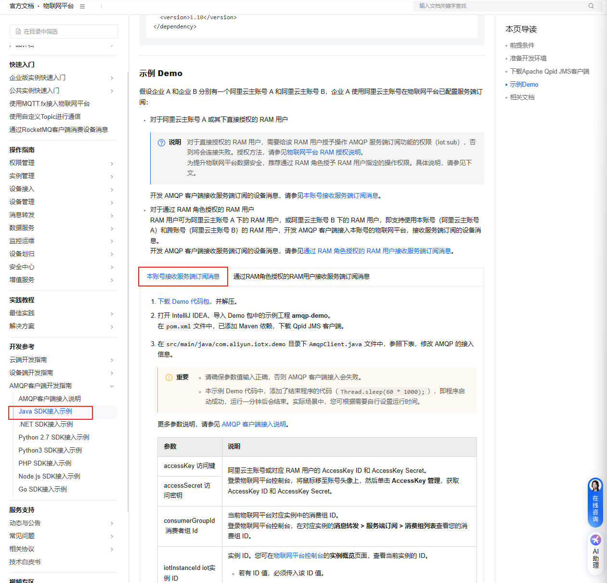

# 健康监测系列\-数据云流转协议 

> English version: [Health Monitoring Series \- Data Cloud Transfer Protocol](https://hqmwp7cauk.feishu.cn/wiki/SYyKwzciuiJky5kpcNlckT6MnGe)
> 
> 历史中文版本：[健康监测系列\-数据云流转协议 ](https://hqmwp7cauk.feishu.cn/wiki/AtVgwVK1Aih6zokwM7mc1PH7n4e?edition_id=KPlGx0)
> 
> 


# 一、对接方式讲解

## 1、AMQP云流转方式

### （1）阿里云AMQP客户端SDK下载

**官方参考文档链接：**

```HTTP
https://help.aliyun.com/zh/iot/developer-reference/connect-an-amqp-client-to-iot-platform?spm=a2c4g.11186623.help-menu-30520.d_4_2_0.5b3b2a2b6rPoAh
```

### （2）关于阿里云官方文档使用讲解

#### 步骤一:

通过上述链接进入到阿里云官方文档中，详细查看[AMQP客户端接入说明](https://help.aliyun.com/zh/iot/developer-reference/connect-an-amqp-client-to-iot-platform?spm=a2c4g.11186623.help-menu-30520.d_4_2_0.5b3b2a2b6rPoAh)，找到自身所需要的SDK说明，点击进入即可。


#### 步骤二：

以Python3 SDK为例，**通过我司提供的消费组参数**，进行客户端的搭建，进而去消费接收设备数据，如下图“Python SDK图片”所示；其中特别说明的是，Java SDK中需要选择以“本账号接收服务端订阅信息”，如下图“JAVA SDK图片”所示。




#### 步骤三：

再仔细阅读完阿里云官方说明后，继续下载示例Demo，将我司所提供的账号文档中的参数一一对应填入即可。


### （3）关于参数文档说明

#### 我司提供的参数文档包括：

|参数说明|需替换标志位|备注|
|---|---|---|
|host（此为固定，不会在文档中体现）|$\{YourHost\}|iot\-010a0clt\.amqp\.iothub\.aliyuncs\.com|
|User AccessKey|ALIBABA\_CLOUD\_ACCESS\_KEY\_ID||
|User AccessSecert|ALIBABA\_CLOUD\_ACCESS\_KEY\_SECRET||
|ConsumerGroup ID|$\{YourConsumerGroupId\}||
|ClientID |$\{YourClientId\}|*自定义，用来区分自己的多个接收端*|
|IOT Instance ID|$\{YourIotInstanceId\}||
|ProductKey（设备类型）|无|用于区分不同的产品或不同批次的产品|


#### 实践demo说明：

以 Python 2\.7 SDK 为例，根据我司提供的[账户文档](https://hqmwp7cauk.feishu.cn/wiki/AtVgwVK1Aih6zokwM7mc1PH7n4e#share-GajhdNz8Ro96jbxrUnwctHIxnmt)，替换代码中的关键信息，运行后即可获得 JSON 格式的云流转数据。下表列出了代码中需替换的标志位。

|对应部分|需替换标志位|替换内容|
|---|---|---|
|url 部分|$\{YourHost\}|iot\-010a0clt\.amqp\.iothub\.aliyuncs\.com|
|accessKey 部分|ALIBABA\_CLOUD\_ACCESS\_KEY\_ID||
|accessSecret 部分|ALIBABA\_CLOUD\_ACCESS\_KEY\_SECRET||
|consumerGroupId 部分|$\{YourConsumerGroupId\}||
|clientId 部分|$\{YourClientId\}|*自定义，用来区分自己的多个接收端*|
|iotInstanceId 部分|$\{YourIotInstanceId\}||

*表格内容对应代码示例中标红部分*

部分代码示例：                                                                        *（仅供参考）*

```Python
*# encoding=utf-8*import sys
import logging
import time
from proton.handlers import MessagingHandler
from proton.reactor import Container
import hashlib
import hmac
import base64
import os

reload(sys)
sys.setdefaultencoding('utf-8')
logging.basicConfig(level=logging.INFO, format='%(asctime)s - %(name)s - %(levelname)s - %(message)s')
logger = logging.getLogger(__name__)
console_handler = logging.StreamHandler(sys.stdout)


def current_time_millis():
    return str(int(round(time.time() * 1000)))


def do_sign(secret, sign_content):
    m = hmac.new(secret, sign_content, digestmod=hashlib.sha1)
    return base64.b64encode(m.digest())


class AmqpClient(MessagingHandler):
    def __init__(self):
        super(AmqpClient, self).__init__()

    def on_start(self, event):
        *# 接入域名，请参见AMQP客户端接入说明文档。*
        url = "amqps://${YourHost}:5671"*# 工程代码泄露可能会导致 AccessKey 泄露，并威胁账号下所有资源的安全性。以下代码示例使用环境变量获3取 AccessKey 的方式进行调用，仅供参考*
        accessKey = os.environ['ALIBABA_CLOUD_ACCESS_KEY_ID']
        accessSecret = os.environ['ALIBABA_CLOUD_ACCESS_KEY_SECRET']
        consumerGroupId = "${YourConsumerGroupId}"
        clientId = "${YourClientId}"*# iotInstanceId：实例ID。*
        iotInstanceId = "${YourIotInstanceId}"*# 签名方法：支持hmacmd5，hmacsha1和hmacsha256。*
        signMethod = "hmacsha1"
        timestamp = current_time_millis()
        *# userName组装方法，请参见AMQP客户端接入说明文档。*
        userName = clientId + "|authMode=aksign" + ",signMethod=" + signMethod \
                        + ",timestamp=" + timestamp + ",authId=" + accessKey \
                        + ",iotInstanceId=" + iotInstanceId + ",consumerGroupId=" + consumerGroupId + "|"
        signContent = "authId=" + accessKey + "&timestamp=" + timestamp
        *# 计算签名，password组装方法，请参见AMQP客户端接入说明文档。*
        passWord = do_sign(accessSecret.encode("utf-8"), signContent.encode("utf-8"))
        conn = event.container.connect(url, user=userName, password=passWord, heartbeat=60)
        self.receiver = event.container.create_receiver(conn)

    *# 当连接成功建立时被调用。*def on_connection_opened(self, event):
        logger.info("Connection established, remoteUrl: %s", event.connection.hostname)

    *# 当连接关闭时被调用。*def on_connection_closed(self, event):
        logger.info("Connection closed: %s", self)

    *# 当远端因错误而关闭连接时被调用。*def on_connection_error(self, event):
        logger.info("Connection error")

    *# 当建立AMQP连接错误时被调用，包括身份验证错误和套接字错误。*def on_transport_error(self, event):
        if event.transport.condition:
            if event.transport.condition.info:
                logger.error("%s: %s: %s" % (
                    event.transport.condition.name, event.transport.condition.description,
                    event.transport.condition.info))
            else:
                logger.error("%s: %s" % (event.transport.condition.name, event.transport.condition.description))
        else:
            logging.error("Unspecified transport error")

    *# 当收到消息时被调用。*def on_message(self, event):
        message = event.message
        content = message.body.decode('utf-8')
        topic = message.properties.get("topic")
        message_id = message.properties.get("messageId")
        print("receive message: message_id=%s, topic=%s, content=%s" % (message_id, topic, content))
        event.receiver.flow(1)


Container(AmqpClient()).run()
```

## 2、API流转方式

### （1）使用说明

1. 根据 API的不同准备不同的请求和传递实际有效的功能参数

2. API 用户验证方面：需要额外传递验证所用参数，含义如下

|参数标志位|含义|
|---|---|
|appkey|分配给每个客户的 16 位随机字符串，需要每次调用 api 时传输；|
|secret|分配给每个客户的 24 位随机字符串，始终保留在开发者本地，不在请求参数中；|
|timestamp|发出 api 请求时的 13 位\(毫秒级\)时间戳，超时将会拒绝请求；|
|sign|加密后得到的字符串；|

##### 补充：

sign计算方法为：secret以外的其他请求参数（包括 appkey 和 timestamp），按键字母顺序排序后的 k1=v1\&k2=v2\&……\&kn=vn\&secret=YOURSECRET 字符串，对其进行 UTF\-8 编码后进行md5哈希，所得32位字符串再全部大写化即为sign。

需要特别注意的是，嵌套字典的传参在签名时，所有非文本的引号均为单引号；且子典的非文本的标点符号":"与","后，需要恰好空一格。如字典参数\{"1":1,"2":2\}，在计算签名的字符串中应该为\{'1': 1, '2': 2\}

##### sign计算方法的Python Demo如下：

```Python
def genesign(args):
"""
args={
'device_name':'YOUR_DEVICE_NAME',
'date':'QUERIED_DATE',
'db':'QUERIED-DB',
'appkey':'YOUR_KEY'
}
"""

timestamp=round(time.time()*1000)
args['timestamp']=str(timestamp)
print("Timestamp should be %d"%timestamp)

secret="YOUR_SECRET"

str_part=['%s=%s'%(k,args[k]) for k in sorted(args)]
str_part.append("secret=%s"%secret)
reqstring=('&'.join(str_part))
right_sign=hashlib.md5(reqstring.encode(encoding='UTF-8')).hexdigest().upper()
print("Sign should be %s"%right_sign)
return 0
```

##### sign计算方法的java Demo如下：

```Java
//尝试本地运行一下
import java.util.Map;
import java.util.HashMap;
import java.util.Arrays;

import java.security.MessageDigest;
import java.security.NoSuchAlgorithmException;

import java.nio.charset.StandardCharsets;

public class getsign2{
    public static void main(String[] args) {
        Map<String, String> params = new HashMap<>();
        params.put("device_name", "YOUR_DEVICE_NAME");
        params.put("date", "QUERIED_DATE");
        params.put("db", "QUERIED_DB");
        params.put("appkey", "YOUR_KEY");

        genesign(params);
    }

    public static int genesign(Map<String, String> args) {
        long timestamp = System.currentTimeMillis();
        // timestamp = 1715593478070L;
        timestamp = 1732861839402L;//写死时间戳，测试用
        args.put("timestamp", String.valueOf(timestamp));
        System.out.println("Timestamp should be " + timestamp);

        String secret = "YOUR_SECRET";

        StringBuilder strPart = new StringBuilder();
        String[] keys = args.keySet().toArray(new String[0]);
        Arrays.sort(keys);
        for (String key : keys) {
            strPart.append(key).append("=").append(args.get(key)).append("&");
        }
        strPart.append("secret=").append(secret);

        String reqstring = strPart.toString();
        String rightSign = md5(reqstring).toUpperCase();
        System.out.println("Sign should be " + rightSign);

        String fullReqPara = reqstring.substring(0, reqstring.length() - ("secret=" + secret).length()) + "&sign=" + rightSign;
        System.out.println("Full req-para is " + fullReqPara);

        return 0;
    }

    private static String md5(String input) {
        try {
            MessageDigest md = MessageDigest.getInstance("MD5");
            byte[] messageDigest = md.digest(input.getBytes(StandardCharsets.UTF_8));
            StringBuilder hexString = new StringBuilder();
            for (byte b : messageDigest) {
                String hex = Integer.toHexString(0xFF & b);
                if (hex.length() == 1) {
                    hexString.append('0');
                }
                hexString.append(hex);
            }
            return hexString.toString();
        } catch (NoSuchAlgorithmException e) {
            throw new RuntimeException(e);
        }
    }
}
```

***如在调用中出现错误，详见***[***附录/一、错误指引***](https://hqmwp7cauk.feishu.cn/wiki/AtVgwVK1Aih6zokwM7mc1PH7n4e#share-AgNZdSOU7oX0XLxYELbcfCnhn6f)

# 二、云流转数据\-\-实时呼吸心率对接

## \(一\) 功能说明

1. “实时呼吸心率对接”对接部分采用AMQP对接方式（客户端搭建方式参照“[AMQP云流转方式](https://hqmwp7cauk.feishu.cn/wiki/AtVgwVK1Aih6zokwM7mc1PH7n4e#share-K4YxdED5PoPtCdx9e35cbxfHnsc)”），此方式具有很强的实时性，*设备数据\-\>阿里云平台\-\>用户客户端总体延时在100ms\-50ms之间*。

2. 需要提前说明的是：**4G设备和WIFI设备的数据格式不相同**，具体请参照“[AMQP云流转消息内容示例](https://hqmwp7cauk.feishu.cn/wiki/AtVgwVK1Aih6zokwM7mc1PH7n4e#share-W7x1dRsW4oAQJhxL0ZachGd5nUb)”。

3. *AMQP 流转消息中可能含有其他表格中未列出的数据，均为睡眠报告中需要用到的中间值，对于实时展示无意义可以忽略。*

## \(二\) 物模型字段定义及格式

|序号|标识符|数据类型|取值范围|含义|备注|
|---|---|---|---|---|---|
|1|HeartRate;<br>H;|int32 \(整数型\) |取值范围：0 \~ 150|心率|单位：bpm|
|2|D|int32 \(整数型\)|取值范围：0 \~ 65535|睡眠分期|计算方法：数值余8；<br>计算后对应数字解析：0\-设备初始化中；1\-清醒；2\-REM;3\-浅睡；4\-深睡。|
|3|E;<br>A;|int32 \(整数型\)|取值范围：0 \~ 100|呼吸暂停时长|单位：秒<br>0表示未发生呼吸暂停|
|4|RespiratoryRate;<br>R;|int32 \(整数型\)<br>|取值范围：0 \~ 50|呼吸率|单位：bpm|
|5|HRV;<br>X;|int32 \(整数型\)|取值范围：0 \~ 40|焦虑分数，越高表示越放松，越低表示越紧张|此标志位还在开发中，不建议使用|
|6|Version|text \(字符4串\)|数据长度：10240|设备运行固件版本|4G设备1分钟上传1次|
|7|Amp\_value;<br>S;|int32 \(整数型\)|取值范围：0 \~ 100000|信号幅度|表示设备探测雷达的信号质量与稳定度，主要反馈设备雷达 是否正确对准人体胸腔位置；<br>常规是0\-30为差，30\-70为良，70\-100，100以上为优；|
|8|time\_now|text \(字符串\)|数据长度：10240|时间戳||
|9|People\_flag;<br>O;|int32 \(整数型\)|取值范围：0 \~ 512<br>|有无人<br>|（建议使用此种）数值余2：0\-无人，1\-有人，建议用于整夜睡眠报告中，置信度更高<br>---<br>【一般不启用，如果要启用，必须满足People\_flag\&64==1（即二进制化后，自bit0数起的bit6的数值为1而不是0）】数值先整除 2，再对 2 取余：<br>结果为 0 表示无人，结果为 1 表示有人。<br>该方式建议用于实时界面中的在床/离床状态呈现，响应速度更快。<br>该状态与压敏检测结果存在绑定关系：<br>当压敏检测为“有人”，但雷达信号判断为“无人”时，实时界面仍可能显示为“有人”，但此时由于雷达未检测到有效人体体征信号，因此可能不会输出呼吸、心率等生命体征数据。|
|10|id;<br>I;|text \(字符串\)|数据长度：10240|设备ID|纯位数字，例如：*51416062，*[*转换代码链接*](https://hqmwp7cauk.feishu.cn/wiki/AtVgwVK1Aih6zokwM7mc1PH7n4e#share-W2icdA51io9qK8xDXvCcwRsnnBf)|
|11|moving;<br>M;|int32 \(整数型\)|取值范围：0 \~ 2|体动标志|0\-无体动；1\-有小体动（小程序中的蓝色线）；2\-有大体动（包括翻身，小程序中的红色线）|
|12|RSSI;<br>B;|int32（整数型）|取值范围\-1000\-0|网络信号质量|信号质量越高越好，（4G设备隔1分钟上传一次）|
|13|Pressure\_Off<br>|int32（整数型）|取值范围：0 \~ 10240|无人压敏值|压敏自适应后上报；<br>设备会自学习无人压力值，且无人的时候上报，时间不定（两次上报间隔大于两分钟）；|
|14|Pressure\_On|int32（整数型）|取值范围：0 \~ 10240<br>|有人压敏值<br>|压敏自适应结束后的1\-2分钟内会上报；<br>有人且处于静息状态上报，时间不定（两次上报间隔大于两分钟）；<br>简要功能说明：在与无人压敏值间隔大于300，且雷达能监测到人体数据即为有人，否则为无人；在与无人压敏值间隔小于300，设备只靠雷达去判断|

## \(三\) AMQP云流转消息内容示例

无论用户采用Java、Python或其他形式处理AMQP消息，收到的消息内容保持一致。虽然不同版本的设备接收到的消息有细微差别，但在设备上下线过程中，用户接收到的消息是一致的。

*【补充：不同型号版本的设备（即Wi\-Fi设备和4G\-LTE设备）接收到的消息有细微差别详细解释：呼吸心率的信息所对应的****Topic ****格式有所不同。】*

### 基于Wi\-Fi版本的示例如下：

```json
*Topic:/产品id/设备id/thing/event/property/post*
*{"deviceType":"CustomCategory","iotId":"w48OQocXrxrby728cKJOi0m708","requestId":"xkl","checkFailedData":{},"productKey":"i0m7Ob0vHiU","gmtCreate":1722831370123,"deviceName":"51416062","items":{"HeartRate":{"value":67,"time":1722831370121},"C":{"value":0,"time":1722831370121},"D":{"value":10241,"time":1722831370121},"E":{"value":0,"time":1722831370121},"RespiratoryRate":{"value":15,"time":1722831370121},"RDS_ID":{"value":1,"time":1722831370121},"HRV":{"value":14,"time":1722831370121},"Version":{"value":"1.1.6+3.1.7","time":1722831370121},"Amp_value":{"value":1883,"time":1722831370121},"time_now":{"value":"2024-08-0512:16:10\n","time":1722831370121},"People_flag":{"value":1,"time":1722831370121},"id":{"value":"51416062","time":1722831370121},"DeviceName":{"value":"M1_S01B02N1022","time":1722831370121},"RSSI":{"value":-60,"time":1722831370121}}}*
```

### 基于4G\-LTE版本的示例如下：

```json
*Topic：/产品id/设备id/user/update*
*{"id":"xkl","version":"1.0","items":{"People_flag":{"value":0},"Amp_value":{"value":0},"HeartRate":{"value":0},"RespiratoryRate":{"value":0},"DeviceName":{"value":"X1LTE_S01B02N041"},"id":{"value":"35686441"},"Version":{"value":"2.0.6+3.1.7"},"C":{"value":0},"D":{"value":0},"E":{"value":0},"HRV":{"value":0},"RDS_ID":{"value":97},"time_now":{"value":"MonAug517:56:132024"},"RSSI":{"value":-60}},"method":"thing.event.property.post"}*
```

### 基于4G\-LTE的上报简化示例如下：

```json
*Topic：/产品id/设备id/user/update*
*{"O":0,"S":46,"H":61,"R":12,"I":"58754062","D":10241,"A":0,"X":37,"M":0,"B":-60}  *
# 特别说明，此处O对应原字段People_flag,S对应原字段Amp_value，H对应原字段HeartRate，R对应原字段RespiratoryRate，I对应原字段Id，D对应原字段D，A对应原字段E，X对应原字段HRV，M对应原字段moving，B对应原字段RSSI
```

### WiFi/LTE通用的设备在离线状态推送（来自阿里云平台）如下：

**`Topic：`**`/as/mqtt/status/产品id/设备id`

**示例数据：**

```JSON
{"lastTime":"2026-07-10 17:37:11.604","iotId":"xz85jEUgsxZisoADpieTi0m708","utcLastTime":"2026-07-10T09:37:11.604Z","clientIp":"112.3.238.211","utcTime":"2026-07-10T09:37:11.604Z","offlineReasonCode":1910,"time":"2026-07-10 17:37:11.604","productKey":"i0m78qMTACA","deviceName":"52495381","status":"offline"}
```

字段释义：

|标识符|数据类型|取值范围|解析含义|备注|
|---|---|---|---|---|
|productKey|字符串 ||产品id||
|deviceName|字符串||设备id||
|iotId|字符串||物联网设备的唯一id|不重要，请以前两项作为设备区分标志|
|clientIp|字符串||物联网设备的连接ip||
|status|字符串|offline/online|指示设备的上线行为和下线行为|在设备在线过一段时间后，一段时间内通过断电/断网的方式导致设备的重连时，消息队列将会解析到时间上紧挨着的一对上线和下线消息，这两条消息无法保证顺序，需要借助其他字段辅助判别|
|offlineReasonCode|整型|自然数|阿里云的离线错误码，仅限离线消息中存在|最常见的离线错误码为427（同名连接上线，最常见发生于设备短时间内断连再重连），以及1910（通道过久不活跃，最常见于正常离线，设备重连有时也会是这个错误码），这两大类错误码不必过多关注|
|time|字符串|"%Y\-%m\-%d %H:%M:%S\.%f"|消息时间（北京时间）|（参见https://help\.aliyun\.com/zh/iot/user\-guide/data\-formats?spm=5176\.11485173\.aillm\.2\.cb4b70d8h30Ylp\#:\~:text=%E4%B8%8B%E7%BA%BF%E7%9A%84%E6%97%B6%E9%97%B4%E3%80%82%20%E6%94%B6%E5%88%B0%E6%B6%88%E6%81%AF%E7%9A%84%E9%A1%BA%E5%BA%8F%E4%B8%8D%E6%98%AF%E5%AE%9E%E9%99%85%E8%AE%BE%E5%A4%87,%E4%B8%8A%E4%B8%8B%E7%BA%BF%E6%97%B6%E9%97%B4%E6%8E%92%E5%BA%8F%E3%80%82%E8%AE%BE%E5%A4%87%E4%B8%8A%E4%B8%8B%E7%BA%BF%E9%A1%BA%E5%BA%8F%E9%9C%80%E6%8C%89%E7%85%A7time%E5%85%B7%E4%BD%93%E5%80%BC%E6%8E%92%E5%BA%8F%E3%80%82）<br>前述的重连导致的紧挨着的一对上下线消息，即便消息队列中的顺序无法保证，但是对应消息体中可以保证总是前一次连接的下线消息的此字段早于新的连接的上线消息的此字段|
|utcTime|字符串|"%Y\-%m\-%d %H:%M:%S\.%fZ"|消息时间（格林威治时间）|除了时区是格林威治时间之外，和time一致|
|lastTime|字符串|"%Y\-%m\-%d %H:%M:%S\.%f"|消息时间（北京时间）|历史剩余的存量字段，含义和time一致|
|utcLastTime|字符串|"%Y\-%m\-%d %H:%M:%S\.%fZ"|消息时间（格林威治时间）|除了时区是格林威治时间之外，和lastTime一致|

推荐的设备在离线状态判断逻辑：

1. 维护设备的“在线”/“离线”二元状态，以及状态最后更新时间；

2. 每当在线消息到来，总是把该设备的状态置为“在线”，并记录对应的json报文中的time字段到状态最后更新时间；

3. 每当离线消息到来，若当前为“在线”状态，且time字段\<=目前的最后更新时间，忽略这个消息；反之，则把该设备的状态置为“离线”，并记录对应的json报文中的time字段到状态最后更新时间；


# 三、云流转数据\-\-睡眠报告对接

## （一）功能说明

- 睡眠报告的对接分为AMQP推送和纯api调用，此两种方式只能任选一种进行对接：

    - AMQP推送特点：独立于希卡立官方小程序、必须事先设置报告起止时间、客户端被动从消息队列接收并过滤、预警消息也能独立推送

    - 纯api调用特点：依托于希卡立官方小程序、不需要设置报告起止时间、客户端主动发起查询

## （二）睡眠报告的AMQP获取

### 使用前注意：

如需获取睡眠报告，须先行进行API设置，详情请参照“[三、AMQP对接条件下的警报及睡眠参数设置和查询方式：](https://hqmwp7cauk.feishu.cn/wiki/AtVgwVK1Aih6zokwM7mc1PH7n4e#share-A6Ucdy6eqoyTX0xgbxdcl8Dgnqe)[API](https://hqmwp7cauk.feishu.cn/wiki/AtVgwVK1Aih6zokwM7mc1PH7n4e#share-A6Ucdy6eqoyTX0xgbxdcl8Dgnqe)”的表格关于record\_st和record\_ed的配置，确保相关设备能够计算并输出睡眠报告。

### （1）字段定义及格式

|键|类型|含义|备注|
|---|---|---|---|
|AHI|浮点数|睡眠期间每小时呼吸暂停数||
|ambulation\_num|整型|离床次数<br>||
|Apn\_begins|时间戳列表|呼吸暂停检出时间点列表||
|Apn\_lens|整型列表|被检出的呼吸暂停长度||
|apnea\_duration\_average|整型|呼吸暂停平均秒数<br>||
|apnea\_duration\_max|整型|呼吸暂停最长秒数||
|apnea\_num|整型|呼吸暂停次数||
|ave\_br|整型|平均呼吸率||
|ave\_hr|整型|平均心率||
|bed\_duration|整型|卧床时长（分钟）||
|brs|列表|hr\_br\_time\_split\_point所指示的前后时间点的区间内的平均呼吸率||
|bluetooth\_name|字符串|设备背部标识\(蓝牙\)名称||
|date|字符串|报告产生日期||
|dcg|字符串|750个4位16进制字符串，总长3000，表示50Hz采样的15秒长度的代表性心动图的数值；如’00011000……’表示dcg数组的第一位的数值为1，第二位的数值为4096，仅限X2设备||
|deep\_duration|整型|深睡时长（分钟）||
|device\_name|整型|8位设备唯一标志，纯位数字，例如：*51416062，*[*转换代码链接*](https://hqmwp7cauk.feishu.cn/wiki/AtVgwVK1Aih6zokwM7mc1PH7n4e#share-W2icdA51io9qK8xDXvCcwRsnnBf)||
|getoffbed\_time|字符串（北京时间）|下床时间<br>||
|gotobed\_time|字符串（北京时间）|上床时间||
|heart\_hp|整型|心脏健康分数，分值范围0\-100||
|hr\_br\_time\_split\_point<br>|列表|心率呼吸率统计的起止区间的时间点\(一维，含开头和结尾，元素为字符串格式\)，长度为hrs和brs字段的列表长度\+1||
|hrs<br>|列表|hr\_br\_time\_split\_point所指示的前后时间点的区间内的平均心率||
|hrv|整型|心率变异性（毫秒）||
|light\_duration|整型|浅睡时长（分钟）||
|max\_br|整型|最大呼吸率||
|max\_hr|整型|最大心率||
|min\_br|整型|最小呼吸率||
|min\_hr|整型|最小心率||
|mood<br>|整型|心情分数，分值范围0\-100<br>|体动次数\+睡眠分期进行分析的|
|moving\_array|字符串<br>|（开发测试版）长度为入睡到醒来的总分钟数的字符串，每位数值为0\-2，0表示无体动，1表示体动，2表示翻身||
|moving\_index|浮点数|体动指数（每小时体动数）||
|moving\_num|整型|体动次数||
|off\_periods|列表|\[\[t11,t12\],\[t21,t22\]……\]形式的列表，其中tn1表示离床开始，tn2表示离床结束；列表长度与ambulation\_num字段一致||
|Onbed\_valid|布尔值|如果有连续且总计达1小时的在床，标志为1，反之为0，（关键字段，此字段为0，后续的有些对于睡眠的解析不会进行）||
|pnn50|整型|心动图RR间期差分绝对值大于50ms的个数占总RR间期个数之比，单位为%，仅限X2设备||
|respiration\_score|整型|呼吸分数，分值范围0\-100<br>0\-30：呼吸暂停非常多<br>31\-50：呼吸暂停较多<br>51\-70：呼吸暂停偶发<br>71\-85：呼吸正常<br>86\-100：呼吸优秀|结合一晚上呼吸数据\+呼吸暂停数据\+呼吸暂停时长计算得出（具体细节无法给出）|
|rmssd|整型|心动图差分RR间期的均方根（毫秒），仅限X2设备||
|rr\_period|整型|心动图RR间期的均值（毫秒），仅限X2设备||
|sdnn|整型|心动图RR间期的std（毫秒），仅限X2设备||
|sleep\_duration|整型|睡眠时长（分钟），不含清醒，<br>|睡眠时长=浅睡时长\+深睡时长\+快速眼动|
|sleep\_efficiency|浮点数|睡眠效率||
|sleep\_latency|整型|入睡潜伏期/睡眠准备期（分钟）||
|sleep\_score|整型|睡眠总体分数，分值范围0\-100<br>|结合一晚上呼吸，心率数据\+呼吸暂停数据\+呼吸暂停时长\+睡眠分期\+离床次数\+离床时长计算得出（具体细节无法给出）|
|sleep\_time|字符串（北京时间）|入睡时间||
|sleep\_valid|布尔值|如果有连续且总计达1小时的睡眠，标志为1，反之为0，（关键字段，此字段为0，后续的有些对于睡眠的解析不会进行）||
|stages|元组列表|N个3元组，三元组分别为\(st,ed,type\)，表示在st到ed的时间范围内，分期种类为type，type在1\-4的范围内，依次表示清醒期/眼动期/浅睡期/深睡期||
|tiredness|整型|缓解疲劳分数，分值范围0\-100||
|wake\_duration|整型|夜醒时长（分钟）||
|wake\_num|整型|夜醒次数||
|wake\_time|字符串（北京时间）|醒来时间||

### （2）AMQP云流转消息内容示例

无论用户采用Java或Python处理AMQP消息，收到的消息内容保持一致。

#### 内容示例：

```JSON
*Topic:/产品id/设备id/user/fullreport*
*{'AHI': '1.4118', 'brs': [11, 14, 13, 13, 13, 14, 13, 12, 12, 14, 12, 12, 12, 12, 12, 13, 14, 12, 13, 11, 12, 12, 12, 12, 13, 12, 12, 13, 10, 11, 11, 11, 11, 11, 10, 11, 10, 10, 11, 10, 12, 11, 10, 11, 10, 11, 11, 11, 11, 11, 12, 12, 13], 'hrs': [67, 69, 59, 65, 72, 75, 73, 62, 65, 70, 75, 73, 69, 65, 73, 76, 75, 72, 72, 65, 65, 65, 67, 65, 65, 66, 70, 70, 66, 68, 65, 68, 63, 60, 58, 63, 65, 60, 62, 62, 64, 63, 59, 71, 60, 59, 60, 66, 63, 63, 69, 63, 64], 'hrv': 150, 'date': '2024-10-21', 'Onbed_valid': 1, 'sleep_valid': 1, 'mood': 86, 'ave_br': 12, 'ave_hr': 66, 'max_br': 23, 'max_hr': 84, 'min_br': 7, 'min_hr': 50, 'stages': [['2024-10-21 00:51:14', '2024-10-21 00:52:20', 1], ['2024-10-21 00:52:20', '2024-10-21 00:53:27', 2], ['2024-10-21 00:53:27', '2024-10-21 01:00:09', 3], ['2024-10-21 01:00:09', '2024-10-21 01:03:31', 2], ['2024-10-21 01:03:31', '2024-10-21 01:41:55', 3], ['2024-10-21 01:41:55', '2024-10-21 01:45:16', 2], ['2024-10-21 01:45:16', '2024-10-21 02:07:35', 3], ['2024-10-21 02:07:35', '2024-10-21 02:08:42', 2], ['2024-10-21 02:08:42', '2024-10-21 02:34:21', 3], ['2024-10-21 02:34:21', '2024-10-21 02:38:49', 2], ['2024-10-21 02:38:49', '2024-10-21 02:42:09', 1], ['2024-10-21 02:42:09', '2024-10-21 02:44:23', 2], ['2024-10-21 02:44:23', '2024-10-21 02:53:18', 3], ['2024-10-21 02:53:18', '2024-10-21 02:54:24', 2], ['2024-10-21 02:54:24', '2024-10-21 02:57:46', 1], ['2024-10-21 02:57:46', '2024-10-21 02:58:53', 2], ['2024-10-21 02:58:53', '2024-10-21 03:05:34', 3], ['2024-10-21 03:05:34', '2024-10-21 03:08:56', 2], ['2024-10-21 03:08:56', '2024-10-21 03:15:37', 3], ['2024-10-21 03:15:37', '2024-10-21 03:25:39', 2], ['2024-10-21 03:25:39', '2024-10-21 03:27:53', 3], ['2024-10-21 03:27:53', '2024-10-21 03:39:02', 2], ['2024-10-21 03:39:02', '2024-10-21 04:00:14', 3], ['2024-10-21 04:00:14', '2024-10-21 04:04:43', 2], ['2024-10-21 04:04:43', '2024-10-21 04:06:56', 3], ['2024-10-21 04:06:56', '2024-10-21 05:15:01', 4], ['2024-10-21 05:15:01', '2024-10-21 05:16:08', 3], ['2024-10-21 05:16:08', '2024-10-21 05:30:39', 2], ['2024-10-21 05:30:39', '2024-10-21 05:37:20', 3], ['2024-10-21 05:37:20', '2024-10-21 06:15:17', 4], ['2024-10-21 06:15:17', '2024-10-21 06:18:39', 3], ['2024-10-21 06:18:39', '2024-10-21 06:20:08', 2], ['2024-10-21 06:20:08', '2024-10-21 06:23:06', 1], ['2024-10-21 06:23:06', '2024-10-21 06:25:20', 2], ['2024-10-21 06:25:20', '2024-10-21 06:36:47', 3], ['2024-10-21 06:36:47', '2024-10-21 06:38:00', 1], ['2024-10-21 06:38:00', '2024-10-21 06:38:08', 2], ['2024-10-21 06:38:08', '2024-10-21 06:38:40', 1], ['2024-10-21 06:38:40', '2024-10-21 06:38:44', 2], ['2024-10-21 06:38:44', '2024-10-21 06:44:20', 1], ['2024-10-21 06:44:20', '2024-10-21 06:47:42', 2], ['2024-10-21 06:47:42', '2024-10-21 06:57:49', 3], ['2024-10-21 06:57:49', '2024-10-21 06:58:56', 2], ['2024-10-21 06:58:56', '2024-10-21 07:00:03', 3], ['2024-10-21 07:00:03', '2024-10-21 07:01:10', 2], ['2024-10-21 07:01:10', '2024-10-21 07:25:46', 3], ['2024-10-21 07:25:46', '2024-10-21 07:26:54', 2], ['2024-10-21 07:26:54', '2024-10-21 07:28:00', 3], ['2024-10-21 07:28:00', '2024-10-21 07:29:09', 2], ['2024-10-21 07:29:09', '2024-10-21 07:35:52', 3], ['2024-10-21 07:35:52', '2024-10-21 07:40:22', 2], ['2024-10-21 07:40:22', '2024-10-21 08:01:35', 3], ['2024-10-21 08:01:35', '2024-10-21 08:07:10', 2], ['2024-10-21 08:07:10', '2024-10-21 08:12:46', 3], ['2024-10-21 08:12:46', '2024-10-21 08:13:53', 2], ['2024-10-21 08:13:53', '2024-10-21 08:13:57', 1]], 'Apn_lens': [9, 8, 7, 8, 8, 8, 9, 12, 7, 12], 'heart_hp': 99, 'wake_num': 8, 'apnea_num': 10, 'tiredness': 61, 'wake_time': '2024-10-21 08:13:57', 'Apn_begins': ['2024-10-21 02:42:12', '2024-10-21 02:57:48', '2024-10-21 03:07:12', '2024-10-21 03:18:05', '2024-10-21 03:20:15', '2024-10-21 03:34:24', '2024-10-21 05:53:46', '2024-10-21 06:44:56', '2024-10-21 06:49:17', '2024-10-21 07:16:30'], 'moving_num': 13, **'moving_array': '0000000000000000000000000000000000000000000000000000000000000000000000000000000000000000000000000000100000000000000000000000000000000000000000000000000000000000000000000000000000000000000000000000000020000000000000000000000000000000000000000000000000000000000000000000000000000000000000000000000000000000000000000000000000000000000000000000000000000000000000000000000000000000000000000000000000000000000000000000000000000000000000000000000000', **'sleep_time': '2024-10-21 00:51:14', 'device_name': '41976853', 'sleep_score': 69, 'bed_duration': 537, 'gotobed_time': '2024-10-20 23:09:27', 'moving_index': '0.0306', 'deep_duration': 106, 'sleep_latency': 102, 'wake_duration': 18, 'ambulation_num': 2, 'bluetooth_name': 'X2_S01B01N021', 'getoffbed_time': '2024-10-21 08:17:05', 'light_duration': 234, 'sleep_duration': 425, 'sleep_efficiency': '0.7914', 'respiration_score': 68, 'apnea_duration_max': 12, 'apnea_duration_average': 9, 'hr_br_time_split_point': ['2024-10-20 23:09:27', '2024-10-20 23:19:55', '2024-10-20 23:30:24', '2024-10-20 23:40:53', '2024-10-20 23:51:21', '2024-10-21 00:01:49', '2024-10-21 00:12:19', '2024-10-21 00:22:50', '2024-10-21 00:33:20', '2024-10-21 00:43:49', '2024-10-21 00:54:19', '2024-10-21 01:04:49', '2024-10-21 01:15:16', '2024-10-21 01:26:12', '2024-10-21 01:36:40', '2024-10-21 01:47:07', '2024-10-21 01:57:34', '2024-10-21 02:08:02', '2024-10-21 02:18:30', '2024-10-21 02:28:57', '2024-10-21 02:39:24', '2024-10-21 02:49:51', '2024-10-21 03:00:18', '2024-10-21 03:10:46', '2024-10-21 03:21:14', '2024-10-21 03:31:41', '2024-10-21 03:42:08', '2024-10-21 03:52:36', '2024-10-21 04:03:03', '2024-10-21 04:13:31', '2024-10-21 04:23:58', '2024-10-21 04:34:27', '2024-10-21 04:44:55', '2024-10-21 04:55:24', '2024-10-21 05:05:51', '2024-10-21 05:16:19', '2024-10-21 05:26:46', '2024-10-21 05:37:14', '2024-10-21 05:47:41', '2024-10-21 05:58:09', '2024-10-21 06:08:37', '2024-10-21 06:19:05', '2024-10-21 06:29:33', '2024-10-21 06:40:01', '2024-10-21 06:50:33', '2024-10-21 07:01:04', '2024-10-21 07:11:33', '2024-10-21 07:22:02', '2024-10-21 07:32:33', '2024-10-21 07:43:03', '2024-10-21 07:53:32', '2024-10-21 08:04:00', '2024-10-21 08:14:28', '2024-10-21 08:17:05']}*
```

##### 含义：见字段含义表，其他信息包括：

\* 睡眠打分：90分以上 \- 睡的很棒

75\-90分 睡得还不错哦

60\-74分 \- 睡的一般哦

60分以下 \- 睡的不大好哦

\* 呼吸健康打分：0\-100分值，对应需要关注\-优秀

\* Onbed\_valid：1表示正常，若为0，设备请检查以下项目：

1\. 设备是否对准受测者胸腔;

2\. 是否持续保持卧床足够时间;

3\. 若为床下设备，请确认压敏是否正确初始化过

4\. 若为床下设备，请检查床垫构成是否带有金属

5\. 设备是否有异常的断线情况

6\. 其他可能影响的因素

\* sleep\_valid：1表示正常，若为0，设备请检查以下项目：

1\. 设备是否对准受测者胸腔;

2\. 是否持续保持睡眠足够时间;

3\. 若为床下设备，请确认压敏是否正确初始化过

4\. 若为床下设备，请检查床垫构成是否带有金属

5\. 设备是否有异常的断线情况

6\. 若为床下设备，请检查是否床垫存在按摩功能

7\. 其他可能影响的因素


## （三）**AMQP****/纯API****的****共通****X2****进阶功能对接方式：**[**API**](https://zcn5z4pp7zi6.feishu.cn/wiki/NvCKw3QT4iHG9ok9i6ecJbcmnZc?larkTabName=space#share-DwWcdGsS4oNYxpxUgcIciWyUnrb)

### **床垫相关参数设置接口****（****POST****方法\+/bedinfo路由）:**

用于设置床垫的宽度和厚度，此API执行后，理想情况下需要接着调用/pressure路由的API

```HTTP
curl --request POST \
  --url http://59.110.175.77:4881/bedinfo \
  --header 'Content-Type: application/json' \
  --data '{
    "timestamp":1739498788040,
    "appkey":"YOUR_KEY",
    "sign":"YOUR_SIGN",
    "bedWidth":90.0,
    "db":"YOUR_DATABASE",
    "device_name":"YOUR_DEVICE_ID",
    "mattressThickness":10.0
}
```

参数说明如下：

|**键**|类型|**含义**||
|---|---|---|---|
|device\_name|整型<br>|设备唯一标志，必选参数，和AMQP相关api中的id字段含义相同，纯位数字，例如：*51416062，*[*转换代码链接*](https://hqmwp7cauk.feishu.cn/wiki/AtVgwVK1Aih6zokwM7mc1PH7n4e#share-W2icdA51io9qK8xDXvCcwRsnnBf)||
|db|字符串|所在数据库，必选参数，amqp对接睡眠报告的条件下，所传参数为客户定制数据库名称；纯api对接条件下，所传参数为xkl\_prod||
|bedWidth|浮点数|床宽，单位为厘米，必选参数||
|mattressThickness|浮点数|床垫厚度，单位为厘米，必选参数||
|sleepEnv|整型|0\-单人睡，1\-双人睡，其他\-非法数值||

响应样例如下：

```Plain Text
{
    "code": 200,
    "msg": "成功",
    "result": "成功",
    "success": true,
    "timestamp": XXXXXXX
}
```

返回结果为json格式，内容含义为：

|**键**|类型|**含义**|
|---|---|---|
|code|整型|响应状态码\(200成功,40X无权限或无数据\)|
|msg|字符串|简要信息|
|data|整型/字符串|（仅验证报错情况下存在该字段）\-1\(400参数错误\)/验证失败原因\(401验证不通过\)/500（所传db下无对应设备【此时需要通过/configset或/userset的API进行设备的注册】/其他原因）|
|result|字符串|简要信息|
|success|布尔型|设置属性成功与否|
|timestamp|整型|下发属性时刻|

### **压敏初始化进程触发接口****（****POST****方法\+/pressure路由）:**

用于控制压敏在无人的情况下进行初始化（一台设备，在1分钟内仅允许调用一次此API），预期的行为包括：

1. 在设备安装正确的情况下，进行压敏校准，此时保持床上无人；

2. 云上下发压敏校准指令，等待本地回应Pressure\_Off；

3. 本地接收到压敏校准指令，记录当前时刻的压敏值作为无人压敏值后，返回心跳包中包含Pressure\_Off；

4. 云上接收到包含Pressure\_Off的心跳包，认为无人压敏校准完成；

5. 用户界面引导用户躺倒床上，保持平稳呼吸，不要体动（可增加[Amp\_value](https://hqmwp7cauk.feishu.cn/wiki/AtVgwVK1Aih6zokwM7mc1PH7n4e#share-Sb8vdlXQeotcdLxrEwRceXCyndf)判断此时雷达监测的人体信信号强度），等待本地回应Pressure\_On

6. 设定一个等待时间（建议1分钟），等待时间内收到本地上报的心跳包中包含Pressure\_On，视为完成了有人压敏校准，如果超时还未收到Pressure\_On，视为有人压敏校准失败，可以提示用户重新校准。

```HTTP
curl --request POST \
  --url http://59.110.175.77:4881/pressure \
  --header 'Content-Type: application/json' \
  --data '{
    "timestamp":1739498788040,
    "appkey":"YOUR_KEY",
    "sign":"YOUR_SIGN",
    "db":"YOUR_DATABASE",
    "device_name":"YOUR_DEVICE_ID"
}
```

参数说明如下：

|**键**|类型|**含义**|
|---|---|---|
|device\_name|整型<br>|设备唯一标志，必选参数，和AMQP相关api中的id字段含义相同，纯位数字，例如：*51416062，*[*转换代码链接*](https://hqmwp7cauk.feishu.cn/wiki/AtVgwVK1Aih6zokwM7mc1PH7n4e#share-W2icdA51io9qK8xDXvCcwRsnnBf)|
|db|字符串|所在数据库，必选参数，amqp对接睡眠报告的条件下，所传参数为客户定制数据库名称；纯api对接条件下，所传参数为xkl\_prod|

返回样例如下：

```Plain Text
{
    "code": 200,
    "msg": "成功",
    "result": "成功",
    "success": true,
    "timestamp": XXXXXXX
}
```

返回结果为json格式，内容含义为：

|**键**|类型|**含义**|
|---|---|---|
|code|整型|响应状态码\(200成功,40X参数问题或无权限\)|
|msg|字符串|简要信息|
|data|整型/字符串|（仅验证报错情况下存在该字段）\-1\(400参数错误\)/验证失败原因\(401验证不通过\)|
|result|字符串|简要信息|
|success|布尔型|设置属性成功与否|
|timestamp|整型|下发属性时刻|

## （四）**纯API获取睡眠报告（AMQP对接报告的条件下请忽略这个板块）**

***如在调用中出现错误，详见***[***附录/一、错误指引***](https://hqmwp7cauk.feishu.cn/wiki/AtVgwVK1Aih6zokwM7mc1PH7n4e#share-AgNZdSOU7oX0XLxYELbcfCnhn6f)

### 配置和控制系列接口

#### 报告参数查询接口（GET方法\+/reportconfig路由，注意和前述/configget的端口不一致）:

设备当前报告起止参数查询（等效于小程序的可视化页面设置）

```HTTP
http://59.110.175.77:4885/reportconfig?appkey=YOUR_APP_KEY&device_name=YOUR_DEVICE_ID&iot_instance_id=YOUR_IOT_INSTANCE_ID&product_key=YOUR_PRODUCT_KEY&timestamp=CURRENT_TIMESTAMP&sign=YOUR_SIGN
```

这里末尾的三个校验参数如何设置详见第一部分的“[二、API方式](https://zcn5z4pp7zi6.feishu.cn/wiki/NvCKw3QT4iHG9ok9i6ecJbcmnZc?larkTabName=space#share-Lg6bdE1Oqo9JH8xOoZGcYNRznkf)”，下面给出有效参数的含义：

|**键**|类型|**含义**|
|---|---|---|
|iot\_instance\_id|字符串|所在的物联网平台实例ID，必选参数，由我司提供|
|product\_key|字符串|所在的物联网平台产品密钥，必选参数，由我司提供|
|device\_name|整型<br>|设备唯一标志，必选参数，和AMQP相关api中的id字段含义相同，纯15位数字，例如：*861658079984913，*[*转换代码链接*](https://hqmwp7cauk.feishu.cn/docx/HpBBd26Q2oiU89x7Reac8tq8nlg#doxcn0lSCSBOOB5l9I8Ti7cLArg)|
|db|字符串|可选参数，缺省值为'xkl\_prod'，目前仅支持'xkl\_prod'|

调用样例如下：

```JSON
{
    "code": 200,
    "data": "{\"record_st\": \"22:00\", \"record_ed\": \"08:00\", \"report_windows\": [{\"start_time\": \"22:00\", \"end_time\": \"08:00\", \"enable\": 1}, {\"start_time\": \"13:00\", \"end_time\": \"15:00\", \"enable\": 1}]}",
    "msg": "Result dict returned"
}
```

返回结果为json格式，内容含义为：

|**键**|类型|**含义**|
|---|---|---|
|code|整型|响应状态码\(200成功,40X无权限或无数据,500数据库异常\)|
|msg|字符串|简要信息|
|data|json|特定格式的json\(200\)/报错提示\(40X报错\)/报错提示\(500\)|

data字段说明：

|**键**|类型|**含义**|
|---|---|---|
|record\_st|字符串|**兼容字段（Deprecated）**，等效于report\_windows\[0\]\.start\_time，仅保留向后兼容|
|record\_ed|字符串|**兼容字段（Deprecated）**，等效于report\_windows\[0\]\.end\_time|
|report\_windows|数组|报告时段列表，按batch\_idx升序排列，长度1\~3；每个元素包含start\_time、end\_time、enable字段|

report\_windows\[i\]字段说明：

|**键**|类型|**含义**|
|---|---|---|
|start\_time|字符串|报告时段开始时间，格式%H:%M，分钟须能被10整除|
|end\_time|字符串|报告时段结束时间，格式%H:%M，允许跨午夜（如22:00→08:00）|
|enable|整型|是否启用，1为启用，0为禁用|

#### 报告参数设置接口（POST方法\+/reportconfig路由，注意和前述/configset的端口不一致）:

设置的报告参数（推荐使用report\_windows全量设置）。

此接口和希卡立/睡眠管家小程序上进行的可视化的睡眠监测参数设置效果一致；此接口目前仅限设备保持上线至少1分钟后的状态下进行调用。

```HTTP
curl --request POST \
  --url http://59.110.175.77:4885/reportconfig \
  --data '{
    "device_name": "YOUR_DEVICE_ID",
    "product_key": "YOUR_PRODUCT_KEY",
    "iot_instance_id": "YOUR_IOT_INSTANCE_ID",
    "configs": {
        "report_windows": [
            {"start_time": "22:00", "end_time": "08:00", "enable": 1},
            {"start_time": "13:00", "end_time": "15:00", "enable": 1}
        ]
    },
    "appkey": "YOUR_APP_KEY",
    "timestamp": CURRENT_TIME,
    "sign": "YOUR_SIGN"
}'
```

这里末尾的三个校验参数如何设置详见第一部分的“[二、API方式](https://zcn5z4pp7zi6.feishu.cn/wiki/NvCKw3QT4iHG9ok9i6ecJbcmnZc?larkTabName=space#share-Lg6bdE1Oqo9JH8xOoZGcYNRznkf)”，下面给出有效参数的含义：

|**键**|类型|**含义**|
|---|---|---|
|iot\_instance\_id|字符串|所在的物联网平台实例ID，必选参数，由我司提供|
|product\_key|字符串|所在的物联网平台产品密钥，必选参数，由我司提供|
|device\_name|整型<br>|设备唯一标志，必选参数，和AMQP相关api中的id字段含义相同，纯15位数字，例如：*861658079984913，*[*转换代码链接*](https://hqmwp7cauk.feishu.cn/docx/HpBBd26Q2oiU89x7Reac8tq8nlg#doxcn0lSCSBOOB5l9I8Ti7cLArg)|
|db|字符串|可选参数，缺省值为'xkl\_prod'，目前仅支持'xkl\_prod'|
|configs|字典|报告参数|
|record\_st|字符串|报告开始时刻，格式为"%H:%M"，分钟必须为整十数或0。|
|record\_ed|字符串|报告截止时刻，格式为"%H:%M"，分钟必须为整十数或0。record\_st\<record\_ed表示报告时段为当天的record\_st\~record\_ed，record\_st\>record\_ed表示报告时段为当天的record\_st到次日的record\_ed，record\_st=record\_ed表示禁止报告功能|

configs字段说明：

|**键**|类型|**含义**|
|---|---|---|
|report\_windows|数组|**推荐方式**。报告时段列表，长度1\~3，全量覆盖写入。列表下标i对应batch\_idx=i\+1，长度为N时upsert batch\_idx=1\.\.N并删除batch\_idx\>N的旧记录|
|record\_st|字符串|**兼容字段**，仅操作batch\_idx=1。若同时出现report\_windows，则以report\_windows为准覆盖|
|record\_ed|字符串|**兼容字段**，同上|

report\_windows\[i\]字段说明：

|**键**|类型|必填|**含义**|
|---|---|---|---|
|start\_time|字符串|是|报告时段开始时间，格式%H:%M，分钟须能被10整除|
|end\_time|字符串|是|报告时段结束时间，格式%H:%M，允许跨午夜|
|enable|整型|否，默认1|是否启用，当前仅支持1|

**重叠校验规则**：多条时段闭区间不可重叠，边界恰好相接也视为冲突（如08:00\-12:00与12:00\-18:00非法）。跨午夜时段拆段后再做重叠判断。

响应样例如下：

```Plain Text
{
    "code": 200,
    "msg": "Success",
    "data": "Report_conf is set"
}
```

返回结果为json格式，内容含义为：

|**键**|类型|**含义**|
|---|---|---|
|code|整型|响应状态码\(200成功,40X无权限或无数据,500数据库异常\)|
|msg|字符串|简要信息|
|data|json|"Report\_conf is set"/"Report\_conf remain the same"\(200\)/报错提示\(40X报错\)/报错提示\(500\)|

正确返回的data字段详情

|**值**|类型|**含义**|
|---|---|---|
|Report\_conf is set|字符串|新的配置已经写入数据库和设备本地|
|Report\_conf remain the same|字符串|请求中设置的配置和当前配置完全一致，跳过设置|

#### 小程序/纯API报告的提前截止接口（POST方法\+/control路由，注意和前述/control\-mq的端口一致但是路由不同）:

提前指示小程序报告立刻开始计算（报告内容不立刻返回，返回的是指令成功与否），报告仍然将存入数据库，可调用时间范围为每日5点\-13点，11点前调用建议延迟30秒后查询报告

```HTTP
curl --request POST \
  --url http://59.110.175.77:4861/control \
  --data '{
      "appkey": "YOUR_APPKEY",
      "device_name": "YOUR_DEVICE_name",
      "db": "CHOSEN_DB",
      "timestamp": "CURRENT_TIME",
      "sign": "YOUR_SIGN"
}'
```

这里末尾的三个校验参数定义不变，下面给出有效参数的含义。有效的请求发送时间范围为北京时间的5\-13时，否则请求将被拒绝：

|**键**|类型|**含义**|
|---|---|---|
|device\_name|整型<br>|设备唯一标志，必选参数，纯位数字，例如：*51416062，*[*转换代码链接*](https://hqmwp7cauk.feishu.cn/wiki/AtVgwVK1Aih6zokwM7mc1PH7n4e#share-W2icdA51io9qK8xDXvCcwRsnnBf)|
|db|字符串|所在总表，可选类别范围为\["xkl\_prod","wxqc\_prod"\]，分别代表使用希卡立小程序和睡眠管家小程序；默认为"xkl\_prod"|

响应样例如下：

```Plain Text
{
    "code": 200,
    "msg": "Success",
    "data": 0
}
```

返回结果为json格式，内容含义为：

|**键**|类型|**含义**|
|---|---|---|
|code|整型|响应状态码\(200成功,40X无权限或无数据,500数据库异常\)|
|msg|字符串|简要信息|
|data|整型/字符串|0\(200\)/\-1\(40X报错\)/报错信息字符串\(500\)|

#### 用户信息查询接口（GET方法\+/userget路由）:

纯api所用，对应/userset的查询方法，查询某个设备所绑定的用户配置信息，绑定关系仅限希卡立小程序或依托希卡立小程序的纯api服务生效。

```HTTP
http://59.110.175.77:4877/userget?appkey=YOUR_APPKEY&db=YOUR_DEVICE_DB&device_name=YOUR_DEVICE_ID&timestamp=CURRENT_TIME&sign=YOUR_SIGN
```

这里末尾的三个校验参数定义不变，下面给出有效参数的含义：

|**键**|类型|**含义**|
|---|---|---|
|device\_name<br>|整型<br>|设备唯一标志，必选参数，纯位数字，例如：*51416062，*[*转换代码链接*](https://hqmwp7cauk.feishu.cn/wiki/AtVgwVK1Aih6zokwM7mc1PH7n4e#share-W2icdA51io9qK8xDXvCcwRsnnBf)<br>|
|db<br>|字符串|设备所属数据库，使用希卡立小程序时，x1设备传参为xkl\_prod，x2设备传参为x2\_prod，x5设备传参为x5\_prod；使用睡眠管家小程序时，x1设备传参为wxqc\_prod，x2设备传参为wxqcx2\_prod，必选参数|

响应样例如下：

```Plain Text
{
    "code": 200,
    "msg": "Success",
    "data": {
        "phone": "138****5678",
        "name": "API用户",
        "gender": 0,
        "birth": "2000-01",
        "height": 170,
        "weight": 70,
        "full_medical_history": null
    }
}
```

返回结果为json格式，内容含义为：

|**键**|类型|**含义**|
|---|---|---|
|code|整型|响应状态码\(200成功,40X无权限或无数据,500数据库异常\)|
|msg|字符串|简要信息|
|data|整型/字符串|配置参数的json\(200\)/\-1\(40X报错\)/报错信息字符串\(500\)|

data部分字段示意：

|**键**|类型|**含义**|
|---|---|---|
|phone|字符串|当前设备所绑定用户的手机号（仅有首三位和尾4位为真实数字）|
|name|字符串|该用户昵称|
|birth|字符串|用户出生年月|
|gender|整型|用户性别，0代表男性，1代表女性|
|height|浮点数|用户身高，单位厘米|
|weight|浮点数|用户体重，单位公斤|
|full\_medical\_history<br>|字符串/null|若无配置则为null，反之则是所设置的主要大病和额外疾病记录的整合文本|

#### 用户绑定和信息设置接口（POST方法\+/userset路由）:

纯api所用，将用户信息绑定到某个名下设备，绑定关系仅限希卡立小程序或依托希卡立小程序的纯api服务生效，如果已有对应用户和相关绑定记录将更新至所传参数；如果尚未创建过对应的用户将会创建给出的对应参数下的新用户记录。创建的新用户记录按照所传配置进行初始化，没有传递的配置按默认值初始化。

每台设备的新绑定用户创建限频1req/h，更新旧记录不受影响。如设备1未有用户绑定，添加一个手机号后创建用户A以及绑定关系\(A,1\)，当添加一个不同的手机号到设备1的绑定关系后，在1小时内尝试将会失败，成功后创建用户B，且绑定关系从\(A,1\)切换到\(B,1\)。

从B再重新切换到A无限频限制；新建的B用户的参数配置和A用户无继承关系，只受所传参数和缺省默认值决定。

```HTTP
curl --request POST \
  --url http://59.110.175.77:4877/userset \
  --data '{
    "device_name": "YOUR_DEVICE_ID",
    "appkey": "YOUR_APPKEY",
    "db": "YOUR_DEVICE_DB",
    "phone": USER_PHONE_NUMBER,
    "nickname": "USER_CUSTOMIZED_NAME",
    "timestamp": "CURRENT_TIME",
    "sign": "YOUR_SIGN"
}'
```

这里末尾的三个校验参数定义不变，下面给出有效参数的含义：

|**键**|类型|**含义**|
|---|---|---|
|device\_name<br>|整型<br>|设备唯一标志，必选参数，纯位数字，例如：*51416062，*[*转换代码链接*](https://hqmwp7cauk.feishu.cn/wiki/AtVgwVK1Aih6zokwM7mc1PH7n4e#share-W2icdA51io9qK8xDXvCcwRsnnBf)<br>|
|db<br>|字符串|设备所属数据库，使用希卡立小程序时，x1设备传参为xkl\_prod，x2设备传参为x2\_prod，x5设备传参为x5\_prod；使用睡眠管家小程序时，x1设备传参为wxqc\_prod，x2设备传参为wxqcx2\_prod，必选参数|
|phone|整型|所要创建或更新的用户手机号，必选参数 |
|product\_key|字符串|设备所述的产品key，可以留空，可选参数。若非空，则会插入/更新当前设备的所述产品|
|nickname|字符串|自定义的用户昵称，可选参数|
|birthyear|整型|用户出生年份，可选参数|
|birthmonth|整型|用户出生月份，可选参数|
|gender|整型|用户性别，0代表男性，1代表女性，可选参数|
|height|浮点数|用户身高，单位厘米，可选参数|
|weight|浮点数|用户体重，单位公斤，可选参数|
|medical\_history<br>|整型|0\-63的6bit无符号整数（下述bit从低位向高位计数），bit0为1代表存在'高血脂',bit1为1代表'高血压',bit2为1代表'糖尿病',bit3为1代表'冠心病',bit4为1代表'慢性心衰',bit5为1代表'哮喘'，可选参数。<br>案例：medical\_history=4代表有糖尿病，medical\_histroy=5代表同时有高血脂和糖尿病|
|extra\_medical\_history|字符串|其他medical\_history中不包含的病种，可选参数|

响应样例如下：

```Plain Text
{
    "code": 200,
    "msg": "Success",
    "data": 0
}
```

返回结果为json格式，内容含义为：

|**键**|类型|**含义**|
|---|---|---|
|code|整型|响应状态码\(200成功,40X无权限或无数据,500数据库异常\)|
|msg|字符串|简要信息|
|data|整型/字符串|0\(200\)/\-1\(40X报错\)/报错信息字符串\(500\)|

#### 设备上报频次设置接口（POST方法\+/intervalset路由）:

纯api所用，控制设备的报告频率，请求成功代表成功下发到设备。

设备固件版本在11\.1\.18\+可用，否则在不报错的同时也不起作用。

```HTTP
curl --request POST \
  --url http://59.110.175.77:4877/intervalset \
  --data '{
    "device_name": "YOUR_DEVICE_ID",
    "product_key": "YOUR_PRODUCT_KEY",
    "Upload_Interval": 3600,
    "appkey": "YOUR_APPKEY",
    "timestamp": "CURRENT_TIME",
    "sign": "YOUR_SIGN"
}'
```

这里末尾的三个校验参数定义不变，下面给出有效参数的含义：

|**键**|类型|**含义**|
|---|---|---|
|device\_name|整型<br>|设备唯一标志，必选参数，纯位数字，例如：*51416062，*[*转换代码链接*](https://hqmwp7cauk.feishu.cn/wiki/AtVgwVK1Aih6zokwM7mc1PH7n4e#share-W2icdA51io9qK8xDXvCcwRsnnBf)|
|product\_key<br>|字符串<br>|设备所属产品key，必选参数|
|Upload\_Interval|整型|所需调节到的上报频次，单位为秒，必选参数|

响应样例如下：

```Plain Text
{
    "code": 200,
    "msg": "Success",
    "data": 0
}
```

返回结果为json格式，内容含义为：

|**键**|类型|**含义**|
|---|---|---|
|code|整型|响应状态码\(200成功,40X无权限或无数据,500报文下发异常\)|
|msg|字符串|简要信息|
|data|整型/字符串|0\(200\)/\-1\(40X报错\)/报错信息字符串\(500\)|

### 日报分模块查询以及聚合查询接口

#### **主要睡眠报告查询接口****（GET方法\+/dailyreport路由，请注意端口不同）:**

需要在执行完[第一步](https://zcn5z4pp7zi6.feishu.cn/wiki/NvCKw3QT4iHG9ok9i6ecJbcmnZc#share-DMLldlS50oEPulxrhNVcNAygnih)之后，才能通过此API获取到数据，否则需要等到12:00之后才能获取到昨晚到今早的睡眠报告数据

```HTTP
http://59.110.175.77:4859/dailyreport?device_name=YOUR_DEVICE_ID&date=YOUR_DATE&db=YOUR_DB&appkey=YOUR_KEY&timestamp=CURRENT_TIME&sign=YOUR_SIGN
```

参数说明如下：

|**键**|类型|**含义**|
|---|---|---|
|device\_name|整型<br>|设备唯一标志，必选参数，和AMQP相关api中的id字段含义相同，纯位数字，例如：*51416062，*[*转换代码链接*](https://hqmwp7cauk.feishu.cn/wiki/AtVgwVK1Aih6zokwM7mc1PH7n4e#share-W2icdA51io9qK8xDXvCcwRsnnBf)|
|db|字符串|所在数据库，必选参数，可选范围仅有\[xkl\_prod, x2\_prod, x5\_prod, x6\_prod, wxqc\_prod, wxqcx2\_prod\]，其中xkl\_prod为X1设备\+希卡立小程序绑定，x2\_prod对应X2设备\+希卡立小程序绑定，x5\_prod为X5设备，x6\_prod对应X6设备；wxqc\_prod为X1设备\+睡眠管家小程序绑定，wxqcx2\_prod对应X2设备\+睡眠管家小程序绑定|
|date|字符串|报告的昨夜时间，必选参数，如1\.1晚\-1\.2所出报告，应传递参数为'20XX\-1\-1',与AMQP相关api含义不同|
|batch\_idx|整型|可选参数，报告时段批次索引（1\~3），缺省默认按1过滤；传0表示忽略该条件，按原三元组查询|

响应样例如下：

```SQL
{
    "code": 200,
    "data": "{\"user_id\": \"99\", \"device_id\": \"7091\", \"device_name\": \"YOUR_DEVICE_ID\", \"bluetooth_name\": \"X2_S02B01N049\", \"first_login_time\": \"2025-11-07 11:12:41\", \"last_login_time\": \"2026-06-02 10:01:59\", \"id\": \"203355\", \"t0.user_id\": \"99\", \"t0.device_id\": \"7091\", \"date\": \"2026-05-28 00:00:00\", \"go_to_bed_time\": \"2026-05-28 23:28:17\", \"getup_time\": \"2026-05-29 06:52:37\", \"sleep_time\": \"2026-05-28 23:40:12\", \"wake_time\": \"2026-05-29 06:40:32\", \"bed_duration\": \"444\", \"asleep_duration\": \"418\", \"deep_sleep_duration\": \"105\", \"light_sleep_duration\": \"287\", \"awake_duration\": \"2\", \"ambulation_num\": \"0\", \"apnea_num\": \"1\", \"apnea_duration_max\": \"12\", \"apnea_duration_average\": \"12\", \"respiration_score\": \"100.0\", \"sleep_score\": \"92\", \"anxiety_index\": \"33\", \"atrial_fibrillation_risk\": \"0\", \"pneumonia_risk\": \"0\", \"apnea_risk\": \"0\", \"isempty\": \"0\", \"early_stop\": \"0\", \"offline\": \"0\", \"reserve_1\": \"82\", \"reserve_2\": \"None\", \"create_id\": \"None\", \"create_time\": \"2026-05-29 08:00:04\", \"update_id\": \"None\", \"update_time\": \"2026-05-29 08:00:03\", \"delete_flag\": \"0\"}",
    "msg": "Result dict returned"
}
```

返回结果为json格式，内容含义为：

|**键**|类型|**含义**|
|---|---|---|
|code|整型|响应状态码\(200成功,40X无权限或无数据,500数据库异常\)|
|msg|字符串|简要信息|
|data|json|简单格式的主要睡眠信息所构成的json字符串\(200\)/\-1\(40X报错\)/报错信息字符串\(500\)|

data部分字段示意：

|字段名|数据类型|作用|备注|
|---|---|---|---|
|id|整型|表内记录主键||
|user\_id|整型|对应用户id||
|device\_id|整型|对应设备id，纯位数字，例如：*51416062，*[*转换代码链接*](https://hqmwp7cauk.feishu.cn/wiki/AtVgwVK1Aih6zokwM7mc1PH7n4e#share-W2icdA51io9qK8xDXvCcwRsnnBf)||
|date|时间戳|昨夜的时间戳，如5\.1晚\-5\.2晨的睡眠报告中，date将会是5\.1||
|batch\_idx|整型|报告时段批次索引（1\~3）||
|go\_to\_bed\_time|时间戳|上床时间||
|getup\_time|时间戳|下床时间||
|sleep\_time|时间戳|入睡时间||
|wake\_time|时间戳|醒来时间||
|bed\_duration|整型|卧床时长\(分钟\)||
|asleep\_duration|整型|入睡时长\(分钟\)<br>|入睡时长\(分钟\)=深睡时长\+浅睡时长\+快速眼动|
|deep\_sleep\_duration|整型|深睡时长\(分钟\)||
|light\_sleep\_duration|整型|浅睡时长\(分钟\)||
|awake\_duration|整型|清醒时长\(分钟\)||
|ambulation\_num|整型|离床次数||
|apnea\_num|整型|呼吸暂停总个数|AHI=呼吸暂停总次数除以睡眠总时长（醒来时间点\-入睡时间点）|
|apnea\_duration\_max|整型|呼吸暂停最长时长\(秒\)||
|apnea\_duration\_average|整型|呼吸暂停平均时长\(秒\)||
|respiration\_score|浮点数|呼吸分数\(与AHI有关\)||
|sleep\_score<br>|整型<br>|睡眠整体分数<br>|分值 \>= 90 优秀<br>90 \> 分值 \>= 75 良好<br>75 \> 分值 \>= 60 一般<br>60 \> 分值 较差|
|anxiety\_index|整型|焦虑指数||
|isempty|布尔型|是否整夜无人，是为1||
|early\_stop|布尔型|是否提前下线，是为1||
|reserve\_1|字符串|体动次数，如果为‘null’则表示未打开该功能，’0’表示无体动被检出,’n’表示有n个体动或翻身被检出||
|reserve\_2|字符串/null|错误信息，如果为null则表示本条报告一切正常，其他情况下为本条报告的问题的报错信息，当前存在三类错误信息，需要按右侧备注进行查验：未识别出有效卧床、未识别出有效睡眠、设备断线|"未识别出有效卧床"：<br>若出现此错误信息，请按照以下项目进行排查：<br>1. 设备是否对准受测者胸腔；<br>2. 是否持续保持卧床足够时间；<br>3. 若为床下设备，请确认压敏是否正确初始化过；<br>4. 若为床下设备，请检查床垫构成是否带有金属；<br>5. 设备是否有异常的断线情况；<br>6. 其他可能影响的因素；<br>"未识别出有效睡眠"：<br>若出现此错误信息，请按照以下项目进行排查：<br>1. 设备是否对准受测者胸腔；<br>2. 是否持续保持睡眠足够时间；<br>3. 若为床下设备，请确认压敏是否正确初始化过；<br>4. 若为床下设备，请检查床垫构成是否带有金属；<br>5. 设备是否有异常的断线情况；<br>6. 若为床下设备，请检查是否床垫存在按摩功能；<br>7. 其他可能影响的因素；<br>"设备断线"：<br>若出现此错误信息，请按照以下项目进行排查：<br>1. 请检查设备是否上电，以及上电后是否配网成功；<br>2. WiFi设备请检查是否误连了5GHz或混合频段；<br>3. WiFi是否发生了密码变更而没有重新配网；<br>4. 检查WiFi路由器是否存在特殊的定时或防火墙配置；<br>5. 若为4G设备，请迁移到4G信号更佳的地点；|

#### **分期情况查询接口****（GET方法\+/sleepstage路由）:**

```HTTP
http://59.110.175.77:4859/sleepstage?device_name=YOUR_DEVICE_ID&date=YOUR_DATE&db=YOUR_DB&appkey=YOUR_KEY&timestamp=CURRENT_TIME&sign=YOUR_SIGN
```

参数说明如下：

|**键**|类型|**含义**|
|---|---|---|
|device\_name|整型<br>|设备唯一标志，必选参数，和前述api中的id字段含义相同，纯位数字，例如：*51416062，*[*转换代码链接*](https://hqmwp7cauk.feishu.cn/wiki/AtVgwVK1Aih6zokwM7mc1PH7n4e#share-W2icdA51io9qK8xDXvCcwRsnnBf)|
|db|字符串|所在数据库，必选参数，可选范围仅有\[xkl\_prod, x2\_prod, x5\_prod, x6\_prod, wxqc\_prod, wxqcx2\_prod\]，其中xkl\_prod为X1设备\+希卡立小程序绑定，x2\_prod对应X2设备\+希卡立小程序绑定，x5\_prod为X5设备，x6\_prod对应X6设备；wxqc\_prod为X1设备\+睡眠管家小程序绑定，wxqcx2\_prod对应X2设备\+睡眠管家小程序绑定|
|date|字符串|报告的昨夜时间，必选参数，如1\.1晚\-1\.2所出报告，应传递参数为'20XX\-1\-1',与AMQP相关api含义不同|
|batch\_idx|整型|可选参数，报告时段批次索引（1\~3），缺省默认按1过滤；传0表示忽略该条件，按原三元组查询|

响应样例如下：

```SQL
{
    "code": 200,
    "data": "{\"types\": [2, 3, 4, 3, 2, 3, 4, 3, 2, 3, 2, 3, 2, 3, 2, 3, 2, 3, 2, 3, 2, 3, 2, 3, 4, 3, 2, 1, 2, 3, 2], \"time_splits\": [\"2026-05-28 23:40:12\", \"2026-05-28 23:42:12\", \"2026-05-28 23:57:12\", \"2026-05-29 00:13:12\", \"2026-05-29 00:55:12\", \"2026-05-29 00:57:12\", \"2026-05-29 01:32:12\", \"2026-05-29 02:32:12\", \"2026-05-29 02:34:12\", \"2026-05-29 02:37:12\", \"2026-05-29 03:39:12\", \"2026-05-29 03:41:12\", \"2026-05-29 04:01:12\", \"2026-05-29 04:03:12\", \"2026-05-29 04:47:12\", \"2026-05-29 04:49:12\", \"2026-05-29 05:10:12\", \"2026-05-29 05:11:12\", \"2026-05-29 05:13:12\", \"2026-05-29 05:16:12\", \"2026-05-29 05:36:12\", \"2026-05-29 05:37:12\", \"2026-05-29 05:51:12\", \"2026-05-29 05:53:12\", \"2026-05-29 05:55:12\", \"2026-05-29 06:24:12\", \"2026-05-29 06:26:12\", \"2026-05-29 06:28:12\", \"2026-05-29 06:30:12\", \"2026-05-29 06:32:12\", \"2026-05-29 06:38:12\", \"2026-05-29 06:40:32\"]}",
    "msg": "Result dict returned"
}
```

返回结果为json格式，内容含义为：

|**键**|类型|**含义**|
|---|---|---|
|code|整型|响应状态码\(200成功,40X无权限或无数据,500数据库异常\)|
|msg|字符串|简要信息|
|data|json|n个分期类别（type在1\-4的范围内，依次表示清醒期/眼动期/浅睡期/深睡期）和n\+1个时间点\(包含起始\+结束\+n\-1个分割时间点\)的列表所构成的json字符串\(200\)/\-1\(40X报错\)/报错信息字符串\(500\)|

#### **心率/呼吸率汇总数据查询接口****（GET方法\+/ratedata路由）:**

```HTTP
http://59.110.175.77:4859/ratedata?device_name=YOUR_DEVICE_ID&date=YOUR_DATE&db=YOUR_DB&appkey=YOUR_KEY&timestamp=CURRENT_TIME&sign=YOUR_SIGN
```

参数说明如下：

|**键**|类型|**含义**|
|---|---|---|
|device\_name|整型<br>|设备唯一标志，必选参数，和前述api中的id字段含义相同，纯位数字，例如：*51416062，*[*转换代码链接*](https://hqmwp7cauk.feishu.cn/wiki/AtVgwVK1Aih6zokwM7mc1PH7n4e#share-W2icdA51io9qK8xDXvCcwRsnnBf)|
|db<br>|字符串|所在数据库，必选参数，可选范围仅有\[xkl\_prod, x2\_prod, x5\_prod, x6\_prod, wxqc\_prod, wxqcx2\_prod\]，其中xkl\_prod为X1设备\+希卡立小程序绑定，x2\_prod对应X2设备\+希卡立小程序绑定，x5\_prod为X5设备，x6\_prod对应X6设备；wxqc\_prod为X1设备\+睡眠管家小程序绑定，wxqcx2\_prod对应X2设备\+睡眠管家小程序绑定|
|date|字符串|报告的昨夜时间，必选参数，如1\.1晚\-1\.2所出报告，应传递参数为'20XX\-1\-1',与AMQP相关api含义不同|

响应样例如下：

```SQL
{
    "code": 200,
    "data": "{\"hrs\": [74, 72, 70, 71, 71, 70, 70, 70, 70, 75, 75, 73, 71, 71, 68, 70, 70, 68, 70, 71, 70, 67, 68, 69, 67, 69, 68, 67, 68, 68, 67, 71, 73, 72, 72, 70, 68, 68, 68, 69, 67, 67, 73, 70, 67], \"brs\": [13, 13, 12, 13, 12, 12, 12, 13, 13, 14, 14, 12, 12, 13, 13, 12, 13, 13, 12, 12, 14, 14, 13, 13, 13, 12, 12, 12, 12, 12, 12, 13, 15, 15, 13, 12, 11, 11, 11, 12, 12, 12, 13, 11, 11], \"time_splits\": [\"2026-05-28 23:28:17\", \"2026-05-28 23:38:17\", \"2026-05-28 23:48:17\", \"2026-05-28 23:58:17\", \"2026-05-29 00:08:17\", \"2026-05-29 00:18:17\", \"2026-05-29 00:28:17\", \"2026-05-29 00:38:17\", \"2026-05-29 00:48:17\", \"2026-05-29 00:58:17\", \"2026-05-29 01:08:17\", \"2026-05-29 01:18:17\", \"2026-05-29 01:28:17\", \"2026-05-29 01:38:17\", \"2026-05-29 01:48:17\", \"2026-05-29 01:58:17\", \"2026-05-29 02:08:17\", \"2026-05-29 02:18:17\", \"2026-05-29 02:28:17\", \"2026-05-29 02:38:17\", \"2026-05-29 02:48:17\", \"2026-05-29 02:58:17\", \"2026-05-29 03:08:17\", \"2026-05-29 03:18:17\", \"2026-05-29 03:28:17\", \"2026-05-29 03:38:17\", \"2026-05-29 03:48:17\", \"2026-05-29 03:58:17\", \"2026-05-29 04:08:17\", \"2026-05-29 04:18:17\", \"2026-05-29 04:28:17\", \"2026-05-29 04:38:17\", \"2026-05-29 04:48:17\", \"2026-05-29 04:58:17\", \"2026-05-29 05:08:17\", \"2026-05-29 05:18:17\", \"2026-05-29 05:28:17\", \"2026-05-29 05:38:17\", \"2026-05-29 05:48:17\", \"2026-05-29 05:58:17\", \"2026-05-29 06:08:17\", \"2026-05-29 06:18:17\", \"2026-05-29 06:28:17\", \"2026-05-29 06:38:17\", \"2026-05-29 06:48:17\", \"2026-05-29 06:52:42\"]}",
    "msg": "Result dict returned"
}
```

返回结果为json格式，内容含义为：

|**键**|类型|**含义**|
|---|---|---|
|code|整型|响应状态码\(200成功,40X无权限或无数据,500数据库异常\)|
|msg|字符串|简要信息|
|data|json|n个平均心率\(为0表示区间内无人\)，n个平均呼吸率\(为0表示区间内无人\)，以及n\+1个时间点\(包含起始\+结束\+n\-1个分割时间点\)的列表所构成的json字符串\(200\)/\-1\(40X报错\)/报错信息字符串\(500\)|

#### **呼吸暂停详情查询接口****（GET方法\+/apneadata路由）:**

```HTTP
http://59.110.175.77:4859/apneadata?device_name=YOUR_DEVICE_ID&date=YOUR_DATE&db=YOUR_DB&appkey=YOUR_KEY&timestamp=CURRENT_TIME&sign=YOUR_SIGN
```

参数说明如下：

|**键**|类型|**含义**|
|---|---|---|
|device\_name|整型<br>|设备唯一标志，必选参数，和前述api中的id字段含义相同，纯位数字，例如：*51416062，*[*转换代码链接*](https://hqmwp7cauk.feishu.cn/wiki/AtVgwVK1Aih6zokwM7mc1PH7n4e#share-W2icdA51io9qK8xDXvCcwRsnnBf)|
|db|字符串|所在数据库，必选参数，可选范围仅有\[xkl\_prod, x2\_prod, x5\_prod, x6\_prod, wxqc\_prod, wxqcx2\_prod\]，其中xkl\_prod为X1设备\+希卡立小程序绑定，x2\_prod对应X2设备\+希卡立小程序绑定，x5\_prod为X5设备，x6\_prod对应X6设备；wxqc\_prod为X1设备\+睡眠管家小程序绑定，wxqcx2\_prod对应X2设备\+睡眠管家小程序绑定|
|date|字符串|报告的昨夜时间，必选参数，如1\.1晚\-1\.2所出报告，应传递参数为'20XX\-1\-1',与AMQP相关api含义不同|
|batch\_idx|整型|可选参数，报告时段批次索引（1\~3），缺省默认按1过滤；传0表示忽略该条件，按原三元组查询|

响应样例如下：

```SQL
{
    "code": 200,
    "data": "{\"lens\": [12], \"time_splits\": [\"2026-05-29 03:19:57\"]}",
    "msg": "Result dict returned"
}
```

返回结果为json格式，内容含义为：

|**键**|类型|**含义**|
|---|---|---|
|code|整型|响应状态码\(200成功,40X无权限或无数据,500数据库异常\)|
|msg|字符串|简要信息|
|data|json|n个呼吸暂停秒数，以及n个时间点\(呼吸暂停开始时间点\)的列表所构成的json字符串\(200\)/\-1\(40X报错\)/报错信息字符串\(500\)|

#### **额外数据查询接口****（GET方法\+/plusdata路由，目前****仅限X2/X3设备使用****）:**

```HTTP
http://59.110.175.77:4859/plusdata?device_name=YOUR_DEVICE_ID&date=YOUR_DATE&db=YOUR_DB&appkey=YOUR_KEY&timestamp=CURRENT_TIME&sign=YOUR_SIGN
```

参数说明如下：

|**键**|类型|**含义**|
|---|---|---|
|device\_name|整型<br>|设备唯一标志，必选参数，和AMQP相关api中的id字段含义相同，纯位数字，例如：*51416062，*[*转换代码链接*](https://hqmwp7cauk.feishu.cn/wiki/AtVgwVK1Aih6zokwM7mc1PH7n4e#share-W2icdA51io9qK8xDXvCcwRsnnBf)|
|db|字符串|所在数据库，必选参数，可选范围仅有\[xkl\_prod, x2\_prod, x5\_prod, x6\_prod, wxqc\_prod, wxqcx2\_prod\]，其中xkl\_prod为X1设备\+希卡立小程序绑定，x2\_prod对应X2设备\+希卡立小程序绑定，x5\_prod为X5设备，x6\_prod对应X6设备；wxqc\_prod为X1设备\+睡眠管家小程序绑定，wxqcx2\_prod对应X2设备\+睡眠管家小程序绑定|
|date|字符串|报告的昨夜时间，必选参数，如1\.1晚\-1\.2所出报告，应传递参数为'20XX\-1\-1',与AMQP相关api含义不同|
|batch\_idx|整型|可选参数，报告时段批次索引（1\~3），缺省默认按1过滤；传0表示忽略该条件，按原三元组查询|

响应样例如下：

```SQL
{
    "code": 200,
    "data": "{\"id\": \"183052\", \"user_id\": \"99\", \"device_id\": \"7091\", \"date\": \"2026-05-28 00:00:00\", \"ave_hr\": \"70\", \"max_hr\": \"80\", \"min_hr\": \"61\", \"ave_br\": \"11\", \"mood\": \"80\", \"tiredness\": \"87\", \"heart_hp\": \"99\", \"create_time\": \"2026-05-29 08:00:04\", \"update_time\": \"2026-05-29 08:00:04\"}",
    "msg": "Result dict returned"
}
```

返回结果为json格式，内容含义为：

|**键**|类型|**含义**|
|---|---|---|
|code|整型|响应状态码\(200成功,40X无权限或无数据,500数据库异常\)|
|msg|字符串|简要信息|
|data|json|简单格式的主要睡眠信息所构成的json\(200\)/\-1\(40X报错\)/报错信息字符串\(500\)|

data部分有效字段示意：

|字段名|数据类型|作用|
|---|---|---|
|id|整型|表内记录主键|
|user\_id|整型|对应用户id|
|device\_id|整型|对应设备id，纯位数字，例如：*51416062，*[*转换代码链接*](https://hqmwp7cauk.feishu.cn/wiki/AtVgwVK1Aih6zokwM7mc1PH7n4e#share-W2icdA51io9qK8xDXvCcwRsnnBf)|
|date|时间戳|昨夜的时间戳，如5\.1晚\-5\.2晨的睡眠报告中，date将会是5\.1|
|batch\_idx|整型|报告时段批次索引（1\~3）|
|ave\_hr|整型|整夜平均心率|
|max\_hr|整型|整夜最大心率|
|min\_hr|整型|整夜最小心率|
|ave\_br|整型|整夜平均呼吸率|
|mood|整型|心情指数，范围0\-100，越高越好|
|tiredness|整型|疲劳指数，范围0\-100，越高越好|
|heart\_hp|整型|心脏健康指数，范围0\-100，越高越好|

#### **心动图报告查询接口****（GET方法\+/dcgdata路由，目前****仅限X2/X3设备使用****）:**

```HTTP
http://59.110.175.77:4859/dcgdata?device_name=YOUR_DEVICE_ID&date=YOUR_DATE&db=YOUR_DB&appkey=YOUR_KEY&timestamp=CURRENT_TIME&sign=YOUR_SIGN
```

参数说明如下：

|**键**|类型|**含义**|
|---|---|---|
|device\_name|整型<br>|设备唯一标志，必选参数，和AMQP相关api中的id字段含义相同，纯位数字，例如：*51416062，*[*转换代码链接*](https://hqmwp7cauk.feishu.cn/wiki/AtVgwVK1Aih6zokwM7mc1PH7n4e#share-W2icdA51io9qK8xDXvCcwRsnnBf)|
|db|字符串|所在数据库，必选参数，可选范围仅有\[xkl\_prod, x2\_prod, x5\_prod, x6\_prod, wxqc\_prod, wxqcx2\_prod\]，其中xkl\_prod为X1设备\+希卡立小程序绑定，x2\_prod对应X2设备\+希卡立小程序绑定，x5\_prod为X5设备，x6\_prod对应X6设备；wxqc\_prod为X1设备\+睡眠管家小程序绑定，wxqcx2\_prod对应X2设备\+睡眠管家小程序绑定|
|date|字符串|报告的昨夜时间，必选参数，如1\.1晚\-1\.2所出报告，应传递参数为'20XX\-1\-1',与AMQP相关api含义不同|
|batch\_idx|整型|可选参数，报告时段批次索引（1\~3），缺省默认按1过滤；传0表示忽略该条件，按原三元组查询|

响应样例如下：

```SQL
{
    "code": 200,
    "data": "{\"id\": \"121304\", \"user_id\": \"99\", \"device_id\": \"7091\", \"date\": \"2026-05-28 00:00:00\", \"dcg\": \"BBB657232FA92CBD38934A41584263596B937ADB7A9386E783BD66B146F5338D281C23AC2C7F2CED2C162CB42EA92E1D2B312A1E2BD82E3332333B213E3B44E446E44DD657633449000015155A44A206D785AD25595A3B603B5A3B304ED26CA48C9AB466E446DB0EAED284BE61AC47532E5F1AD814971430168819911E16210821B7207B1F70237C28612C23310E365539673D4E3D423CD7335B23AC26763C336E75BC6FDE0D930251A53FF845AE595A659270F36EE794E7A3D6A85791DB743D5CC741CC33EC311135C42B6425D526652904283424AF20E821EB232E262F2B982DEB30D534CD3C673E213E0A383634A63DAF789DE747DF7D7E3F481E346040F9537E673573C17DD798DFA59BAFEBA1897B2F54CE37DF2FDA2ADF32DF30192854250C295428B0257D238E2426256529352BFC314D33AF39433FE7451045493BD73452397544FE6FC0BE50E3EC8DCE54693C8D3E235388676174D27A399F30B270BAF2AB7889EC5CA63BE5331F340A31DA2BBC24BD2458287326D722B121E722F825F9280F2C802F7C32C734553AD142A643B53F8A3C133C633F5341FB5347A226E237AA05638B439D40304FF362246DCB72427D3FA892B037A93E92317235581948933E0D36DD2E0C20CE1C2A21CA257A26102513249D24BE27A02D0E3014327D341D34EC38EE3D4546794A4249DF472F4AA46560BB9EF7E7B45D5C0439323C1043CC5331677B78888363AB85ABAFA3EBA30A8BB15C1138D823FB214420AE219220481EB023292B8230652A472B8A2DCC30FD346A358E3376311C38C6455A52976147705682469B7FCCEADAE896DE52F13F9F45A062C26A32759A7C7084F8813D8D09994D7F834A232578230832AB3194378A3BD038D736AD32952FCD29942AB92AAE2CC62ECD31543359393540BA453644A342C340D13CD63FF87240DC66D8F9830451923C0B42C354F766757824858FB176C8BEC6CDB2CE8E5B64BA3C872DA72ABC30D62D58240924A0286C26F724A61F62205E228825AD291C2D432F96328A39313CF43F973AD2365836F43E915A019D70DFF3AEC8686741733A1349D45E106A82776F877AAB55B670B25295A16B3F4CDC38B22E06321632EC2CBA249027C2293E27922107233725A828572BE62F313288334236AF3CF344D7458442A5437845804314403247877D33DFEFD3C6747D455D3C1B48265DDC72308093929EBE64BB3DBA849B336C6947AB31F8303331B4385D306028E627382A3529B12414239127D52B032EB83207347135A7357D3A323FC24285435B456F49834B3444173B065156C8DEFFFF99214B0F3DA7440A5550696379AD844BA0CAB61DBB94B0DB8FF66A3447D0356932792D2E2CB623D1201B24A0254623552640286E2C0C2ED6332F33873508373E3F22448F43B840333D6E3C633D6E59B8A08EB46A8B7A620C497A45FC4DBF5B2962BF6C0989B8947AA74FA55682C151D02E2220211DCE2B612DC23084328B3664358531CF2EB32E44305F31C9389740E94713434039CD3B0F371516CF154E3BD573C6A032C27BBB536BC33A583B3E48AD5C756B886D969169B4D0B40B9FC87CA3599F403429AB25BA30F82EA328C22A2E2AB026FC24E521891F7F207723B926F82ADE2F1E3045381139223798361933E224CE1B812F4F40A75F01710A6C27644265A465596F197B0480559E1FAAA9B43C9C8D76E75AA64719326F339C382A3045270225E3280F2880245D2339260127942A9A2E87318B3498375F3DC344A348504713460345B840A33BD944248083D4E3D01578EA44A538E845E85B976CEA7E868D96C229C730C025A6F97CEA59923993296B29E42D9C289820DD23B626CB25FB21F72135247F260E2A502DD0309332253487380F407044FC42D43F8C412642BF369A240129213F9153E05F266B7E72F576947AC37C6B882A8E96A80EC30ECC27B9C593746A9347F02F98312338A83160229D256F280625DF23EE21E624BD268028892C4631D22FF8303C31083509395E3C4142284A3851575155503468FCB3DBD676A7BE5F7D42AE4560506260F16DCD6F5289E9A616B71DB3E9974C66303A5C1B0B14281C04269522161DD7201E267B34A2456444BC\", \"rr_period\": \"841\", \"sdnn\": \"125\", \"rmssd\": \"49\", \"pnn50\": \"19\"}",
    "msg": "Result dict returned"
}
```

返回结果为json格式，内容含义为：

|**键**|类型|**含义**|
|---|---|---|
|code|整型|响应状态码\(200成功,40X无权限或无数据,500数据库异常\)|
|msg|字符串|简要信息|
|data|json|简单格式的主要睡眠信息所构成的json字符串\(200\)/\-1\(40X报错\)/报错信息字符串\(500\)|

data部分字段示意：

|字段名|数据类型|作用|
|---|---|---|
|id|整型|表内记录主键|
|user\_id|整型|对应用户id|
|device\_id|整型|对应设备id，纯位数字，例如：*51416062，*[*转换代码链接*](https://hqmwp7cauk.feishu.cn/wiki/AtVgwVK1Aih6zokwM7mc1PH7n4e#share-W2icdA51io9qK8xDXvCcwRsnnBf)|
|date|时间戳|昨夜的时间戳，如5\.1晚\-5\.2晨的睡眠报告中，date将会是5\.1|
|batch\_idx|整型|报告时段批次索引（1\~3）|
|dcg<br>|字符串|长度为4\*750的字符串，代表750个整数转化为4位16进制的字符串后拼接的结果；这750个整数的含义为所选的代表心动图的数据（15秒长度，50Hz采样）|
|rr\_period|整型|平均rr间期，单位ms|
|sdnn|整型|心率变异性的sdnn统计量|
|rmssd|整型|心率变异性的rmssd统计量|
|pnn50|整型|心率变异性的pnn50统计量，单位为%|

#### **体动详情查询接口（GET方法\+/motiondata路由）:**

```HTTP
http://59.110.175.77:4859/motiondata?device_name=YOUR_DEVICE_ID&date=YOUR_DATE&db=YOUR_DB&appkey=YOUR_KEY&timestamp=CURRENT_TIME&sign=YOUR_SIGN
```

参数说明如下：

|**键**|类型|**含义**|
|---|---|---|
|device\_name|整型<br>|设备唯一标志，必选参数，和AMQP相关api中的id字段含义相同，纯位数字，例如：*51416062，*[*转换代码链接*](https://hqmwp7cauk.feishu.cn/wiki/AtVgwVK1Aih6zokwM7mc1PH7n4e#share-W2icdA51io9qK8xDXvCcwRsnnBf)|
|db|字符串|所在数据库，必选参数，可选范围仅有\[xkl\_prod, x2\_prod, x5\_prod, x6\_prod, wxqc\_prod, wxqcx2\_prod\]，其中xkl\_prod为X1设备\+希卡立小程序绑定，x2\_prod对应X2设备\+希卡立小程序绑定，x5\_prod为X5设备，x6\_prod对应X6设备；wxqc\_prod为X1设备\+睡眠管家小程序绑定，wxqcx2\_prod对应X2设备\+睡眠管家小程序绑定|
|date|字符串|报告的昨夜时间，必选参数，如1\.1晚\-1\.2所出报告，应传递参数为'20XX\-1\-1',与AMQP相关api含义不同|
|batch\_idx|整型|可选参数，报告时段批次索引（1\~3），缺省默认按1过滤；传0表示忽略该条件，按原三元组查询|

响应样例如下：

```SQL
{
    "code": 200,
    "data": "{\"id\": \"182154\", \"user_id\": \"99\", \"device_id\": \"7091\", \"date\": \"2026-05-28 00:00:00\", \"moving_info\": \"000000110000022200000000000000000000000000001111000000000000000000000000022022011011000000000000011000000000221000000000000000000000110000001100110000110000000000000000000022110000110000000000000000000000000000000000001110001100000000000122000000000000110110220011000000110000011000110000000000000000000000000000000000000000000000000022000000022000000002201100000000002222111000000000000000000000000000002212211000002200\"}",
    "msg": "Result dict returned"
}
```

返回结果为json格式，内容含义为：

|**键**|类型|**含义**|
|---|---|---|
|code|整型|响应状态码\(200成功,40X无权限或无数据,500数据库异常\)|
|msg|字符串|简要信息|
|data|json|简单格式的主要睡眠信息所构成的json字符串\(200\)/\-1\(40X报错\)/报错信息字符串\(500\)|

data部分字段示意：

|字段名|数据类型|作用|
|---|---|---|
|id|整型|表内记录主键|
|user\_id|整型|对应用户id|
|device\_id|整型|对应设备id，纯位数字，例如：*51416062，*[*转换代码链接*](https://hqmwp7cauk.feishu.cn/wiki/AtVgwVK1Aih6zokwM7mc1PH7n4e#share-W2icdA51io9qK8xDXvCcwRsnnBf)|
|date|时间戳|昨夜的时间戳，如5\.1晚\-5\.2晨的睡眠报告中，date将会是5\.1|
|batch\_idx|整型|报告时段批次索引（1\~3）|
|moving\_info<br>|字符串|长度为n的字符串，第k位对应自当夜报告的入睡时间起的第k分钟，字符串该位的字符为'0'表示正常，为'1'表示有体动，为'2'表示有翻身|

#### **睡眠期间离床详情查询接口（GET方法\+/offbeddata路由）:**

```HTTP
http://59.110.175.77:4859/offbeddata?device_name=YOUR_DEVICE_ID&date=YOUR_DATE&db=YOUR_DB&appkey=YOUR_KEY&timestamp=CURRENT_TIME&sign=YOUR_SIGN
```

参数说明如下：

|**键**|类型|**含义**|
|---|---|---|
|device\_name|整型<br>|设备唯一标志，必选参数，和前述api中的id字段含义相同，纯位数字，例如：*51416062，*[*转换代码链接*](https://hqmwp7cauk.feishu.cn/wiki/AtVgwVK1Aih6zokwM7mc1PH7n4e#share-W2icdA51io9qK8xDXvCcwRsnnBf)|
|db|字符串|所在数据库，必选参数，可选范围仅有\[xkl\_prod, x2\_prod, x5\_prod, x6\_prod, wxqc\_prod, wxqcx2\_prod\]，其中xkl\_prod为X1设备\+希卡立小程序绑定，x2\_prod对应X2设备\+希卡立小程序绑定，x5\_prod为X5设备，x6\_prod对应X6设备；wxqc\_prod为X1设备\+睡眠管家小程序绑定，wxqcx2\_prod对应X2设备\+睡眠管家小程序绑定|
|date|字符串|报告的昨夜时间，必选参数，如1\.1晚\-1\.2所出报告，应传递参数为'20XX\-1\-1',与AMQP相关api含义不同|
|batch\_idx|整型|可选参数，报告时段批次索引（1\~3），缺省默认按1过滤；传0表示忽略该条件，按原三元组查询|

响应样例如下：

```SQL
{
    "code": 200,
    "data": "{\"offbed_starts\": [\"2026-06-01 22:58:58\"], \"offbed_ends\": [\"2026-06-01 23:03:17\"]}",
    "msg": "Result dict returned"
}
```

返回结果为json格式，内容含义为：

|**键**|类型|**含义**|
|---|---|---|
|code|整型|响应状态码\(200成功,40X无权限或无数据,500数据库异常\)|
|msg|字符串|简要信息|
|data|json|n个离床起始时间点\(offbed\_starts\)，以及n个离床结束时间点\(offbed\_ends\)的列表所构成的json字符串\(200\)/\-1\(40X报错\)/报错信息字符串\(500\)|

#### **疾病诊断查询接口（GET方法\+/diseasedata路由，目前****仅限X2/X3设备使用****）:**

```HTTP
http://59.110.175.77:4859/diseasedata?device_name=YOUR_DEVICE_ID&date=YOUR_DATE&db=YOUR_DB&batch_idx=YOUR_BATCH_IDX&appkey=YOUR_KEY&timestamp=CURRENT_TIME&sign=YOUR_SIGN
```

参数说明如下：

|**键**|类型|**含义**|
|---|---|---|
|device\_name|整型|设备唯一标志，必选参数，和前述api中的id字段含义相同，纯位数字，例如：*51416062，*[*转换代码链接*](https://hqmwp7cauk.feishu.cn/docx/UgGkdUchAoQ3SOxbnLlcRJtFnFh#doxcntPRUahEAobnGjY1PbjFTOg)|
|db|字符串|所在数据库，可选参数，可选范围仅有\[xkl\_prod, x2\_prod, x5\_prod, x6\_prod, wxqc\_prod, wxqcx2\_prod\]，默认xkl\_prod|
|date|字符串|报告的昨夜时间，必选参数，如1\.1晚\-1\.2所出报告，应传递参数为'20XX\-1\-1'|
|batch\_idx|整型|可选参数，报告时段批次索引（1\~3），缺省默认按1过滤；传0表示忽略该条件，按原三元组查询|

响应样例如下：

```SQL
{
    "code": 200,
    "data": "{\"ids\": [1, 2], \"timestamps\": [1710000000, 1710003600], \"dcgs\": [\"BBB657...\", \"CCC658...\"], \"disease_types\": [1, 2], \"disease_confidences\": [85, 92]}",
    "msg": "Result dict returned"
}
```

返回结果为json格式，成功时data为JSON字符串，包含以下并行数组（等长）：

|**键**|类型|**含义**|
|---|---|---|
|ids|数组|疾病数据记录ID列表|
|timestamps|数组|数据采集时间戳列表|
|dcgs|数组|心电数据（DCG）列表|
|disease\_types|数组|疾病类型编码列表|
|disease\_confidences|数组|疾病置信度（0\-100）列表|

#### **前述分模块的汇总报告的一次性查询接口****（GET方法\+/fullreport路由，****以上****6****个\(对X2/X3设备允许****8****个\)API结果统一获取****）:**

```HTTP
http://59.110.175.77:4859/fullreport?device_name=YOUR_DEVICE_ID&date=YOUR_DATE&db=YOUR_DB&target=YOUR_TARGET&appkey=YOUR_KEY&timestamp=CURRENT_TIME&sign=YOUR_SIGN
```

参数说明如下：

|**键**|类型|**含义**|
|---|---|---|
|device\_name|整型<br>|设备唯一标志，必选参数，和前述api中的id字段含义相同，纯位数字，例如：*51416062，*[*转换代码链接*](https://hqmwp7cauk.feishu.cn/wiki/AtVgwVK1Aih6zokwM7mc1PH7n4e#share-W2icdA51io9qK8xDXvCcwRsnnBf)|
|db|字符串|所在数据库，必选参数，可选范围仅有\[xkl\_prod, x2\_prod, x5\_prod, x6\_prod, wxqc\_prod, wxqcx2\_prod\]，其中xkl\_prod为X1设备\+希卡立小程序绑定，x2\_prod对应X2设备\+希卡立小程序绑定，x5\_prod为X5设备，x6\_prod对应X6设备；wxqc\_prod为X1设备\+睡眠管家小程序绑定，wxqcx2\_prod对应X2设备\+睡眠管家小程序绑定|
|date<br>|字符串<br>|报告的昨夜时间，如1\.1晚\-1\.2所出报告，应传递参数为'20XX\-1\-1',与AMQP相关api含义不同，必选参数|
|batch\_idx|整型|可选参数，报告时段批次索引（1\~3），缺省默认按1过滤；传0表示忽略该条件，按原三元组查询|
|target|字符串|'s','t','r','a','p','d','m','o','h'的组合，s对应dailyreport，t对应sleepstage，r对应ratedata，a对应apneadata，p对应plusdata，d对应dcgdata, m对应motiondata, o对应offbed, h对应diseasedata；<br>如'st'表示仅获取sleepdata和sleepstage的返回，'stra'表示获取前4类的api结果，'strapdmoh'表示获取全部的9类的api结果|

响应样例如下：

```SQL
{
    "code": 200,
    "data": "{\"SleepData\": {\"id\": \"203355\", \"user_id\": \"99\", \"device_id\": \"7091\", \"date\": \"2026-05-28 00:00:00\", \"go_to_bed_time\": \"2026-05-28 23:28:17\", \"getup_time\": \"2026-05-29 06:52:37\", \"sleep_time\": \"2026-05-28 23:40:12\", \"wake_time\": \"2026-05-29 06:40:32\", \"bed_duration\": \"444\", \"asleep_duration\": \"418\", \"deep_sleep_duration\": \"105\", \"light_sleep_duration\": \"287\", \"awake_duration\": \"2\", \"ambulation_num\": \"0\", \"apnea_num\": \"1\", \"apnea_duration_max\": \"12\", \"apnea_duration_average\": \"12\", \"respiration_score\": \"100.0\", \"sleep_score\": \"92\", \"anxiety_index\": \"33\", \"atrial_fibrillation_risk\": \"0\", \"pneumonia_risk\": \"0\", \"apnea_risk\": \"0\", \"isempty\": \"0\", \"early_stop\": \"0\", \"offline\": \"0\", \"reserve_1\": \"82\", \"reserve_2\": \"None\", \"create_id\": \"None\", \"create_time\": \"2026-05-29 08:00:04\", \"update_id\": \"None\", \"update_time\": \"2026-05-29 08:00:03\", \"delete_flag\": \"0\"}, \"TimeData\": {\"types\": [2, 3, 4, 3, 2, 3, 4, 3, 2, 3, 2, 3, 2, 3, 2, 3, 2, 3, 2, 3, 2, 3, 2, 3, 4, 3, 2, 1, 2, 3, 2], \"time_splits\": [\"2026-05-28 23:40:12\", \"2026-05-28 23:42:12\", \"2026-05-28 23:57:12\", \"2026-05-29 00:13:12\", \"2026-05-29 00:55:12\", \"2026-05-29 00:57:12\", \"2026-05-29 01:32:12\", \"2026-05-29 02:32:12\", \"2026-05-29 02:34:12\", \"2026-05-29 02:37:12\", \"2026-05-29 03:39:12\", \"2026-05-29 03:41:12\", \"2026-05-29 04:01:12\", \"2026-05-29 04:03:12\", \"2026-05-29 04:47:12\", \"2026-05-29 04:49:12\", \"2026-05-29 05:10:12\", \"2026-05-29 05:11:12\", \"2026-05-29 05:13:12\", \"2026-05-29 05:16:12\", \"2026-05-29 05:36:12\", \"2026-05-29 05:37:12\", \"2026-05-29 05:51:12\", \"2026-05-29 05:53:12\", \"2026-05-29 05:55:12\", \"2026-05-29 06:24:12\", \"2026-05-29 06:26:12\", \"2026-05-29 06:28:12\", \"2026-05-29 06:30:12\", \"2026-05-29 06:32:12\", \"2026-05-29 06:38:12\", \"2026-05-29 06:40:32\"]}, \"RateData\": {\"hrs\": [74, 72, 70, 71, 71, 70, 70, 70, 70, 75, 75, 73, 71, 71, 68, 70, 70, 68, 70, 71, 70, 67, 68, 69, 67, 69, 68, 67, 68, 68, 67, 71, 73, 72, 72, 70, 68, 68, 68, 69, 67, 67, 73, 70, 67], \"brs\": [13, 13, 12, 13, 12, 12, 12, 13, 13, 14, 14, 12, 12, 13, 13, 12, 13, 13, 12, 12, 14, 14, 13, 13, 13, 12, 12, 12, 12, 12, 12, 13, 15, 15, 13, 12, 11, 11, 11, 12, 12, 12, 13, 11, 11], \"time_splits\": [\"2026-05-28 23:28:17\", \"2026-05-28 23:38:17\", \"2026-05-28 23:48:17\", \"2026-05-28 23:58:17\", \"2026-05-29 00:08:17\", \"2026-05-29 00:18:17\", \"2026-05-29 00:28:17\", \"2026-05-29 00:38:17\", \"2026-05-29 00:48:17\", \"2026-05-29 00:58:17\", \"2026-05-29 01:08:17\", \"2026-05-29 01:18:17\", \"2026-05-29 01:28:17\", \"2026-05-29 01:38:17\", \"2026-05-29 01:48:17\", \"2026-05-29 01:58:17\", \"2026-05-29 02:08:17\", \"2026-05-29 02:18:17\", \"2026-05-29 02:28:17\", \"2026-05-29 02:38:17\", \"2026-05-29 02:48:17\", \"2026-05-29 02:58:17\", \"2026-05-29 03:08:17\", \"2026-05-29 03:18:17\", \"2026-05-29 03:28:17\", \"2026-05-29 03:38:17\", \"2026-05-29 03:48:17\", \"2026-05-29 03:58:17\", \"2026-05-29 04:08:17\", \"2026-05-29 04:18:17\", \"2026-05-29 04:28:17\", \"2026-05-29 04:38:17\", \"2026-05-29 04:48:17\", \"2026-05-29 04:58:17\", \"2026-05-29 05:08:17\", \"2026-05-29 05:18:17\", \"2026-05-29 05:28:17\", \"2026-05-29 05:38:17\", \"2026-05-29 05:48:17\", \"2026-05-29 05:58:17\", \"2026-05-29 06:08:17\", \"2026-05-29 06:18:17\", \"2026-05-29 06:28:17\", \"2026-05-29 06:38:17\", \"2026-05-29 06:48:17\", \"2026-05-29 06:52:42\"]}, \"ApneaData\": {\"lens\": [12], \"time_splits\": [\"2026-05-29 03:19:57\"]}, \"PlusData\": {\"id\": \"183052\", \"user_id\": \"99\", \"device_id\": \"7091\", \"date\": \"2026-05-28 00:00:00\", \"ave_hr\": \"70\", \"max_hr\": \"80\", \"min_hr\": \"61\", \"ave_br\": \"11\", \"mood\": \"80\", \"tiredness\": \"87\", \"heart_hp\": \"99\", \"create_time\": \"2026-05-29 08:00:04\", \"update_time\": \"2026-05-29 08:00:04\"}, \"DcgData\": {\"id\": \"121304\", \"user_id\": \"99\", \"device_id\": \"7091\", \"date\": \"2026-05-28 00:00:00\", \"dcg\": \"BBB657232FA92CBD38934A41584263596B937ADB7A9386E783BD66B146F5338D281C23AC2C7F2CED2C162CB42EA92E1D2B312A1E2BD82E3332333B213E3B44E446E44DD657633449000015155A44A206D785AD25595A3B603B5A3B304ED26CA48C9AB466E446DB0EAED284BE61AC47532E5F1AD814971430168819911E16210821B7207B1F70237C28612C23310E365539673D4E3D423CD7335B23AC26763C336E75BC6FDE0D930251A53FF845AE595A659270F36EE794E7A3D6A85791DB743D5CC741CC33EC311135C42B6425D526652904283424AF20E821EB232E262F2B982DEB30D534CD3C673E213E0A383634A63DAF789DE747DF7D7E3F481E346040F9537E673573C17DD798DFA59BAFEBA1897B2F54CE37DF2FDA2ADF32DF30192854250C295428B0257D238E2426256529352BFC314D33AF39433FE7451045493BD73452397544FE6FC0BE50E3EC8DCE54693C8D3E235388676174D27A399F30B270BAF2AB7889EC5CA63BE5331F340A31DA2BBC24BD2458287326D722B121E722F825F9280F2C802F7C32C734553AD142A643B53F8A3C133C633F5341FB5347A226E237AA05638B439D40304FF362246DCB72427D3FA892B037A93E92317235581948933E0D36DD2E0C20CE1C2A21CA257A26102513249D24BE27A02D0E3014327D341D34EC38EE3D4546794A4249DF472F4AA46560BB9EF7E7B45D5C0439323C1043CC5331677B78888363AB85ABAFA3EBA30A8BB15C1138D823FB214420AE219220481EB023292B8230652A472B8A2DCC30FD346A358E3376311C38C6455A52976147705682469B7FCCEADAE896DE52F13F9F45A062C26A32759A7C7084F8813D8D09994D7F834A232578230832AB3194378A3BD038D736AD32952FCD29942AB92AAE2CC62ECD31543359393540BA453644A342C340D13CD63FF87240DC66D8F9830451923C0B42C354F766757824858FB176C8BEC6CDB2CE8E5B64BA3C872DA72ABC30D62D58240924A0286C26F724A61F62205E228825AD291C2D432F96328A39313CF43F973AD2365836F43E915A019D70DFF3AEC8686741733A1349D45E106A82776F877AAB55B670B25295A16B3F4CDC38B22E06321632EC2CBA249027C2293E27922107233725A828572BE62F313288334236AF3CF344D7458442A5437845804314403247877D33DFEFD3C6747D455D3C1B48265DDC72308093929EBE64BB3DBA849B336C6947AB31F8303331B4385D306028E627382A3529B12414239127D52B032EB83207347135A7357D3A323FC24285435B456F49834B3444173B065156C8DEFFFF99214B0F3DA7440A5550696379AD844BA0CAB61DBB94B0DB8FF66A3447D0356932792D2E2CB623D1201B24A0254623552640286E2C0C2ED6332F33873508373E3F22448F43B840333D6E3C633D6E59B8A08EB46A8B7A620C497A45FC4DBF5B2962BF6C0989B8947AA74FA55682C151D02E2220211DCE2B612DC23084328B3664358531CF2EB32E44305F31C9389740E94713434039CD3B0F371516CF154E3BD573C6A032C27BBB536BC33A583B3E48AD5C756B886D969169B4D0B40B9FC87CA3599F403429AB25BA30F82EA328C22A2E2AB026FC24E521891F7F207723B926F82ADE2F1E3045381139223798361933E224CE1B812F4F40A75F01710A6C27644265A465596F197B0480559E1FAAA9B43C9C8D76E75AA64719326F339C382A3045270225E3280F2880245D2339260127942A9A2E87318B3498375F3DC344A348504713460345B840A33BD944248083D4E3D01578EA44A538E845E85B976CEA7E868D96C229C730C025A6F97CEA59923993296B29E42D9C289820DD23B626CB25FB21F72135247F260E2A502DD0309332253487380F407044FC42D43F8C412642BF369A240129213F9153E05F266B7E72F576947AC37C6B882A8E96A80EC30ECC27B9C593746A9347F02F98312338A83160229D256F280625DF23EE21E624BD268028892C4631D22FF8303C31083509395E3C4142284A3851575155503468FCB3DBD676A7BE5F7D42AE4560506260F16DCD6F5289E9A616B71DB3E9974C66303A5C1B0B14281C04269522161DD7201E267B34A2456444BC\", \"rr_period\": \"841\", \"sdnn\": \"125\", \"rmssd\": \"49\", \"pnn50\": \"19\"}, \"MotionData\": {\"id\": \"182154\", \"user_id\": \"99\", \"device_id\": \"7091\", \"date\": \"2026-05-28 00:00:00\", \"moving_info\": \"000000110000022200000000000000000000000000001111000000000000000000000000022022011011000000000000011000000000221000000000000000000000110000001100110000110000000000000000000022110000110000000000000000000000000000000000001110001100000000000122000000000000110110220011000000110000011000110000000000000000000000000000000000000000000000000022000000022000000002201100000000002222111000000000000000000000000000002212211000002200\"}, \"OffbedData\": {\"msg\": \"Stage fetching failed\"}}",
    "msg": "Result dict returned"
}
```

返回结果为json格式，内容含义为：

|**键**|类型|**含义**|
|---|---|---|
|code|整型|响应状态码\(200成功,40X无权限或无数据,500数据库异常\)|
|msg|字符串|简要信息|
|data|json|key分别为SleepData（前述dailyreport）/TimeData（前述sleepstage路由对应结果）/TimeData/RateData/ApneaData/PlusData/DcgData/MotionData/OffbedData，值分别为对应的api的响应的data部分，所构成的json字符串\(200\)/\-1\(40X报错\)/报错信息字符串\(500\)|

#### **同日多设备的汇总报告的查询接口（GET方法\+/fullreport\_batch路由，/fullreport的多设备一次性查询接口）:**

```HTTP
http://59.110.175.77:4859/fullreport_batch?appkey=YOUR_APP+KEY&date=YOUR_DATE&db=YOUR_DB&device_names=DEVICE_NAME_1,DEVICE_NAME2&target=strapdmo&timestamp=YOUR_TIMESTAMP&sign=YOUR_SECRET
```

参数说明如下：

|**键**|类型|**含义**|
|---|---|---|
|device\_names|字符串<br>|设备唯一标志列表（列表允许的编号个数为1\-100），必选参数，形式为半角‘,’所连接的纯位数字，例如：*51416062,51416063,51416064*|
|db|字符串|所在数据库，必选参数，可选范围仅有\[xkl\_prod, x2\_prod, x5\_prod, x6\_prod, wxqc\_prod, wxqcx2\_prod\]，其中xkl\_prod为X1设备\+希卡立小程序绑定，x2\_prod对应X2设备\+希卡立小程序绑定，x5\_prod为X5设备，x6\_prod对应X6设备；wxqc\_prod为X1设备\+睡眠管家小程序绑定，wxqcx2\_prod对应X2设备\+睡眠管家小程序绑定|
|date<br>|字符串<br>|报告的昨夜时间，如1\.1晚\-1\.2所出报告，应传递参数为'20XX\-1\-1',与AMQP相关api含义不同，必选参数|
|batch\_idx|整型|可选参数，报告时段批次索引（1\~3），缺省默认按1过滤；传0表示忽略该条件，按原三元组查询|
|target|字符串|'s','t','r','a','p','d','m','o','h'的组合，s对应dailyreport，t对应sleepstage，r对应ratedata，a对应apneadata，p对应plusdata，d对应dcgdata, m对应motiondata, o对应offbed, h对应diseasedata；<br>如'st'表示仅获取sleepdata和sleepstage的返回，'stra'表示获取前4类的api结果，'strapdmoh'表示获取全部的9类的api结果|

响应样例如下：

```SQL
{
    "code": 200,
    "data": "{\"DEVICE_NAME_1\": {\"SleepData\": {\"id\": \"204196\", \"user_id\": \"4456\", \"device_id\": \"2025\", \"date\": \"2026-05-28 00:00:00\", \"go_to_bed_time\": \"2026-05-28 19:00:00\", \"getup_time\": \"2026-05-28 19:00:00\", \"sleep_time\": \"2026-05-28 19:00:00\", \"wake_time\": \"2026-05-28 19:00:00\", \"bed_duration\": \"0\", \"asleep_duration\": \"0\", \"deep_sleep_duration\": \"0\", \"light_sleep_duration\": \"0\", \"awake_duration\": \"0\", \"ambulation_num\": \"0\", \"apnea_num\": \"0\", \"apnea_duration_max\": \"0\", \"apnea_duration_average\": \"0\", \"respiration_score\": \"100.0\", \"sleep_score\": \"0\", \"anxiety_index\": \"0\", \"atrial_fibrillation_risk\": \"0\", \"pneumonia_risk\": \"0\", \"apnea_risk\": \"0\", \"isempty\": \"0\", \"early_stop\": \"1\", \"offline\": \"0\", \"reserve_1\": \"null\", \"reserve_2\": \"设备断线\", \"create_id\": \"None\", \"create_time\": \"2026-05-29 11:49:36\", \"update_id\": \"None\", \"update_time\": \"2026-05-29 11:49:35\", \"delete_flag\": \"0\"}, \"TimeData\": {\"msg\": \"Stage fetching failed\"}, \"RateData\": {\"msg\": \"Rate data fetching failed\"}, \"ApneaData\": {\"msg\": \"Rate data fetching failed\"}, \"PlusData\": {\"msg\": \"plus data fetching failed\"}, \"DcgData\": {\"msg\": \"dcg data fetching failed\"}, \"MotionData\": {\"id\": \"182995\", \"user_id\": \"4456\", \"device_id\": \"2025\", \"date\": \"2026-05-28 00:00:00\", \"moving_info\": \"\"}, \"OffbedData\": {\"msg\": \"Stage fetching failed\"}}, \"DEVICE_NAME_2\": {\"SleepData\": {\"id\": \"203355\", \"user_id\": \"99\", \"device_id\": \"7091\", \"date\": \"2026-05-28 00:00:00\", \"go_to_bed_time\": \"2026-05-28 23:28:17\", \"getup_time\": \"2026-05-29 06:52:37\", \"sleep_time\": \"2026-05-28 23:40:12\", \"wake_time\": \"2026-05-29 06:40:32\", \"bed_duration\": \"444\", \"asleep_duration\": \"418\", \"deep_sleep_duration\": \"105\", \"light_sleep_duration\": \"287\", \"awake_duration\": \"2\", \"ambulation_num\": \"0\", \"apnea_num\": \"1\", \"apnea_duration_max\": \"12\", \"apnea_duration_average\": \"12\", \"respiration_score\": \"100.0\", \"sleep_score\": \"92\", \"anxiety_index\": \"33\", \"atrial_fibrillation_risk\": \"0\", \"pneumonia_risk\": \"0\", \"apnea_risk\": \"0\", \"isempty\": \"0\", \"early_stop\": \"0\", \"offline\": \"0\", \"reserve_1\": \"82\", \"reserve_2\": \"None\", \"create_id\": \"None\", \"create_time\": \"2026-05-29 08:00:04\", \"update_id\": \"None\", \"update_time\": \"2026-05-29 08:00:03\", \"delete_flag\": \"0\"}, \"TimeData\": {\"types\": [2, 3, 4, 3, 2, 3, 4, 3, 2, 3, 2, 3, 2, 3, 2, 3, 2, 3, 2, 3, 2, 3, 2, 3, 4, 3, 2, 1, 2, 3, 2], \"time_splits\": [\"2026-05-28 23:40:12\", \"2026-05-28 23:42:12\", \"2026-05-28 23:57:12\", \"2026-05-29 00:13:12\", \"2026-05-29 00:55:12\", \"2026-05-29 00:57:12\", \"2026-05-29 01:32:12\", \"2026-05-29 02:32:12\", \"2026-05-29 02:34:12\", \"2026-05-29 02:37:12\", \"2026-05-29 03:39:12\", \"2026-05-29 03:41:12\", \"2026-05-29 04:01:12\", \"2026-05-29 04:03:12\", \"2026-05-29 04:47:12\", \"2026-05-29 04:49:12\", \"2026-05-29 05:10:12\", \"2026-05-29 05:11:12\", \"2026-05-29 05:13:12\", \"2026-05-29 05:16:12\", \"2026-05-29 05:36:12\", \"2026-05-29 05:37:12\", \"2026-05-29 05:51:12\", \"2026-05-29 05:53:12\", \"2026-05-29 05:55:12\", \"2026-05-29 06:24:12\", \"2026-05-29 06:26:12\", \"2026-05-29 06:28:12\", \"2026-05-29 06:30:12\", \"2026-05-29 06:32:12\", \"2026-05-29 06:38:12\", \"2026-05-29 06:40:32\"]}, \"RateData\": {\"hrs\": [74, 72, 70, 71, 71, 70, 70, 70, 70, 75, 75, 73, 71, 71, 68, 70, 70, 68, 70, 71, 70, 67, 68, 69, 67, 69, 68, 67, 68, 68, 67, 71, 73, 72, 72, 70, 68, 68, 68, 69, 67, 67, 73, 70, 67], \"brs\": [13, 13, 12, 13, 12, 12, 12, 13, 13, 14, 14, 12, 12, 13, 13, 12, 13, 13, 12, 12, 14, 14, 13, 13, 13, 12, 12, 12, 12, 12, 12, 13, 15, 15, 13, 12, 11, 11, 11, 12, 12, 12, 13, 11, 11], \"time_splits\": [\"2026-05-28 23:28:17\", \"2026-05-28 23:38:17\", \"2026-05-28 23:48:17\", \"2026-05-28 23:58:17\", \"2026-05-29 00:08:17\", \"2026-05-29 00:18:17\", \"2026-05-29 00:28:17\", \"2026-05-29 00:38:17\", \"2026-05-29 00:48:17\", \"2026-05-29 00:58:17\", \"2026-05-29 01:08:17\", \"2026-05-29 01:18:17\", \"2026-05-29 01:28:17\", \"2026-05-29 01:38:17\", \"2026-05-29 01:48:17\", \"2026-05-29 01:58:17\", \"2026-05-29 02:08:17\", \"2026-05-29 02:18:17\", \"2026-05-29 02:28:17\", \"2026-05-29 02:38:17\", \"2026-05-29 02:48:17\", \"2026-05-29 02:58:17\", \"2026-05-29 03:08:17\", \"2026-05-29 03:18:17\", \"2026-05-29 03:28:17\", \"2026-05-29 03:38:17\", \"2026-05-29 03:48:17\", \"2026-05-29 03:58:17\", \"2026-05-29 04:08:17\", \"2026-05-29 04:18:17\", \"2026-05-29 04:28:17\", \"2026-05-29 04:38:17\", \"2026-05-29 04:48:17\", \"2026-05-29 04:58:17\", \"2026-05-29 05:08:17\", \"2026-05-29 05:18:17\", \"2026-05-29 05:28:17\", \"2026-05-29 05:38:17\", \"2026-05-29 05:48:17\", \"2026-05-29 05:58:17\", \"2026-05-29 06:08:17\", \"2026-05-29 06:18:17\", \"2026-05-29 06:28:17\", \"2026-05-29 06:38:17\", \"2026-05-29 06:48:17\", \"2026-05-29 06:52:42\"]}, \"ApneaData\": {\"lens\": [12], \"time_splits\": [\"2026-05-29 03:19:57\"]}, \"PlusData\": {\"id\": \"183052\", \"user_id\": \"99\", \"device_id\": \"7091\", \"date\": \"2026-05-28 00:00:00\", \"ave_hr\": \"70\", \"max_hr\": \"80\", \"min_hr\": \"61\", \"ave_br\": \"11\", \"mood\": \"80\", \"tiredness\": \"87\", \"heart_hp\": \"99\", \"create_time\": \"2026-05-29 08:00:04\", \"update_time\": \"2026-05-29 08:00:04\"}, \"DcgData\": {\"id\": \"121304\", \"user_id\": \"99\", \"device_id\": \"7091\", \"date\": \"2026-05-28 00:00:00\", \"dcg\": \"BBB657232FA92CBD38934A41584263596B937ADB7A9386E783BD66B146F5338D281C23AC2C7F2CED2C162CB42EA92E1D2B312A1E2BD82E3332333B213E3B44E446E44DD657633449000015155A44A206D785AD25595A3B603B5A3B304ED26CA48C9AB466E446DB0EAED284BE61AC47532E5F1AD814971430168819911E16210821B7207B1F70237C28612C23310E365539673D4E3D423CD7335B23AC26763C336E75BC6FDE0D930251A53FF845AE595A659270F36EE794E7A3D6A85791DB743D5CC741CC33EC311135C42B6425D526652904283424AF20E821EB232E262F2B982DEB30D534CD3C673E213E0A383634A63DAF789DE747DF7D7E3F481E346040F9537E673573C17DD798DFA59BAFEBA1897B2F54CE37DF2FDA2ADF32DF30192854250C295428B0257D238E2426256529352BFC314D33AF39433FE7451045493BD73452397544FE6FC0BE50E3EC8DCE54693C8D3E235388676174D27A399F30B270BAF2AB7889EC5CA63BE5331F340A31DA2BBC24BD2458287326D722B121E722F825F9280F2C802F7C32C734553AD142A643B53F8A3C133C633F5341FB5347A226E237AA05638B439D40304FF362246DCB72427D3FA892B037A93E92317235581948933E0D36DD2E0C20CE1C2A21CA257A26102513249D24BE27A02D0E3014327D341D34EC38EE3D4546794A4249DF472F4AA46560BB9EF7E7B45D5C0439323C1043CC5331677B78888363AB85ABAFA3EBA30A8BB15C1138D823FB214420AE219220481EB023292B8230652A472B8A2DCC30FD346A358E3376311C38C6455A52976147705682469B7FCCEADAE896DE52F13F9F45A062C26A32759A7C7084F8813D8D09994D7F834A232578230832AB3194378A3BD038D736AD32952FCD29942AB92AAE2CC62ECD31543359393540BA453644A342C340D13CD63FF87240DC66D8F9830451923C0B42C354F766757824858FB176C8BEC6CDB2CE8E5B64BA3C872DA72ABC30D62D58240924A0286C26F724A61F62205E228825AD291C2D432F96328A39313CF43F973AD2365836F43E915A019D70DFF3AEC8686741733A1349D45E106A82776F877AAB55B670B25295A16B3F4CDC38B22E06321632EC2CBA249027C2293E27922107233725A828572BE62F313288334236AF3CF344D7458442A5437845804314403247877D33DFEFD3C6747D455D3C1B48265DDC72308093929EBE64BB3DBA849B336C6947AB31F8303331B4385D306028E627382A3529B12414239127D52B032EB83207347135A7357D3A323FC24285435B456F49834B3444173B065156C8DEFFFF99214B0F3DA7440A5550696379AD844BA0CAB61DBB94B0DB8FF66A3447D0356932792D2E2CB623D1201B24A0254623552640286E2C0C2ED6332F33873508373E3F22448F43B840333D6E3C633D6E59B8A08EB46A8B7A620C497A45FC4DBF5B2962BF6C0989B8947AA74FA55682C151D02E2220211DCE2B612DC23084328B3664358531CF2EB32E44305F31C9389740E94713434039CD3B0F371516CF154E3BD573C6A032C27BBB536BC33A583B3E48AD5C756B886D969169B4D0B40B9FC87CA3599F403429AB25BA30F82EA328C22A2E2AB026FC24E521891F7F207723B926F82ADE2F1E3045381139223798361933E224CE1B812F4F40A75F01710A6C27644265A465596F197B0480559E1FAAA9B43C9C8D76E75AA64719326F339C382A3045270225E3280F2880245D2339260127942A9A2E87318B3498375F3DC344A348504713460345B840A33BD944248083D4E3D01578EA44A538E845E85B976CEA7E868D96C229C730C025A6F97CEA59923993296B29E42D9C289820DD23B626CB25FB21F72135247F260E2A502DD0309332253487380F407044FC42D43F8C412642BF369A240129213F9153E05F266B7E72F576947AC37C6B882A8E96A80EC30ECC27B9C593746A9347F02F98312338A83160229D256F280625DF23EE21E624BD268028892C4631D22FF8303C31083509395E3C4142284A3851575155503468FCB3DBD676A7BE5F7D42AE4560506260F16DCD6F5289E9A616B71DB3E9974C66303A5C1B0B14281C04269522161DD7201E267B34A2456444BC\", \"rr_period\": \"841\", \"sdnn\": \"125\", \"rmssd\": \"49\", \"pnn50\": \"19\"}, \"MotionData\": {\"id\": \"182154\", \"user_id\": \"99\", \"device_id\": \"7091\", \"date\": \"2026-05-28 00:00:00\", \"moving_info\": \"000000110000022200000000000000000000000000001111000000000000000000000000022022011011000000000000011000000000221000000000000000000000110000001100110000110000000000000000000022110000110000000000000000000000000000000000001110001100000000000122000000000000110110220011000000110000011000110000000000000000000000000000000000000000000000000022000000022000000002201100000000002222111000000000000000000000000000002212211000002200\"}, \"OffbedData\": {\"msg\": \"Stage fetching failed\"}}}",
    "msg": "Result dict returned"
}
```

返回结果为json格式，内容含义为：

|**键**|类型|**含义**|
|---|---|---|
|code|整型|响应状态码\(200成功,40X无权限或无数据,500数据库异常\)|
|msg|字符串|简要信息|
|data|json|key分别为所查询的device\_names列表中的每一个device\_name\(类型为字符串\)，值分别为对应的/fullreport的响应，所构成的json字符串\(200\)/\-1\(40X报错\)/报错信息字符串\(500\)|

### 周期汇总报告接口

#### 小程序/纯API报告的提前截止接口（POST方法\+/comparison路由，请注意端口与之前的均不同）:

与periodreport接口不同，返回的是希卡立小程序风格的周报/月报，与上一周/月的对比结果的json数据

```HTTP
curl --request POST \
  --url http://59.110.175.77:4881/comparison \
  --header 'Content-Type: application/json' \
  --data '{
        "appkey": "YOUR_APPKEY",
        "db": "CHOSEN_DB",
        "device_name": "YOUR_DEVICE_ID",
        "endDay": "2025-3-31",
        "flag": "1",
        "startDay": "2025-3-1",
        "timestamp": "CURRENT_TIME",
        "sign": "YOUR_SIGN"
}
```

有效参数的含义。：

|**键**|类型|**含义**|
|---|---|---|
|device\_name|整型<br>|设备唯一标志，必选参数，和AMQP相关api中的id字段含义相同，纯位数字，例如：*51416062，*[*转换代码链接*](https://hqmwp7cauk.feishu.cn/wiki/AtVgwVK1Aih6zokwM7mc1PH7n4e#share-W2icdA51io9qK8xDXvCcwRsnnBf)|
|db|字符串|所在数据库，必选参数，目前可选范围包括\[xkl\_prod,x2\_prod,x5\_prod,wxqc\_prod,wxqcx2\_prod\]，不是AMQP的专有数据库，其中xkl\_prod为X1设备\+希卡立小程序绑定，x2\_prod对应X2设备\+希卡立小程序绑定，x5\_prod为X5设备；wxqc\_prod为X1设备\+睡眠管家小程序绑定，wxqcx2\_prod对应X2设备\+睡眠管家小程序绑定|
|startDay|字符串|yyyy\-mm\-dd格式的日期，推荐为自然周/月的第一天，必选参数|
|endDay|字符串|yyyy\-mm\-dd格式的日期，推荐为自然周/月的最后一天，必选参数|
|flag|整型|可选范围为\{0,1\}，0表示返回周报（此时时间范围内至少需要3天存在报告），1表示返回月报（此时时间范围内至少需要15天存在报告）|

调用样例如下：

```JSON
{
    "code": 200,
    "msg": "操作成功！",
    "result": {
        "analyzeTextList": [
            "您上月的情绪水平指数平均值为49分，情绪水平较紧张。其中，2025年04月20日，情绪水平指数为28分。感觉您本周比较焦虑，情绪紧张，请关注。",
            "您上月的疲劳水平指数平均值为36分，睡眠质量较差。其中，2025年04月22日，疲劳水平指数低于10分。整体睡眠不好，会导致日间人体较疲惫，并影响身体健康。",
            "您上月的呼吸健康指数平均值为64分，呼吸暂停偶发。",
            "您上月的心脏健康指数平均值为84分，心脏健康良好。"
        ],
        "apneaNum": 9,
        "apneaNumCompare": "--",
        "apneaNumLast": null,
        "apneaNumLastText": "--",
        "apneaNumText": "9次",
        "asleepDuration": 351,
        "asleepDurationCompare": "--",
        "asleepDurationLast": null,
        "asleepDurationLastText": "0小时0分",
        "asleepDurationText": "5小时51分",
        "deepSleepDuration": 60,
        "deepSleepDurationCompare": "--",
        "deepSleepDurationLast": null,
        "deepSleepDurationLastText": "0小时0分",
        "deepSleepDurationText": "1小时0分",
        "heartHp": 84,
        "hrv": 79,
        "hrvCompare": "--",
        "hrvLast": null,
        "hrvLastText": "--",
        "hrvText": "79",
        "mood": 49,
        "reserve1": 6,
        "reserve1Compare": "--",
        "reserve1Last": null,
        "reserve1LastText": "--",
        "reserve1Text": "6次",
        "respirationScore": 64,
        "sleepPreparationTime": 118,
        "sleepPreparationTimeCompare": "--",
        "sleepPreparationTimeLast": null,
        "sleepPreparationTimeLastText": "0小时0分",
        "sleepPreparationTimeText": "1小时58分",
        "suggestionText": [
            "夜间体动较少，睡得很安稳。",
            "HRV指数反映您的情绪有些紧张，建议听听音乐和进行适量的有氧运动，如散步、跑步、游泳或骑自行车等，让自己的情绪舒缓下来。",
            "入睡时间过长， 建议睡前控制手机等电子产品的使用时间，注意平时多摄入富含色氨酸、钙和 B 族维生素的助眠食物如小米、燕麦和牛奶等，必要时进行镇定药物治疗。",
            "呼吸指标显示您在夜间有呼吸暂停的情况，可以尝试多用侧卧姿势睡眠，将身体调整到一个更加舒适的位置，并减少情绪压力，不要晚睡，控制自身体重。",
            "睡眠时长还有提升空间，改善睡眠环境和培养良好的助眠习惯吧，充足的睡眠能让您第二天精神满满哦！",
            "您的夜间离床次数过多，睡眠质量下降。请检查睡眠环境是否舒适，关闭周围可能有影响的噪声源和亮光源。在睡前控制饮水量，以免因排尿而频繁起夜。",
            "您的夜间深睡时长一般，可改善睡眠环境，并在睡前少看手机，保持情绪平稳，减少压力，提高睡眠质量。",
            "检测到您偶有呼吸暂停情况，建议控制睡前饮食，减少晚睡，给身体减压。",
            "您的呼吸暂停时长较短，症状不严重，可以通过变换睡姿、控制体重等方法来改善。",
            "最高心率正常。",
            "最低心率较低！请适度锻炼，避免高强度的运动。平常应注意劳逸结合，保证自己充足的睡眠时间。",
            "心率变异性指标正常！请注意适度锻炼和保持心情放松让自己的心率水平维持在正常水平哦！"
        ],
        "tiredness": 71,
        "title1": "2025年04月",
        "title2": "2025年03月"
    },
    "success": true,
    "timestamp": 1780395380341
}
```

返回结果为json格式，内容含义为：

|**键**|类型|**含义**|
|---|---|---|
|code|整型|响应状态码\(200成功,40X参数问题或无权限,500设备不存在或报告数据不足\)|
|msg|字符串|简要信息|
|data|整型/字符串|（仅验证报错情况下存在该字段）\-1\(400参数错误\)/验证失败原因\(401验证不通过\)|
|result|字符串|完整的对比结果结构体|
|success|布尔型|设置属性成功与否|
|timestamp|整型|下发属性时刻|

result字段返回信息

|字段|类型|释义|
|---|---|---|
|title1|字符串|所查周日期范围/所查月份|
|title2|字符串|上一周（对比周）日期范围/所查月份的上一月份|
|sleepPreparationTime|整型|所查周/月平均入睡准备时间 单位：分钟|
|sleepPreparationTimeText|字符串|所查周/月平均入睡准备时间|
|deepSleepDuration|整型|所查周/月平均深睡时长 单位：分钟|
|deepSleepDurationText|字符串|所查周/月平均深睡时长|
|asleepDuration|整型|所查周/月平均睡眠总时长 单位：分钟|
|asleepDurationText|字符串|所查周/月平均睡眠总时长|
|reserve1|整型|所查周/月平均离床次数 单位：次|
|reserve1Text|字符串|所查周/月平均离床次数|
|apneaNum|整型|所查周/月平均呼吸暂停次数 单位：次|
|apneaNumText|字符串|所查周/月平均呼吸暂停次数|
|hrv|整型|所查周/月平均焦虑指数HRV|
|hrvText|字符串|所查周/月平均焦虑指数HRV|
|sleepPreparationTimeLast|整型|对比周/月平均入睡准备时间 单位：分钟|
|sleepPreparationTimeLastText|字符串|对比周/月平均入睡准备时间|
|deepSleepDurationLast|整型|对比周/月平均深睡时长 单位：分钟|
|deepSleepDurationLastText|字符串|对比周/月平均深睡时长|
|asleepDurationLast|整型|对比周/月平均睡眠总时长 单位：分钟|
|asleepDurationLastText|字符串|对比周/月平均睡眠总时长|
|reserve1Last|整型|对比周/月平均离床次数 单位：次|
|reserve1LastText|字符串|对比周/月平均离床次数|
|apneaNumLast|整型|对比周/月平均呼吸暂停次数 单位：次|
|apneaNumLastText|字符串|对比周/月平均呼吸暂停次数|
|hrvLast|整型|对比周/月平均焦虑指数HRV|
|hrvLastText|字符串|对比周/月平均焦虑指数HRV|
|sleepPreparationTimeCompare|字符串|入睡准备时间环比|
|deepSleepDurationCompare|字符串|深睡时长环比|
|asleepDurationCompare|字符串|睡眠总时长环比|
|reserve1Compare|字符串|离床次数环比|
|apneaNumCompare|字符串|呼吸暂停次数环比|
|hrvCompare|字符串|焦虑指数HRV环比|
|respirationScore|整型|所查周/月呼吸健康分数|
|mood|整型|所查周/月情绪水平分数|
|tiredness|整型|所查周/月疲劳水平分数|
|heartHp|整型|所查周/月心脏健康水平分数|
|analyzeTextList|字符串集合|所查周/月对比报告分析|
|suggestionText|字符串集合|所查周/月对比报告建议|

---

# 四、云流转数据\-\-预警消息对接

## 一、预警消息的阿里云[AMQP云流转](https://zcn5z4pp7zi6.feishu.cn/wiki/NvCKw3QT4iHG9ok9i6ecJbcmnZc?larkTabName=space#share-OZ8cdET42oREccxCUHlcwzr2nMe)获取

**使用前注意：**

如需获取警报消息，须先行进行API设置，详情请参照“[三、AMQP对接条件下的警报及睡眠参数设置和查询方式：](https://hqmwp7cauk.feishu.cn/wiki/AtVgwVK1Aih6zokwM7mc1PH7n4e#share-A6Ucdy6eqoyTX0xgbxdcl8Dgnqe)[API](https://hqmwp7cauk.feishu.cn/wiki/AtVgwVK1Aih6zokwM7mc1PH7n4e#share-A6Ucdy6eqoyTX0xgbxdcl8Dgnqe)”中的“参数表格”关于预警部分的配置，确保相关设备能够输出警报消息；警报消息只会在设置的预警时间段内生成。

### 1、数据传输格式：JSON

### 2、字段定义及格式

|**键**|**类型**|**含义**|备注|
|---|---|---|---|
|phone|字符串|手机号||
|DeviceType|字符串|设备类型，例：睡眠监测仪X1||
|id|字符串|设备id，纯位数字，例如：*51416062，*[*转换代码链接*](https://hqmwp7cauk.feishu.cn/wiki/AtVgwVK1Aih6zokwM7mc1PH7n4e#share-W2icdA51io9qK8xDXvCcwRsnnBf)||
|DeviceName|字符串|设备名称（字符串）||
|type|整形|通知类型\(0\.呼吸率 1\.心率 2\.离床 3\.设备上线 4\.设备下线\)|上下线需要3分钟的延迟判断（降低误判，设备假离线情况）|
|typeStr|字符串|通知类型中文解释\(呼吸率 心率 离床\.\.\.\)||
|title|字符串|通知标题\(例：心率过低,请注意\!\)||
|content|字符串|通知内容（例：21:37分，呼吸率为12，超出设定预警范围，请注意！）||
|dateTime|长整型|推送时间||

注意：离床预警\-\-\-需要先在床15分钟以上，才能进行后续的离床预警；

**内容示例：**

```JSON
*Topic:/产品id/设备id/user/warning*

*呼吸率过低：
{
    "content": "23:33分，呼吸率为7，超出设定预警范围，请注意！",
    "dateTime": 1748273646858,
    "deviceName": "X2_S01B01N267",
    "id": "41977099",
    "title": "呼吸率过低，请注意！",
    "type": 0,
    "typeStr": "呼吸率预警"
}
呼吸率过高：
{
    "content": "06:23分，呼吸率为26，超出设定预警范围，请注意！",
    "dateTime": 1748298245912,
    "deviceName": "X2_S01B01N336",
    "id": "41977168",
    "title": "呼吸率过高，请注意！",
    "type": 0,
    "typeStr": "呼吸率预警"
}
心率过低：
{
    "content": "23:33分，心率为48，超出设定预警范围，请注意！",
    "dateTime": 1748273646858,
    "deviceName": "X2_S01B01N267",
    "id": "41977099",
    "title": "心率过低，请注意！",
    "type": 1,
    "typeStr": "心率预警"
}
心率过高：
{
    "content": "06:23分，心率为109，超出设定预警范围，请注意！",
    "dateTime": 1748298245912,
    "deviceName": "X2_S01B01N336",
    "id": "41977168",
    "title": "心率过高，请注意！",
    "type": 1,
    "typeStr": "心率预警"
}
离床：
{
    "content": "06:24分，起夜离床超过5分钟未归，请注意！",
    "dateTime": 1748298245640,
    "deviceName": "X2_S01B01N267",
    "id": "41977099",
    "title": "离床长时未归，请注意！",
    "type": 2,
    "typeStr": "离床预警"
}
设备上线：
{
    "content": "08:55分，设备上线！",
    "dateTime": 1748307300792,
    "deviceName": "X2_S01B01N259",
    "id": "41977091",
    "title": "设备上线",
    "type": 3,
    "typeStr": "设备上线"
}
设备离线：
{
    "content": "08:15分，设备离线！",
    "dateTime": 1748304900981,
    "deviceName": "X2_S01B01N259",
    "id": "41977091",
    "title": "设备离线",
    "type": 4,
    "typeStr": "设备离线"
**}*
```

## 二、预警消息获取的纯API对接（AMQP对接预警的情况下请忽略这个板块）

### **时间段内预警消息查询接口****（GET方法\+/warning路由）:**

```HTTP
http://59.110.175.77:4859/warning?device_name=YOUR_DEVICE_ID&st=QUERY_START_TIME&ed=QUERY_END_TIME&appkey=YOUR_KEY&timestamp=CURRENT_TIME&sign=YOUR_SIGN
```

参数说明如下：

|**键**|类型|**含义**|
|---|---|---|
|device\_name<br>|整型<br>|设备唯一标志，必选参数，和AMQP相关api中的id字段含义相同，纯位数字，例如：*51416062，*[*转换代码链接*](https://hqmwp7cauk.feishu.cn/wiki/AtVgwVK1Aih6zokwM7mc1PH7n4e#share-W2icdA51io9qK8xDXvCcwRsnnBf)|
|db|字符串|所在总表，可选参数。有效范围为\["xkl\_prod","wxqc\_prod"\]，分别代表使用希卡立小程序和睡眠管家小程序；默认为"xkl\_prod"|
|st|整型|查询范围的起始时间点的13位时间戳，默认值为请求前1小时|
|ed|整型|查询范围的结束时间点的13位时间戳，默认值为请求时间点|
|limit|整型|可选参数，数值范围为1\-1000之间的整数，缺省代表传参为1|

响应样例如下：

```SQL
{
    "code": 200,
    "data": "{\"user_id\": \"3569\", \"device_id\": \"4973\", \"title\": \"呼吸率过低，请注意！\", \"content\": \"18:39分，呼吸率为7，超出设定预警范围，请注意！\", \"date_time\": \"1780396833213\", \"record_date\": \"2026-06-02 18:40:33\", \"type\": \"breathing\"}",
    "msg": "Result dict returned"
}
```

返回结果为json格式，内容含义为：

|**键**|类型|**含义**|
|---|---|---|
|code|整型|响应状态码\(200成功,40X无权限或无数据,500数据库异常\)|
|msg|字符串|简要信息|
|data|json|时间范围内的预警（含上下线预警）消息\(200\)/\-1\(40X报错\)/报错信息字符串\(500\)|

符合条件按的预警仅1条的情况下，data字段为字典（不是单元素的列表）；符合条件按的预警存在n\(n\>1\)条的情况下，data字段为n个字典所构成的列表。字典元素的字段释义如下：

|**键**|**类型**|**含义**|
|---|---|---|
|user\_id|整型|数据库内部用户id|
|device\_id|整型|数据库内部设备id|
|title|字符串|通知标题\(例：心率过低,请注意\!\)|
|content|字符串|通知内容（例：21:37分，呼吸率为12，超出设定预警范围，请注意！）|
|type|字符串|通知类型，包括heart，breathing，out\_of\_bed，online，offline|
|date\_time|长整型|推送时间|
|record\_date|字符|date\_time转化为的北京时间，格式为"%Y\-%m\-%d %H:%M:%S"|

### **时间段内多设备的预警消息查询接口（GET方法\+/warning\_batch路由，/warning的多设备一次性查询接口）:**

```HTTP
http://59.110.175.77:4859/_batch?device_names=DEVICE_NAME_1,DEVICE_NAME_2&st=QUERY_START_TIME&ed=QUERY_END_TIME&appkey=YOUR_KEY&timestamp=CURRENT_TIME&sign=YOUR_SIGN
```

参数说明如下：

|**键**|类型|**含义**|
|---|---|---|
|device\_names<br>|字符串<br>|设备唯一标志列表（列表允许的编号个数为1\-100），必选参数，形式为半角‘,’所连接的纯位数字，例如：*51416062,51416063,51416064*|
|db|字符串|所在总表，可选参数。有效范围为\["xkl\_prod","wxqc\_prod"\]，分别代表使用希卡立小程序和睡眠管家小程序；默认为"xkl\_prod"|
|st|整型|查询范围的起始时间点的13位时间戳，默认值为请求前1小时|
|ed|整型|查询范围的结束时间点的13位时间戳，默认值为请求时间点|
|limit|整型|可选参数，数值范围为1\-1000之间的整数，缺省代表传参为1|

响应样例如下：

```SQL
{
    "code": 200,
    "data": "{\"DEVICE_NAME_1\": [{\"user_id\": \"4456\", \"device_id\": \"2025\", \"device_name\": \"DEVICE_NAME_1\", \"title\": \"设备离线\", \"content\": \"14:27分，设备离线！\", \"date_time\": \"1780900052786\", \"record_date\": \"2026-06-08 14:27:33\", \"type\": \"off_line\"}, {\"user_id\": \"4456\", \"device_id\": \"2025\", \"device_name\": \"DEVICE_NAME_1\", \"title\": \"设备上线\", \"content\": \"14:33分，设备上线！\", \"date_time\": \"1780900412872\", \"record_date\": \"2026-06-08 14:33:33\", \"type\": \"on_line\"}]}",
    "msg": "Result dict returned"
}
```

返回结果为json格式，内容含义为：

|**键**|类型|**含义**|
|---|---|---|
|code|整型|响应状态码\(200成功,40X无权限或无数据,500数据库异常\)|
|msg|字符串|简要信息|
|data|json|key分别为所查询的device\_names列表中的每一个device\_name\(类型为字符串，若没有查到对应的设备的预警记录则没有对应的key\)，值分别为对应的/warning的响应，所构成的json字符串\(200\)/\-1\(40X报错\)/报错信息字符串\(500\)|

### 3、纯API对接下的预警参数（AMQP对接预警的情况下请忽略这个板块）

#### **3\.1  纯Api对接下的预警参数查询（等效于小程序查询）（GET方法\+/warn\-config路由）:**

```HTTP
http://59.110.175.77:4877/warn-config?appkey=YOUR_APP_KEY&db=YOUR_DB&device_name=YOUR_DEVICE_NAME&timestamp=CURRENT_TIME&sign=YOUR_SIGN
```

参数说明如下：

|**键**|类型|**含义**|
|---|---|---|
|device\_name<br>|整型<br>|设备唯一标志，必选参数，和AMQP相关api中的id字段含义相同，纯位数字，例如：*51416062，*[*转换代码链接*](https://hqmwp7cauk.feishu.cn/wiki/AtVgwVK1Aih6zokwM7mc1PH7n4e#share-W2icdA51io9qK8xDXvCcwRsnnBf)|
|db|字符串|默认值为'xkl\_prod'，非白牌设备（使用希卡立小程序）的情况下传参为'xkl\_prod'；白牌设备（使用睡眠管家小程序）的情况下传参伪'wxqc\_prod'|

响应样例如下：

```JSON
{
    "code": 200,
    "msg": "Success",
    "data": {
        "hr_switch": 0,
        "hr_warn_st": "00:00",
        "hr_warn_ed": "06:00",
        "hr_ub": 125,
        "hr_lb": 50,
        "br_switch": 0,
        "br_warn_st": "00:00",
        "br_warn_ed": "06:00",
        "br_ub": 25,
        "br_lb": 6,
        "offbed_switch": 1,
        "offbed_warn_st": "00:00",
        "offbed_warn_ed": "05:00",
        "offbed_win": 30,
        "vacancy_switch": 0,
        "vacancy_warn_st": null,
        "vacancy_warn_ed": null,
        "vacancy_win": 30
    }
}
```

返回结果为json格式，内容含义为：

|**键**|类型|**含义**|
|---|---|---|
|code|整型|响应状态码\(200成功,40X无权限或无数据,500数据库异常\)|
|msg|字符串|简要信息|
|data|json|特定格式的json\(200\)/\-1\(40X报错\)/报错信息字符串\(500\)|

正确返回的data字段详情

|**键**|类型|**含义**|
|---|---|---|
|hr\_switch|整型|是否触发心率预警，1为是，0为否，默认0|
|hr\_warn\_st|字符串|心率预警开始时间点的"%H:%M"格式的字符串|
|hr\_warn\_ed|字符串|心率预警截止时间点的"%H:%M"格式的字符串。其中，hr\_warn\_st\<hr\_warn\_st表示在当天的hr\_warn\_st\~hr\_warn\_st进行预警；hr\_warn\_st\>hr\_warn\_st表示在当天的hr\_warn\_st到次日的hr\_warn\_st进行预警；hr\_warn\_st=hr\_warn\_st表示全天预警|
|hr\_ub|整型|心率数值的预警上界（次/分钟），可选范围为\[70,110\]|
|hr\_lb|整型|心率数值的预警下界（次/分钟），可选范围为\[30,70\]|
|br\_switch|整型|是否触发呼吸率预警，1为是，0为否，默认0|
|br\_warn\_st|字符串|呼吸率预警开始时间点的"%H:%M"格式的字符串|
|br\_warn\_ed<br>|字符串|呼吸率预警截止时间点的"%H:%M"格式的字符串。其中，hr\_warn\_st\<hr\_warn\_st表示在当天的hr\_warn\_st\~hr\_warn\_st进行预警；hr\_warn\_st\>hr\_warn\_st表示在当天的hr\_warn\_st到次日的hr\_warn\_st进行预警；hr\_warn\_st=hr\_warn\_st表示全天预警|
|br\_ub|整型|呼吸率数值的预警上界（次/分钟），可选范围为\[15,45\]|
|br\_lb|整型|呼吸率数值的预警下界（次/分钟），可选范围为\[5,15\]|
|offbed\_switch|整型|是否触发离床预警，1为是，0为否，默认0|
|offbed\_warn\_st|字符串|离床预警开始时间点的"%H:%M"格式的字符串|
|offbed\_warn\_ed<br>|字符串|离床预警截止时间点的"%H:%M"格式的字符串。其中，hr\_warn\_st\<hr\_warn\_st表示在当天的hr\_warn\_st\~hr\_warn\_st进行预警；hr\_warn\_st\>hr\_warn\_st表示在当天的hr\_warn\_st到次日的hr\_warn\_st进行预警；hr\_warn\_st=hr\_warn\_st表示全天预警|
|offbed\_win|整型|离床预警的触发阈值（视窗大小），单位为分钟|

#### **3\.2  纯Api对接下的预警参数设置（等效于小程序设置）（POST方法\+/warn\-config路由）:**

```HTTP
curl --request POST \
  --url http://59.110.175.77:4877/warn-config \
  --data '{
        "appkey": "YOUR_APP_KEY",
        "device_name": "YOUR_DEVICE_NAME",
        "product_key": "YOUR_PRODUCT_KEY",
        "iot_instance_id": "YOUR_IOT_INSTANCE_ID",
        "configs": {
            "hr_switch": 1
        },
        "timestamp": "CURRENT_TIME",
        "sign": "YOUR_SIGN"
}'
```

参数说明如下：

|**键**|类型|**含义**|
|---|---|---|
|device\_name<br>|整型<br>|设备唯一标志，必选参数，和AMQP相关api中的id字段含义相同，纯位数字，例如：*51416062，*[*转换代码链接*](https://hqmwp7cauk.feishu.cn/wiki/AtVgwVK1Aih6zokwM7mc1PH7n4e#share-W2icdA51io9qK8xDXvCcwRsnnBf)|
|db|字符串|默认值为'xkl\_prod'，非白牌设备（使用希卡立小程序）的情况下传参为'xkl\_prod'；白牌设备（使用睡眠管家小程序）的情况下传参伪'wxqc\_prod'|
|product\_key|字符串|设备所属的产品key|
|iot\_instance\_id|字符串|设备所述的物联网实例id|
|configs|字典||
|hr\_switch|整型|是否触发心率预警，1为是，0为否，默认0|
|hr\_warn\_st|字符串|心率预警开始时间点的"%H:%M"格式的字符串|
|hr\_warn\_ed|字符串|心率预警截止时间点的"%H:%M"格式的字符串。其中，hr\_warn\_st\<hr\_warn\_st表示在当天的hr\_warn\_st\~hr\_warn\_st进行预警；hr\_warn\_st\>hr\_warn\_st表示在当天的hr\_warn\_st到次日的hr\_warn\_st进行预警；hr\_warn\_st=hr\_warn\_st表示全天预警|
|hr\_ub|整型|心率数值的预警上界（次/分钟），可选范围为\[70,110\]|
|hr\_lb|整型|心率数值的预警下界（次/分钟），可选范围为\[30,70\]|
|br\_switch|整型|是否触发呼吸率预警，1为是，0为否，默认0|
|br\_warn\_st|字符串|呼吸率预警开始时间点的"%H:%M"格式的字符串|
|br\_warn\_ed<br>|字符串|呼吸率预警截止时间点的"%H:%M"格式的字符串。其中，hr\_warn\_st\<hr\_warn\_st表示在当天的hr\_warn\_st\~hr\_warn\_st进行预警；hr\_warn\_st\>hr\_warn\_st表示在当天的hr\_warn\_st到次日的hr\_warn\_st进行预警；hr\_warn\_st=hr\_warn\_st表示全天预警|
|br\_ub|整型|呼吸率数值的预警上界（次/分钟），可选范围为\[15,45\]|
|br\_lb|整型|呼吸率数值的预警下界（次/分钟），可选范围为\[5,15\]|
|offbed\_switch|整型|是否触发离床预警，1为是，0为否，默认0|
|offbed\_warn\_st|字符串|离床预警开始时间点的"%H:%M"格式的字符串|
|offbed\_warn\_ed<br>|字符串|离床预警截止时间点的"%H:%M"格式的字符串。其中，hr\_warn\_st\<hr\_warn\_st表示在当天的hr\_warn\_st\~hr\_warn\_st进行预警；hr\_warn\_st\>hr\_warn\_st表示在当天的hr\_warn\_st到次日的hr\_warn\_st进行预警；hr\_warn\_st=hr\_warn\_st表示全天预警|
|offbed\_win|整型|离床预警的触发阈值（视窗大小），单位为分钟|

调用样例如下：

```Plain Text
{
    "code": 200,
    "msg": "Success",
    "data": "Warning_conf is set"
}
```

返回结果为json格式，内容含义为：

|**键**|类型|**含义**|||
|---|---|---|---|---|
|code|整型|响应状态码\(200成功,40X无权限或无数据,500数据库异常\)|||
|msg|字符串|简要信息|||
|data|json|**值**|类型|**含义**|
|||Warning\_conf is set|字符串|新的配置已经写入数据库和设备本地|
|||Warning\_conf|字符串|请求中设置的配置和当前配置完全一致，跳过设置|

正确返回的data字段详情

|**值**|类型|**含义**|
|---|---|---|
|Warning\_conf is set|字符串|新的配置已经写入数据库和设备本地|
|Warning\_conf|字符串|请求中设置的配置和当前配置完全一致，跳过设置|

# 五、附录

## 一、错误指引

### 基本响应内容和常见错误码

#### 1、响应体基本结构

|**键**|类型|**含义**|
|---|---|---|
|code|整型|响应状态码\(200成功,40X无权限或无数据,500数据库异常\)|
|msg|字符串|成功与否大类简写的字符串|
|data|json|所查询的具体内容\(200\)/0\(200\)/\-1\(40X报错\)/报错信息字符串\(500\)|

#### 2、错误返回条件下的常见情况

|code|msg|data|含义|备注|
|---|---|---|---|---|
|400|Essenttial params not passed/其他规则性提示|\-1<br>|参数缺失或类别错误，或者参数不符合内在规则，post方法的情况下还可能是没有使用json传参<br>||
|401<br>|Rejected<br>|"Timeout\!"<br>|时间戳已经过期\(一般为10分钟\)或超前过多，最常见原因为时间戳误传为秒级精度的10位时间戳|检查时间戳|
|||"User not registered"|appkey误传<br>||
|||"Signiture incorrect"|签名计算有误<br>|检查签名|
|||"No previlege"|所传设备无权限操作或查询||
|||"Valid request should arrive between 5\-13 o'clock"|部分接口存在时段限制<br>||
|403|\-\-|\-\-|访问被拒绝||
|404|No record matched|\-1|请求中所要求查找或设置的设备或对应记录不存在<br>||
||\-\-|\-\-|访问了错误路由||
|405|\-\-|\-\-|请求的Method错误，请参照协议使用正确的方法（GET/POST）||
|409|\-\-|\-\-|api操作的前提条件不符合、未设置相关记录就进行了查询、当前设备未绑定、当前状态调用此API条件不符、所传产品下不存在对应设备等|打印完整json，通过错误响应的msg和data提示进行修正|
|429|\-\-|\-\-|API的调用过于频繁，超过了限频大小||
|500|\-\-|\-\-|接口的服务端运行报错，db传参有问题会报此错误<br>|查询：https://api\.aliyun\.com/document/Iot/2018\-01\-20/errorCode|

## 二、设备编号转换设备ID

**示例**： 设备编码\(nickname\)：X2\_S01B01N001\(示例\)转换成设备ID\(devicename\):41976833\(示例\)

### Pyhon版

```Python
import tkinter as tk
from tkinter import ttk, messagebox, scrolledtext

type_prefix = {
    1: 'X1', 2: 'X1LTE', 3: 'X4', 4: 'K3', 5: 'X1S',
    6: 'X1SLTE', 7: 'S1', 8: 'X2', 9: 'L4P', 10: 'L4PLTE',9: 'L4', 10: 'L4LTE',
    11: 'X5', 12: 'N1', 13: 'N1LTE', 14: 'N4', 15: 'N4LTE',
    16: 'R1', 17: 'M1', 18: 'L7', 19: 'L7LTE', 20: 'X3',
    21: 'M1LTE', 22: 'L2', 23: 'L2LTE', 24: 'X2LTE', 25: 'L2P',
    26: 'L7P', 27: 'L2PLTE', 28: 'L5'
}

def _get_HCAY_ID_V3(type_val, series, batch, number):
    return (1 << 25) ^ (type_val << 20) | (series << 15) | (batch << 10) | number

class IDGeneratorApp:
    def __init__(self, root):
        self.root = root
        self.root.title("设备ID生成器")
        self.entries = {}  *# 初始化字典*
*        *self.create_widgets()
        self.setup_layout()

    def create_widgets(self):
        *# 设备类型下拉框*
*        *self.type_label = ttk.Label(self.root, text="设备类型:")
        self.type_combobox = ttk.Combobox(self.root, values=list(type_prefix.values()))
        self.type_combobox.current(0)

        *# 输入字段配置*
*        *input_fields = [
            ("系列号 (series):", "series", 1, 1, 31),
            ("批次号 (batch):", "batch", 1, 1, 31),
            ("设备数量:", "num_devices", 2, 1, 999),
            ("起始编号:", "start_number", 1, 1, 999)
        ]
        
        *# 创建输入框和标签*
*        *for idx, (label_text, field_name, default_val, min_val, max_val) in enumerate(input_fields):
            *# 创建标签*
*            *label = ttk.Label(self.root, text=label_text)
            label.grid(row=idx+1, column=0, padx=5, pady=2, sticky=tk.W)
            
            *# 创建输入框*
*            *entry = ttk.Entry(self.root)
            entry.insert(0, str(default_val))
            
            *# 设置输入验证*
*            *vcmd = (self.root.register(self.validate_entry),
                    '%P', min_val, max_val, field_name)
            entry.config(validate="key", validatecommand=vcmd)
            
            entry.grid(row=idx+1, column=1, padx=5, pady=2, sticky=tk.EW)
            
            *# 存储到字典*
*            *self.entries[field_name] = entry

        *# 生成按钮*
*        *self.generate_btn = ttk.Button(self.root, text="生成ID", command=self.generate_ids)
        
        *# 结果显示区域*
*        *self.device_text = scrolledtext.ScrolledText(self.root, width=30, height=5)
        self.nickname_text = scrolledtext.ScrolledText(self.root, width=40, height=5)

    def setup_layout(self):
        *# 设备类型选择布局*
*        *self.type_label.grid(row=0, column=0, padx=5, pady=5, sticky=tk.W)
        self.type_combobox.grid(row=0, column=1, padx=5, pady=5, sticky=tk.EW)
        
        *# 生成按钮布局*
*        *self.generate_btn.grid(row=5, column=0, columnspan=2, pady=10)
        
        *# 结果区域布局*
*        *ttk.Label(self.root, text="设备ID:").grid(row=6, column=0, sticky=tk.W)
        self.device_text.grid(row=7, column=0, padx=5, pady=5, sticky=tk.NSEW)
        
        ttk.Label(self.root, text="设备昵称:").grid(row=6, column=1, sticky=tk.W)
        self.nickname_text.grid(row=7, column=1, padx=5, pady=5, sticky=tk.NSEW)

        *# 设置网格权重*
*        *self.root.columnconfigure(1, weight=1)
        self.root.rowconfigure(7, weight=1)

    def validate_entry(self, value, min_val, max_val, field_name):
        if value == "":
            return True  *# 允许空值以便用户可以清除输入*
*        *
*        *try:
            num = int(value)
            if num < int(min_val):
                messagebox.showwarning("输入错误", f"{field_name}不能小于{min_val}")
                return False
            if num > int(max_val):
                messagebox.showwarning("输入错误", f"{field_name}最大值为{max_val}")
                return False
            return True
        except ValueError:
            messagebox.showwarning("输入错误", f"{field_name}必须是整数")
            return False

    def generate_ids(self):
        try:
            *# 获取设备类型键值*
*            *selected_type = self.type_combobox.get()
            type_val = [k for k, v in type_prefix.items() if v == selected_type][0]

            *# 获取输入参数*
*            *params = {
                "series": int(self.entries["series"].get()),
                "batch": int(self.entries["batch"].get()),
                "num_devices": int(self.entries["num_devices"].get()),
                "start_number": int(self.entries["start_number"].get())
            }

            *# 额外验证 - 检查起始编号 + 设备数量是否超过999*
*            *if (params["start_number"] + params["num_devices"] - 1) > 999:
                messagebox.showwarning("输入错误", "起始编号 + 设备数量 - 1 不能超过999")
                return

            *# 清空结果区域*
*            *self.device_text.delete(1.0, tk.END)
            self.nickname_text.delete(1.0, tk.END)

            *# 生成设备ID*
*            *device_ids = [
                str(_get_HCAY_ID_V3(
                    type_val,
                    params["series"],
                    params["batch"],
                    params["start_number"] + n
                )) for n in range(params["num_devices"])
            ]
            self.device_text.insert(tk.INSERT, "\n".join(device_ids))

            *# 生成设备昵称*
*            *nicknames = [
                f"{selected_type}_S{params['series']:02d}B{params['batch']:02d}N{(params['start_number'] + n):03d}"
                for n in range(params["num_devices"])
            ]
            self.nickname_text.insert(tk.INSERT, "\n".join(nicknames))

        except IndexError:
            messagebox.showerror("错误", "无效的设备类型选择")
        except ValueError as e:
            messagebox.showerror("输入错误", f"请输入有效的数字参数\n{str(e)}")
        except Exception as e:
            messagebox.showerror("运行时错误", f"发生未知错误：{str(e)}")

if __name__ == "__main__":
    root = tk.Tk()
    app = IDGeneratorApp(root)
    
    *# 获取屏幕宽度和高度*
*    *screen_width = root.winfo_screenwidth()
    screen_height = root.winfo_screenheight()
    
    *# 设置窗口宽度和高度*
*    *window_width = 600
    window_height = 400
    
    *# 计算窗口左上角坐标*
*    *x_coordinate = (screen_width // 2) - (window_width // 2)
    y_coordinate = (screen_height // 2) - (window_height // 2)
    
    *# 设置窗口位置和大小*
*    *root.geometry(f"{window_width}x{window_height}+{x_coordinate}+{y_coordinate}")
    
    root.mainloop()
    
```

### JAVA版：

```Java
import java.util.*;

public class DeviceIdGenerator {

    // 设备类型映射
    private static final Map<Integer, String> typePrefix = new LinkedHashMap<>();
    static {
        typePrefix.put(1, "X1");
        typePrefix.put(2, "X1LTE");
        typePrefix.put(3, "X4");
        typePrefix.put(4, "K3");
        typePrefix.put(5, "X1S");
        typePrefix.put(6, "X1SLTE");
        typePrefix.put(7, "S1");
        typePrefix.put(8, "X2");
        typePrefix.put(9, "L4");
        typePrefix.put(10, "L4LTE");
        typePrefix.put(9, "L4P");
        typePrefix.put(10, "L4PLTE");
        typePrefix.put(11, "X5");
        typePrefix.put(12, "N1");
        typePrefix.put(13, "N1LTE");
        typePrefix.put(14, "N4");
        typePrefix.put(15, "N4LTE");
        typePrefix.put(16, "R1");
        typePrefix.put(17, "M1");
        typePrefix.put(18, "L7");
        typePrefix.put(19, "L7LTE");
        typePrefix.put(20, "X3");
        typePrefix.put(21, "M1LTE");
        typePrefix.put(22, "L2");
        typePrefix.put(23, "L2LTE");
        typePrefix.put(24, "X2LTE");
        typePrefix.put(25, "L2P");
        typePrefix.put(26, "L7P");
        typePrefix.put(27, "L2PLTE");
        typePrefix.put(28, "L5");
    }

    /** 反向映射：前缀 -> 类型值 */
    private static final Map<String, Integer> prefixToType = new HashMap<>();
    static {
        for (Map.Entry<Integer, String> entry : typePrefix.entrySet()) {
            prefixToType.put(entry.getValue(), entry.getKey());
        }
    }

    /** 主要算法：生成设备 ID */
    public static long getHCAYIdV3(int typeVal, int series, int batch, int number) {
        return ((1L << 25) ^ ((long) typeVal << 20)) 
                | ((long) series << 15)
                | ((long) batch << 10)
                | number;
    }

    /** 批量生成设备 ID */
    public static List<Long> generateDeviceIds(String typeName, int series, int batch, int startNum, int numDevices) {
        if (!prefixToType.containsKey(typeName)) {
            throw new IllegalArgumentException("未知设备类型: " + typeName);
        }
        int typeVal = prefixToType.get(typeName);

        List<Long> result = new ArrayList<>();
        for (int i = 0; i < numDevices; i++) {
            int number = startNum + i;
            result.add(getHCAYIdV3(typeVal, series, batch, number));
        }
        return result;
    }

    /** 批量生成设备昵称 */
    public static List<String> generateNicknames(String typeName, int series, int batch, int startNum, int numDevices) {
        List<String> names = new ArrayList<>();
        for (int i = 0; i < numDevices; i++) {
            int number = startNum + i;
            String nickname = String.format(
                    "%s_S%02dB%02dN%03d",
                    typeName, series, batch, number
            );
            names.add(nickname);
        }
        return names;
    }

    public static void main(String[] args) {
        // 示例
        String type = "X2";
        int series = 1;//“S”后面的数字，如01写1
        int batch = 1;//“B”后面的数字，如01写1
        int start = 1;//“N”后面的数字，如005写5
        int num = 1;//不用动，控制生成的个数

        System.out.println("设备ID:");
        generateDeviceIds(type, series, batch, start, num).forEach(System.out::println);

        System.out.println("\n设备昵称:");
        generateNicknames(type, series, batch, start, num).forEach(System.out::println);
    }
}

```

### 基础python版本（只做原理展示）：

```Java
public static class ParsedResult {
    public String typeName;
    public int series;
    public int batch;
    public int number;

    @Override
    public String toString() {
        return String.format("%s_S%02dB%02dN%03d",
                typeName, series, batch, number);
    }
}

public static ParsedResult parseHCAYIdV3(long id) {
    ParsedResult result = new ParsedResult();

    // 取出位段
    int typeVal = (int)((id >> 20) & 0x1F);   // 5 bit
    int series  = (int)((id >> 15) & 0x1F);   // 5 bit
    int batch   = (int)((id >> 10) & 0x1F);   // 5 bit
    int number  = (int)(id & 0x3FF);          // 10 bit

    // 映射回类型前缀
    String typeName = typePrefix.get(typeVal);
    if (typeName == null) {
        typeName = "UNKNOWN";
    }

    result.typeName = typeName;
    result.series = series;
    result.batch = batch;
    result.number = number;

    return result;
}

```


